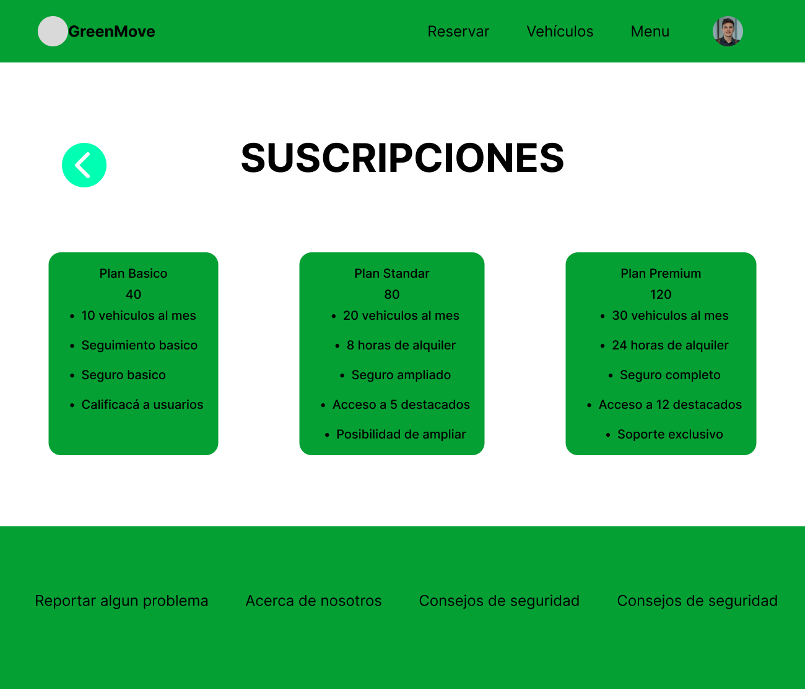
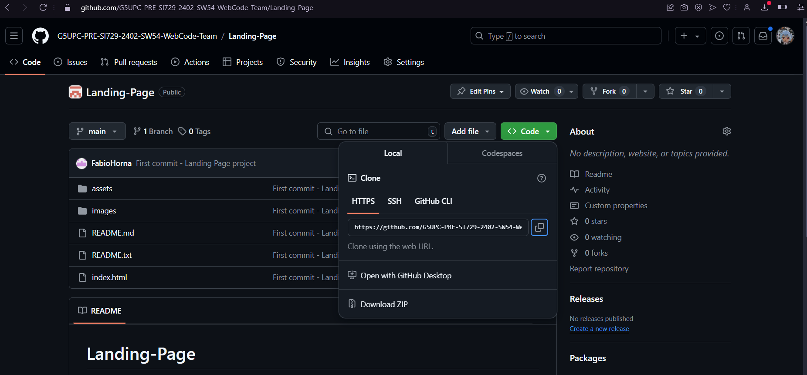
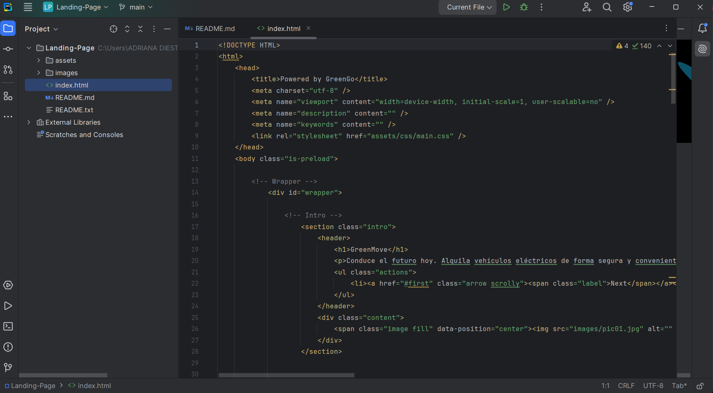

  

	

	
## Universidad Peruana de Ciencias Aplicadas 
### **CURSO:** SI729 Desarrollo de Aplicaciones Open Source 
### **SECCIÓN:** SW54 
### **Profesor:** SANCHEZ SEÑA, ALBERTO WILMER
### **Ingeniería de software** 
### **Ciclo:** Quinto

 

## Informe de Trabajo Final

 

### **Nombre del startup:** GreenGo

### **Nombre del producto:** GreenMove

## **Integrantes**

<table align="center", border="1px">
	<tbody>
		<tr>
			<td>
Nombre
</td>
			<td>
Código
</td>
		</tr>
		<tr>
			<td>Adriana María Diestra Zambrano</td>
			<td>u202218110</td>
		</tr>
		<tr>
			<td>Yair Christofer Aru Acevedo</td>
			<td>u202125984</td>
		</tr>
		<tr>
			<td>Enrique Manuel Villon Amez</td>
			<td>u20161a304</td>
		</tr>
		<tr>
			<td>Eduard Gedeon Travezaño Patiño</td>
			<td>u20211a789</td>
		</tr>
		<tr>
			<td>Fabio Ernesto Horna Silva</td>
			<td>u202020229</td>
		</tr>
	</tbody>
</table>

## Agosto, 2024.

# Contenido

## Tabla de contenidos

### [Registro de versiones del informe](#registro-de-versiones-del-informe)

 

# **Registro de Versiones**

<table>
  <thead>
    <tr>
        <th>Versión</th>
        <th>Fecha</th>
        <th>Autor</th>
        <th>Descripción de modificación</th>
    </tr>
  </thead>
  <tbody>
  <tr>
      <th>TB1</th>
      <td>26 de Agosto</td>
      <td>
        <ul>
          <li>Adriana María Diestra Zambrano</li>
          <li>Yair Christofer Aru Acevedo</li>
          <li>Eduard Gedeon Travezaño Patiño</li>
          <li>Enrique Manuel Villón Amez</li>
          <li>Fabio Horna Silva</li>
        </ul>
      </td>
      <td>
        Se han incluído los siguientes capítulos:
        <ul>
          <li>Capítulo I: Introducción</li>
          <li>Capítulo II: Requirements Elicitation & Analysis</li>
          <li>Capítulo III: Requirements Specification</li>
	  <li>Capítulo IV: Product Design</li>
        </ul>
     <thead>
    <tr>
        <th>TP1</th>
        <th>25 de Setiembre</th>
        <td>
        <ul>
          <li>Adriana María Diestra Zambrano</li>
          <li>Yair Christofer Aru Acevedo</li>
          <li>Eduard Gedeon Travezaño Patiño</li>
          <li>Enrique Manuel Villón Amez</li>
          <li>Fabio Horna Silva</li>
        </ul>
      </td>
        <td>
        Se han incluído los siguientes capítulos:
        <ul>
	  <li>Capítulo V: Sprint 2</li>
        </ul>
	<thead>
    <tr>
        <th>TB2</th>
        <th>01 de Noviembre</th>
        <td>
        <ul>
          <li>Adriana María Diestra Zambrano</li>
          <li>Yair Christofer Aru Acevedo</li>
          <li>Enrique Manuel Villón Amez</li>
        </ul>
      </td>
        <td>
        Se han incluído los siguientes capítulos:
        <ul>
	  <li>Capítulo V: Sprint 3</li>
	  <li>Entrevistas</li>
	  <li>Video About-the-Product</li>
        </ul>
	<thead>
    <tr>
  </thead>
  </tr>
  </tbody>
</table>

 
 

### [Project Report Collaboration Insights](#project-report-collaboration-insights)

TB1: Las tareas asignadas para la entrega TB1 se han completado y están documentadas en el siguiente repositorio de Github perteneciente a la organización del equipo:

Durante la preparación del informe, se llevaron a cabo las siguientes actividades:

- Se escribieron y graficaron los contenidos asignados a cada miembro en formato Markdown, seguido de commits para monitorear el progreso de cada integrante en el repositorio.
- Se crearon los artefactos necesarios utilizando las herramientas indicadas en el PDF del proyecto.
- Se organizaron reuniones para asignar las tareas, para coordinar el progreso de los elementos del informe y para comunicar los avances del primer Sprint.

### [Student Outcome](#student-outcome)

## ABET – EAC - Student Outcome 3

Criterio: La capacidad de comunicarse efectivamente con un rango de audiencias.
En el siguiente cuadro se describe las acciones realizadas y enunciados de
conclusiones por parte del grupo, que permiten sustentar el haber alcanzado el logro
del ABET – EAC - Student Outcome 3.

<table align="center", border="1px">
	<tbody>
		<tr>
			<td>Criterio específico</td>
			<td>Acciones realizadas</td>
			<td>Conclusiones</td>
		</tr>
		<tr>
			<td>Comunica oralmente sus ideas y/o resultados con objetividad a público de diferentes especialidades y niveles jerarquicos, en el marco del desarrollo de un proyecto en ingeniería.</td>
			<td> Eduard Travezaño - TB1: Durante las reuniones con los miembros del grupo, mostré una participación activa usando un lenguaje comprensible para cualquier público en general, incluso para las entrevistas al hablar sobre nuestra startup. TP: Durante los las reuniones diarias comentabamos los avances que realizabamos y problemas o opiniones que teniamos. Con eso logró corregir la versión anterior del proyecto y realizar un nuevo sprint más adecuado a lo que hicimos. 
			<strong>Fabio Horna- TB1</strong>: Durante las sesiones de grupo y presentaciones de avance del proyecto, expliqué los resultados del desarrollo de la landing page, destacando la estructura del código, las herramientas utilizadas y la integración de los elementos visuales. Además, participé activamente en las entrevistas a usuarios, interpretando y comunicando los resultados de manera clara y accesible para todos los miembros del equipo. 
            <strong>Fabio Horna- TP1</strong>: Al desarrollar la landing page, mockups y wireframes, expliqué con claridad las decisiones de diseño a colegas de diferentes áreas y jerarquías. Durante las reuniones, presenté de manera directa cómo cada componente visual respalda los objetivos del proyecto, asegurando que todos comprendieran su propósito y valor, sin importar su especialidad técnica. 
            <strong>Yair Aru Acevedo- TB1</strong>: Durante las reuniones del equipo, aportó ideas para la asignación de tareas entre los integrantes lo que permitio que se realicen de manera satisfactoria los puntos del proyecto asi como la elaboracion del diseño de la landing page y el web application. 
            <strong>Yair Aru Acevedo- TP1</strong>: Durante esta entrega, participó en las reuniones de equipo aportando ideas para el desarrollo de la aplicacion web y la corrección de información en el reporte. 
             <strong>Adriana Diestra- TB1</strong>: Durante las reuniones con los miembros del grupo, mostré una participación activa usando un lenguaje comprensible, participé activamente en las entrevistas a usuarios, interpretando y comunicando los resultados de manera clara y accesible para todos los miembros del equipo. 
	         <strong>Adriana Diestra- TP1</strong>: Me aseguré de transmitir mis ideas y resultados de manera clara y concisa, utilizando un lenguaje accesible para todo tipo de audiencias, desde ingenieros especializados hasta directivos de diferentes áreas. 
            <strong>Enrique Villón- TB1</strong>: Durante el desarollo de los puntos del proyecto, mostré una comunicación efectiva para entender las ideas de mi equipo, investigué sobre los requerimientos de un proyecto analizando las necesidades y las mejores que lograremos a cada segmento objetivo.  
            <strong>Enrique Villón- TP1</strong>: A través de la documentación detallada de los mockups y las guías de estilo, logré estructurar de manera clara las ideas y resultados del proyecto. Esto permitió que todas las áreas involucradas comprendieran el enfoque visual y funcional de la aplicación, facilitando una implementación coherente y alineada con los objetivos del proyecto.  
            </td>
			<td><strong>TB1</strong>: La participación activa de los miembros del equipo en la comunicación oral con diferentes rangos de audiencia permitió un alineamiento efectivo en las metas del proyecto, asegurando que tanto el equipo técnico como los stakeholders estuvieran en la misma página. Esta comunicación fue crucial para el avance eficiente de los entregables. 
				 <strong>TP1</strong>:El enfoque de GreenMove en el desarrollo frontend con Angular, Angular Material y un API simulado demuestra un compromiso con la comunicación efectiva en el marco del proyecto de ingeniería. A través de la utilización de tecnologías bien establecidas como Angular y Angular Material, se facilita la presentación clara y coherente de ideas y resultados. Estas herramientas permiten una interfaz de usuario intuitiva y atractiva, lo que contribuye a una comunicación efectiva con diferentes audiencias, independientemente de su experiencia técnica. El uso de una comunicación escrita precisa ayudó a cumplir con el criterio de transmitir ideas complejas de forma comprensible para todos los miembros del equipo, independientemente de su especialidad. Este proceso me permitió cumplir con el criterio de comunicar ideas de manera efectiva a personas con diversos niveles de experiencia y roles dentro del proyecto.  
            </td>
		</tr>
		<tr>
			<td>Comunica en forma escrita ideas y/o resultados con objetividad a público de diferentes especialidades y niveles jerarquicos, en el marco del desarrollo de un proyecto en ingeniería.</td>
			<td> <strong>Eduard Travezaño - TB1</strong>: Durante el desarrollo del trabajo realizando user stories, comparaciones con la competencia o características que puede tener nuestro producto, utilicé términos fáciles de comprender para no confundir a un público de distintas especialidades y comprendan adecuadamente el proyecto y a lo que queremos lograr. TP: Durante el desarrollo de las correciones pasadas, como en el diseño de la página, anotabamos los comentarios que teniamos de manera que cualquier persona de diferente público pueda entender. 
            <strong>Fabio Horna - TB1</strong>: Durante el desarrollo de la landing page y la documentación del proyecto, creé esquemas detallados, análisis de entrevistas con usuarios, y documentación de user personas. Utilicé un lenguaje claro y directo para asegurar que todos los miembros del equipo pudieran entender el propósito y los avances del proyecto. 
            <strong>Fabio Horna - TP1</strong>: A través de la documentación detallada de los mockups y las guías de estilo, logré estructurar de manera clara las ideas y resultados del proyecto. Esto permitió que todas las áreas involucradas comprendieran el enfoque visual y funcional de la aplicación, facilitando una implementación coherente y alineada con los objetivos del proyecto. 
            <strong>Yair Aru Acevedo - TB1</strong>: Durante el desarrollo del proyecto, creo los primeros diseños de la landing page tanto en wireframes como en mock-ups, además elaboró el diseño del funcionamiento de la aplicación web. También, creó las preguntas necesarias para las entrevistas a los segmentos User y Owner, añadiendo una entrevista relacionada al segmento User. 
            <strong>Yair Aru Acevedo- TP1</strong>: Durante esta entrega, modificó las users stories y añadió los technical stories. Además, generó los datos de la fake api. 
            <strong>Enrique Villón - TB1</strong>: Durante el proyecto, cree los segmentos de negocio, tanto como la descripción principal, asimismo como los to-be mapping, user stories, impact mapping y product backlog, todo lo necesario para saber los requerimientos.
			<strong>Enrique Villón- TP1</strong>: Con la web application se permitió aterrizar la idea de negocio, probando la experiencia de usuario y la resolución al problema mediante un software, facilitando la venta del negocio, la cantidad de clientes, y los objetivos del equipo.  
             <strong>Adriana Diestra - TB1</strong>: Durante el desarrollo del trabajo realizó los diagramas de contenedores (context, component y container, ademas realizó User Stories, Product Backlog 
             <strong>Adriana Diestra - TP1</strong>: En esta segunda entrega, dirigí la implementación del segundo sprint de nuestro proyecto de desarrollo web. Con un enfoque estratégico, planifiqué meticulosamente cada tarea para este período. Durante la reunión de planificación, comuniqué de manera clara y precisa las metas y expectativas del sprint, garantizando que todos en el equipo tuvieran una comprensión común. 
            </td>
			<td> <strong>TB1</strong>: La realización de un diseño en Figma fortalece la comunicación efectiva en el desarrollo de GreenMove al proporcionar una representación visual clara y tangible del producto. Figma facilita la colaboración en tiempo real entre equipos multidisciplinarios, permitiendo que nuestros stakeholders comprendan fácilmente la estructura y funcionalidades del proyecto. Esto promueve una comprensión compartida y una alineación de objetivos, mejorando así la eficacia de la comunicación en el proceso. 
                   <strong>TP1</strong>:El enfoque de GreenMove en el desarrollo frontend con Angular, Angular Material y un API simulado demuestra un compromiso con la comunicación efectiva en el marco del proyecto de ingeniería. A través de la utilización de tecnologías bien establecidas como Angular y Angular Material, se facilita la presentación clara y coherente de ideas y resultados. Estas herramientas permiten una interfaz de usuario intuitiva y atractiva, lo que contribuye a una comunicación efectiva con diferentes audiencias, independientemente de su experiencia técnica.
                  Además, la implementación de un API ficticio hasta que esté disponible el backend real muestra una visión proactiva hacia la comunicación transparente.La capacidad para plasmar el flujo del negocio en interfaces, junto con una comunicación efectiva y coherente con todas las partes involucradas, fue clave para transmitir las ideas del proyecto a diversas jerarquías. Logrando un entendimiento común y facilitó la implementación de la aplicación de manera alineada con las expectativas del negocio. El uso de una comunicación escrita precisa ayudó a cumplir con el criterio de transmitir ideas complejas de forma comprensible para todos los miembros del equipo, independientemente de su especialidad.
            </td>
		</tr>
	</tbody>
</table>

## [Capítulo I: Introducción](#capítulo-i-introducción)

- [1.1. Startup Profile](#11-startup-profile)
  - [1.1.1. Descripción de la Startup](#111-descripción-de-la-startup)
  - [1.1.2. Perfiles de integrantes del equipo](#112-perfiles-de-integrantes-del-equipo)
- [1.2. Solution Profile](#12-solution-profile)
  - [1.2.1 Antecedentes y problemática](#121-antecedentes-y-problemática)
  - [1.2.2 Lean UX Process](#122-lean-ux-process)
    - [1.2.2.1. Lean UX Problem Statements](#1221-lean-ux-problem-statements)
    - [1.2.2.2. Lean UX Assumptions](#1222-lean-ux-assumptions)
    - [1.2.2.3. Lean UX Hypothesis Statements](#1223-lean-ux-hypothesis-statements)
    - [1.2.2.4. Lean UX Canvas](#1224-lean-ux-canvas)
- [1.3. Segmentos objetivo](#13-segmentos-objetivo)

## [Capítulo II: Requirements Elicitation & Analysis](#capítulo-ii-requirements-elicitation--analysis)

- [2.1. Competidores](#21-competidores)
  - [2.1.1. Análisis competitivo](#211-análisis-competitivo)
  - [2.1.2. Estrategias y tácticas frente a competidores](#212-estrategias-y-tácticas-frente-a-competidores)
- [2.2. Entrevistas](#22-entrevistas)
  - [2.2.1. Diseño de entrevistas](#221-diseño-de-entrevistas)
  - [2.2.2. Registro de entrevistas](#222-registro-de-entrevistas)
  - [2.2.3. Análisis de entrevistas](#223-análisis-de-entrevistas)
- [2.3. Needfinding](#23-needfinding)
  - [2.3.1. User Personas](#231-user-personas)
  - [2.3.2. User Task Matrix](#232-user-task-matrix)
  - [2.3.3. User Journey Mapping](#233-user-journey-mapping)
  - [2.3.4. Empathy Mapping](#234-empathy-mapping)
  - [2.3.5. As-is Scenario Mapping](#235-as-is-scenario-mapping)
- [2.4. Ubiquitous Language](#24-ubiquitous-language)

## [Capítulo III: Requirements Specification](#capítulo-iii-requirements-specification)

- [3.1. To-Be Scenario Mapping](#31-to-be-scenario-mapping)
- [3.2. User Stories](#32-user-stories)
- [3.3. Impact Mapping](#33-impact-mapping)
- [3.4. Product Backlog](#34-product-backlog)

## [Capítulo IV: Product Design](#capítulo-iv-product-design)

- [4.1. Style Guidelines](#41-style-guidelines)
  - [4.1.1. General Style Guidelines](#411-general-style-guidelines)
  - [4.1.2. Web Style Guidelines](#412-web-style-guidelines)
- [4.2. Information Architecture](#42-information-architecture)
  - [4.2.1. Organization Systems](#421-organization-systems)
  - [4.2.2. Labeling Systems](#422-labeling-systems)
  - [4.2.3. SEO Tags and Meta Tags](#423-seo-tags-and-meta-tags)
  - [4.2.4. Searching Systems](#424-searching-systems)
  - [4.2.5. Navigation Systems](#425-navigation-systems)
- [4.3. Landing Page UI Design](#43-landing-page-ui-design)
  - [4.3.1. Landing Page Wireframe](#431-landing-page-wireframe)
  - [4.3.2. Landing Page Mock-up](#432-landing-page-mock-up)
- [4.4. Web Applications UX/UI Design](#44-web-applications-uxui-design)
  - [4.4.1. Web Applications Wireframes](#441-web-applications-wireframes)
  - [4.4.2. Web Applications Wireflow Diagrams](#442-web-applications-wireflow-diagrams)
  - [4.4.3. Web Applications Mock-ups](#443-web-applications-mock-ups)
  - [4.4.4. Web Applications User Flow Diagrams](#444-web-applications-user-flow-diagrams)
- [4.5. Web Applications Prototyping](#45-web-applications-prototyping)
- [4.6. Domain-Driven Software Architecture](#46-domain-driven-software-architecture)
  - [4.6.1. Software Architecture Context Diagram](#461-software-architecture-context-diagram)
  - [4.6.2. Software Architecture Container Diagrams](#462-software-architecture-container-diagrams)
  - [4.6.3. Software Architecture Components Diagrams](#463-software-architecture-components-diagrams)
- [4.7. Software Object-Oriented Design](#47-software-object-oriented-design)
  - [4.7.1. Class Diagrams](#471-class-diagrams)
  - [4.7.2. Class Dictionary](#472-class-dictionary)
- [4.8. Database Design](#48-database-design)
  - [4.8.1. Database Diagram](#481-database-diagram)

## [Capítulo V: Product Implementation, Validation & Deployment](#capítulo-v-product-implementation-validation--deployment)

- [5.1. Software Configuration Management](#51-software-configuration-management)
  - [5.1.1. Software Development Environment Configuration](#511-software-development-environment-configuration)
  - [5.1.2. Source Code Management](#512-source-code-management)
  - [5.1.3. Source Code Style Guide & Conventions](#513-source-code-style-guide--conventions)
  - [5.1.4. Software Deployment Configuration](#514-software-deployment-configuration)
- [5.2. Landing Page, Services & Applications Implementation](#52-landing-page-services--applications-implementation)

  - [5.2.1. Sprint 1](#521-sprint-1)
    - [5.2.1.1. Sprint Planning 1](#5211-sprint-planning-1)
    - [5.2.1.2. Sprint Backlog 1](#5212-sprint-backlog-1)
    - [5.2.1.3. Development Evidence for Sprint Review](#5213-development-evidence-for-sprint-review)
    - [5.2.1.4. Testing Suite Evidence for Sprint Review](#5214-testing-suite-evidence-for-sprint-review)
    - [5.2.1.5. Execution Evidence for Sprint Review](#5215-execution-evidence-for-sprint-review)
    - [5.2.1.6. Services Documentation Evidence for Sprint Review](#5216-services-documentation-evidence-for-sprint-review)
    - [5.2.1.7. Software Deployment Evidence for Sprint Review](#5217-software-deployment-evidence-for-sprint-review)
    - [5.2.1.8. Team Collaboration Insights during Sprint](#5218-team-collaboration-insights-during-sprint)

- [5.3. Validation Interviews](#53-validation-interviews)

  - [5.3.1. Diseño de entrevistas](#531-diseño-de-entrevistas)
  - [5.3.2. Registro de entrevistas](#532-registro-de-entrevistas)
  - [5.3.3. Evaluación según heurísticas](#532-evaluación-según-heurísticas)

- [5.4. Video about the product](#54-video-about-the-product)

## [Conclusiones](#conclusiones)

- [Conclusiones y Recomendaciones](#conclusiones-y-recomendaciones)
- [Video about the team](#video-about-the-team)

## [Bibliografía](#bibliografía)

## [Anexos](#anexos)

# Capítulo I: Introducción

## 1.1. Startup Profile

### 1.1.1. Descripción de la Startup

Somos GreenGo, un startup conformado por 5 estudiantes de la Universidad Peruana de Ciencias Aplicadas (UPC),
que trabajará en el desarrollo del producto GreenMove, dedicada a facilitar el alquiler de vehículos eléctricos.
Nuestro enfoque se centra en brindar soluciones tanto para usuarios que buscan alquilar vehículos eléctricos para fines de
transporte como para personas que tienen vehículos eléctricos y buscan generar ganacias alquilandolo, nuestro objetivo es
facilitar el acceso a vehículos eléctricos de forma segura y conveniente para nuestros usuarios, nuestro sitio
web ofrece una experiencia excepcional, garantizando la disponibilidad y seguridad de sus vehículos.

<table border="1px" style="text-align: center; width: 100%;">
    <tbody>
        <tr>
            <td><strong>Misión</strong></td>
            <td><strong>Visión</strong></td>
            <td><strong>Valores</strong></td>
        </tr>
        <tr>
            <td>Transformar la movilidad urbana y recreativa con un acceso conveniente, económico y seguro a vehículos eléctricos.</td>
            <td>Ser líderes en el mercado de desarrollo de aplicaciones orientadas al cuidado del medio ambiente.</td>
            <td>
                <ul style="list-style-type:none; padding-left: 0;">
                    <li><strong>Innovación:</strong> La innovación constante para ofrecer soluciones creativas.</li>
                    <li><strong>Calidad:</strong> Buscamos la excelencia en nuestro producto.</li>
                </ul>
            </td>
        </tr>
    </tbody>
</table>

### 1.1.2. Perfiles de integrantes del equipo

<table border="1px" style="width: 100%; text-align: center;">
    <thead>
        <tr>
            <th>Integrante</th>
            <th>Foto</th>
            <th>Descripción del Perfil</th>
        </tr>
    </thead>
    <tbody>
        <tr>
            <td>Adriana María Diestra Zambrano</td>
            <td></td>
            <td>Estudiante de la carrera Ingeniería de Software de 6to ciclo. Con conocimientos en C++, Python, HTML y CSS, así como una actitud positiva para trabajar en equipo, generando un ambiente tranquilo y responsable. </td>
        </tr>
        <tr>
            <td>Yair Christofer Aru Acevedo	</td>
            <td></td>
            <td>Estudiante de 6to ciclo de la carrera de Ingenieria de Software. Conocimientos en vue y el uso de los lenguajes de programación: C++, C#, Javascript, Python, Java.</td>
        </tr>
        <tr>
            <td>Enrique Manuel Villon Amez	</td>
            <td></td>
            <td>Estudiante de quinto ciclo de la carrera de Ingeniería de Software en la UPC. Cuento con conocimientos avanzados en Swift y  Javascript  con sus frameworks o librerias mas populares (React, Angular, React Native), además profundos conocimientos en C++, Python, AWS). Actualmente soy Mobile Developer Senior en Auna tengo mas de 5 años en la industria tecnológica. Me considero una persona comunicativa y dedicada, me gusta el trabajo en equipo y la tecnología.</td>
        </tr>
        <tr>
            <td>Eduard Gedeon Travezaño Patiño	</td>
            <td></td>
            <td>Soy Eduard, tengo 20 años actualmente estoy cursando la carrera de Ingeniería de Software. Considero que soy alguien que se adapta a lo que requiera el trabajo, logrando aportar en este de buena manera, para asegurar un trabajo bien hecho. Con conocimientos en distintos lenguajes de programación como C++, Python, SQL y entre otros. Además mis motivaciones me ayudan a dar lo mejor de mí y mantenerme constante apoyando al equipo en lo que se requiera.</td>
        </tr>
        <tr>
            <td>Fabio Ernesto Horna Silva	</td>
            <td></td>
            <td>Soy Fabio, tengo 21 años y soy sumamente apasionado al análisis de datos y a los videojuegos. Actualmente me encuentro trabajando como analista de datos y poseo conocimientos avanzados de redes neuronales, SQL, y otras herramientas como Python, donde manejo pandas y otras herramientas para la minería de datos. Me considero una buena persona para trabajar en equipo y me gusta ayudar a mis compañeros.</td>
        </tr>
    </tbody>
</table>

## 1.2. Solution Profile

### 1.2.1. Antecedentes y problemática

Nuestra capital Lima, es una de las ciudades con mayor tráfico del mundo, lo que genera grandes costos económicos para las millones de personas que transitan diariamente por la ciudad de lima y callao, el sistema de transporte se encuentran notablemente retrasados. En el 2023 nuestra ciudad de Lima pasó del quinto al segundo país en el ranking de ciudades con mayor tráfico a nivel mundial. Según TomTom Traffic, trasladarse 10 kilómetros (distancia entre plaza San Martín y el Óvalo Naranjal al norte o al Larcomar al sur) demora 24 a 30 minutos en promedio.

<table border="1px" style="text-align: center; width: 100%;">
    <tr>
    <td valign="top"> What (Qué) </td>
    <td valign="top"> El problema identificado radica en el tráfico de Lima, que es uno de los más congestionados del mundo, generando costos económicos significativos y afectando la calidad de vida de millones de personas. </td>
   </tr>
    <tr>
        <td valign="top"> When (Cuándo) </td>
        <td valign="top"> El problema del tráfico se experimenta diariamente, especialmente durante las horas pico de la mañana y la tarde, afectando los desplazamientos laborales y personales. </td>
    </tr>
    <tr>
        <td valign="top"> Where (Dónde) </td>
        <td valign="top"> El tráfico congestionado se encuentra generalmente en las avenidas principales, intersecciones críticas y puntos de entrada y salida de la ciudad. </td>
    </tr>
    <tr>
        <td valign="top"> Who (Quiénes) </td>
        <td valign="top"> El problema afecta a todos los residentes y usuarios de Lima, que dependen del transporte terrestre para sus actividades diarias, incluidos trabajadores, estudiantes y visitantes. </td>
    </tr>
    <tr>
        <td valign="top"> Why (Por qué) </td>
        <td valign="top"> La congestion vehicular se debe a una combinación de factores, como el crecimiento poblacional desmedido, la falta de infraestructura vial adecuada, el aumento del parque automotor, la falta de sistemas de transporte público eficientes y sobre todo el desconocimiento de transportes alternativos. </td>
    </tr>
    <tr>
        <td valign="top"> How (Cómo) </td>
        <td valign="top"> Como una congestión constante en las vías principales, causando retrasos significativos en los tiempos de viaje y aumentando el estrés y la frustración de los usuarios. La congestión tiende a empeorar durante las horas pico y en días laborables. </td>
    </tr>
    <tr>
        <td valign="top"> How much (Cuánto) </td>
        <td valign="top"> La congestión vehicular causa un impacto diario a millones de personas, provocando retraso en sus actividades diarias, pérdida de productividad y el aumento en el coste de transporte que asciende a mas de 500 soles anuales por manejar en horas pico o la alza de pasajes en el transporte público que a aumentado en casi 100 soles mensuales desde 2010. </td>
    </tr>
</table>

### 1.2.2. Lean UX Process

#### 1.2.2.1. Lean UX Problem statements

1.  Alta congestión vehicular en Lima: La alta congestión vehicular en Lima afecta negativamente la movilidad urbana, causando largos tiempos de desplazamiento y contribuyendo a la contaminación del aire. Esta situación limita la calidad de vida de los residentes y plantea un desafío significativo para la adopción de soluciones de transporte más sostenibles.

- **Owner:** Propietarios que desean contribuir a la reducción de la congestión vehicular al alquilar sus vehículos eléctricos, pero enfrentan dificultades para conectar con usuarios interesados en utilizar estos vehículos como alternativa al transporte convencional.
- **Cliente:** Personas que desean evitar el tráfico congestionado y reducir su impacto ambiental al elegir vehículos eléctricos, pero enfrentan desafíos para encontrar opciones disponibles y accesibles.

2.  Ineficiencia en el transporte público de Lima: El sistema de transporte público en Lima está notablemente retrasado y no satisface adecuadamente las necesidades de los residentes, contribuyendo a la alta congestión vehicular. Los tiempos prolongados de desplazamiento y la falta de alternativas rápidas y eficientes agravan el problema, afectando la movilidad diaria de millones de personas.

- **Owner:** Propietarios que desean alquilar sus vehículos eléctricos pero enfrentan dificultades debido a la alta congestión causada por un sistema de transporte público ineficiente, que limita la demanda y el uso de sus vehículos como alternativa efectiva.
- **Cliente:** Residentes que buscan alternativas de transporte más eficientes debido a la ineficiencia del transporte público, deseando una solución que ofrezca tiempos de viaje más cortos y una experiencia de movilidad más cómoda.

3.  Costos elevados de transporte convencional: Con el aumento constante de los precios del combustible, los usuarios de transporte ecológico enfrentan altos costos asociados con el uso de vehículos convencionales, lo que impulsa la búsqueda de opciones más económicas y sostenibles.

- **Owner:** Propietarios que ven en el alquiler de sus vehículos eléctricos una forma de contrarrestar el impacto financiero de los altos precios del combustible, generando ingresos adicionales.
- **Cliente:** Personas que desean reducir sus gastos en transporte y están motivadas a buscar alternativas más económicas debido al incremento de los precios del combustible.

4.  Necesidad de información sobre el impacto ambiental: Los usuarios de transporte ecológico quieren conocer el impacto ambiental de sus decisiones de transporte, pero a menudo carecen de información clara y accesible sobre cómo sus elecciones contribuyen a la sostenibilidad.

- **Owner:** Propietarios interesados en demostrar el impacto positivo de sus vehículos en el medio ambiente a los usuarios y así atraer más interés en el alquiler de sus vehículos.
- **Cliente:** Personas que buscan no solo alternativas de transporte sostenibles, sino también información sobre cómo su uso contribuye a la reducción de la huella de carbono.

5.  Pérdida de productividad debido a la congestión: La congestión vehicular en Lima resulta en pérdida de productividad significativa para los residentes debido a los largos tiempos de desplazamiento. Esto afecta negativamente tanto a las personas que se desplazan diariamente como a los propietarios de vehículos que buscan maximizar el uso de sus vehículos eléctricos en un entorno congestionado.

- **Owner:** Propietarios que buscan optimizar el uso de sus vehículos eléctricos y contribuir a la reducción del tráfico, pero enfrentan dificultades debido a la alta congestión que limita la efectividad de sus vehículos como solución a la pérdida de productividad.
- **Cliente:** Personas que desean reducir el tiempo perdido en el tráfico para aumentar su productividad diaria, buscando alternativas de transporte que puedan ofrecerles una experiencia más eficiente y menos estresante.

6.  Acceso limitado a transporte ecológico: En áreas urbanas con alta congestión vehicular y escasas opciones de transporte sostenible, los usuarios de transporte ecológico enfrentan dificultades para encontrar vehículos eléctricos accesibles y en buen estado. Esto se traduce en una experiencia de movilidad insatisfactoria y un aumento en el uso de medios de transporte menos sostenibles.

- **Owner:** Individuos que poseen vehículos eléctricos pero no los utilizan regularmente y desean encontrar una plataforma que facilite el alquiler de sus vehículos de manera eficiente.
- **Cliente:** Personas jóvenes y adultas que buscan alternativas sostenibles para sus desplazamientos diarios pero encuentran que las opciones disponibles son limitadas o difíciles de acceder.

#### 1.2.2.2. Lean UX Assumptions

- Business Outcomes

1. Aumentar el número de usuarios registrados en la plataforma en un 30% en los primeros 6 meses, como resultado de la creciente demanda de transporte eficiente y ecológico.
2. Expandir las fuentes de ingresos a través de la inclusión de diferentes tipos de vehículos y tarifas, optimizando las ganancias por alquiler.
3. Lograr una tasa de satisfacción del cliente del 85% o más, derivada de la facilidad de uso de la plataforma y la experiencia positiva del usuario.

- Users Outcomes

1. Los usuarios podrán encontrar y reservar vehículos eléctricos de manera rápida y sencilla, lo que mejorará su experiencia de movilidad diaria.
2. Al optar por vehículos eléctricos en lugar de vehículos convencionales, los usuarios podrán reducir significativamente sus gastos de transporte, especialmente en un contexto de precios de combustible elevados.
3. Los usuarios experimentarán una mayor satisfacción emocional al saber que están contribuyendo a la reducción de la huella de carbono, lo que también fortalecerá su conexión con GreenMove.

#### 1.2.2.3. Lean UX Hypothesis Statements

- **Creemos que** al simplificar el proceso de registro en nuestra plataforma, aumentaremos la cantidad de nuevos usuarios. **Sabremos que** hemos tenido éxito **cuando** observemos un aumento significativo en el número de cuentas creadas en los primeros 7 días después del lanzamiento.

- **Creemos que** al facilitar la información de cada vehículo disponible, aumentaremos la cantidad de usuarios que alquilen un vehículo. **Sabremos que** hemos tenido éxito **cuando** observemos un aumento significativo en el número de personas que pongan en alquiler sus vehículos.

- **Creemos que** al ofrecer una plataforma de alquiler de vehículos eléctricos, reduciremos la congestión vehicular en Lima. **Sabremos que** hemos tenido éxito **cuando** observemos un aumento en la adopción de vehículos eléctricos y una disminución en la congestión en áreas clave de la ciudad.
- **Creemos que** al ofrecer una opción de alquiler de vehículos eléctricos como alternativa al ineficiente sistema de transporte público, los residentes podrán experimentar tiempos de viaje más cortos y una movilidad más cómoda. **Sabremos que** hemos tenido éxito **cuando** veamos una mayor utilización de los vehículos eléctricos en lugar del transporte público.

- **Creemos que** ofrecer vehículos eléctricos a precios competitivos atraerá a quienes buscan reducir costos de transporte. **Sabremos que** hemos tenido éxito **cuando** veamos un incremento en la demanda de alquiler de vehículos eléctricos.
- **Creemos que** proporcionando información clara sobre el impacto ambiental, atraeremos a usuarios interesados en reducir su huella de carbono. **Sabremos que** hemos tenido éxito **cuando** aumente la adopción de vehículos eléctricos y la interacción con la información ambiental.

- **Creemos que** al ofrecer vehículos eléctricos, ayudaremos a los residentes a reducir el tiempo perdido en el tráfico y mejorar su productividad. **Sabremos que** hemos tenido éxito **cuando** mejore la percepción de eficiencia del transporte y se reduzcan los tiempos de desplazamiento.

#### 1.2.2.4. Lean UX Canvas

## 1.3. Segmentos Objetivo

- **Owner:** Este segmento está compuesto por propietarios de vehículos eléctricos que residen en áreas urbanas densas (Lima) y que buscan generar ingresos adicionales al alquilar sus vehículos cuando no los están utilizando. Estos propietarios son conscientes del valor económico de sus activos y están interesados en maximizar el retorno sobre su inversión. Además, tienen una fuerte orientación hacia la sostenibilidad y desean participar activamente en la economía colaborativa. Son personas que valoran tanto la rentabilidad como la contribución a un transporte más limpio en su ciudad.
  - **Ocupación:** Profesionales, empresarios, o individuos con conciencia ambiental y sentido de responsabilidad social.
  - **Motivaciones:** Maximizar la rentabilidad de un activo subutilizado, contribuir a la reducción de emisiones y fomentar el uso de transporte sostenible en la comunidad.
  - **Comportamiento:** Están abiertos a plataformas digitales que ofrecen seguridad, control y conveniencia en la gestión del alquiler de su vehículo.
- **Cliente:** Este segmento incluye a profesionales jóvenes y familias pequeñas que viven en grandes ciudades y buscan soluciones de transporte que sean sostenibles, asequibles y convenientes. Son personas con un fuerte sentido de responsabilidad ambiental que buscan minimizar su impacto ecológico, pero también necesitan opciones de movilidad que se adapten a sus estilos de vida urbanos ocupados. Además, valoran la flexibilidad de alquileres de corto o mediano plazo, sin el compromiso de poseer un vehículo.
  - **Ocupación:** Profesionales, freelancers, familias jóvenes, estudiantes de posgrado.
  - **Motivaciones:** Reducir la huella de carbono, evitar el tráfico y la congestión, opciones de transporte asequibles, cómodas y sin complicaciones.
  - **Comportamiento:** Prefieren opciones de movilidad que ofrezcan flexibilidad y conveniencia, utilizan aplicaciones móviles para la gestión de servicios diarios, y están dispuestos a pagar un poco más por opciones ecológicas.

---

# Capítulo III: Requirements Specification

## 3.1. To-Be Scenario Mapping

Describiremos los escenarios To-Be para los dos segmentos correspondientes, owners que quieran alquilar sus vehículos eléctricos y clientes con conciencia ambiental que desean una mayor productividad. Estos escenarios representan la situación futura al usar la aplicación GreenMove para trasladarse a las oficinas de su trabajo. Con ello, analizaremos los beneficios que tendran los usuarios de GreenMove y se destacará las áreas donde se genera un impacto positivo significativo para la calidad de transporte y vida

**Segmento 1: Owner**

**Segmento 2: User**

## 3.2. User Stories

<table >
    <tr>
        <th>Epic / Story ID</th>
        <th>Título</th>
        <th>Descripción</th>
        <th>Criterios de Aceptación</th>
        <th>Relacionado con (Epic ID)</th>
    </tr>
    <tr>
        <td>EP01</td>
        <td>Landing page para la aplicacion GreenMove</td>
        <td><b>Como</b> Owner/Cliente GreenMove <b>Quiero</b> ingresar una landing page <b>Para</b> informarme sobre la aplicación y su equipo de desarrollo.</td>
        <td>No corresponde</td>
        <td>No corresponde</td>
    </tr>
    <tr>
        <td>EP02</td>
        <td>Gestión de cuenta de usuario</td>
        <td><b>Como</b> Owner/Cliente de GreenMove <b>Quiero</b> crear, visualizar, eliminar y editar mi cuenta <b>Para</b> tener mis datos actualizados y comenzar a hacer uso de la aplicación correctamente.</td>
        <td>No corresponde</td>
        <td>No corresponde</td>
    </tr>
    <tr>
        <td>EP03</td>
        <td>Gestión de vehículos en alquiler</td>
        <td><b>Como</b> Owner en GreenMove <b>Quiero</b> agregar y gestionar mis vehículos <b>Para</b> asegurarme que estén disponibles y en buen estado para el alquiler.</td>
        <td>No corresponde</td>
        <td>No corresponde</td>
    </tr>
    <tr>
        <td>EP04</td>
        <td>Gestión de reservas</td>
        <td><b>Como</b> cliente de GreenMove <b>Quiero</b> gestionar mis reservas y el uso de vehículos <b>Para</b> planificar y controlar mis alquileres. </td>
        <td>No corresponde</td>
        <td>No corresponde</td>
    </tr>
    <tr>
        <td>EP05</td>
        <td>Gestionar historial de reservas</td>
        <td><b>Cómo</b> Cliente de GreenMove <b>Quiero</b> poder ver el historial completo de las reservas realizadas<b> Para</b> acceder a la información de estos de manera sencilla.
        <b>Y</b> tener un control de mi historial</td>
        <td>No corresponde</td>
        <td>No corresponde</td>
    </tr>
    <tr>
        <td>EP06</td>
        <td>Gestión de planes</td>
        <td><b>Cómo</b> cliente de GreenMove <b>Quiero</b> tener una gestión y control de mi plan <b>Para</b> poder adquirirlo y coancelarlo cuando lo requiera</td>
        <td>No corresponde</td>
        <td>No corresponde</td>
    </tr>
    <tr>
        <td>EP07</td>
        <td>Implementaciones técnica</td>
        <td><b>Cómo</b> desarrollador <b>Quiero</b> tener una gestión y control de cambios de la página <b>Para</b> poder brindar mejoras continuas a la aplicación web</td>
        <td>No corresponde</td>
        <td>No corresponde</td>
    </tr>
    <tr>
        <td>US01</td>
        <td>Descripción de la aplicación</td>
        <td><b>Como</b> visitante de la landing page
        <b>Quiero</b> visualizar una descripción del producto ofrecido
        <b>Para</b> conocer los beneficios que puedo adquirir mediante el uso de la aplicación.</td>
        <td>
            <b>Scenario 1: Visualizar sección Home</b>  
            <b>Dado que</b> el visitante ingresa a la página 
            <b>Cuando</b>la página cargue  
            <b>Entonces</b> se muestra una sección llamativa que anime al usuario a usar la aplicación. 
             
            <b>Scenario 2: Acceder a la sección "Services"</b>  
            <b>Dado que</b> el visitante se encuentre dentro de la landing page 
            <b>Cuando</b> navegue hasta la sección “Services”  
            <b>Entonces</b> se muestra información sobre los servicios que ofrece GreenMove  
             
            <b>Scenario 3: Explorar la sección "Pricing"</b>  
            <b>Dado que</b> el visitante se encuentre dentro de la landing page 
            <b>Cuando</b> navegue hasta la sección “Pricing”  
            <b>Entonces</b> se muestra la información relacionada a los planes de pago que se ofrecen y cuáles son los beneficios de cada uno de estos. 
        <td>EP01</td>
    </tr>
    <tr>
        <td>US02</td>
        <td>Descripción de la startup</td>
        <td><b>Cómo</b> visitante interesado 
        <b>Quiero</b> ver una descripción clara de la startup
        <b>Para</b> conocer a sus integrantes y su propósito como startup</td>
        <td>
            <b>Scenario 1: Acceder a la sección "About us</b>  
            <b>Dado que</b> el visitante se encuentre dentro de la landing page  
            <b>Cuando</b> navegue hasta la sección “About Us”  
            <b>Entonces</b> se muestra información importante sobre la startup.  
             
            <b>Scenario 2: Conocer al equipo en "About The Team"</b>  
            <b>Dado que</b> el visitante se encuentre dentro de la landing page  
            <b>Cuando</b> navegue hasta la sección “About The Team” 
            <b>Entonces</b> se muestra la información correspondiente a los videos about the project y about the team, además de la información de cada uno de los miembros. 
        <td>EP01</td>
    </tr>
    <tr>
        <td>US03</td>
        <td>Acceder a la aplicación desde la landing page </td>
        <td><b>Cómo</b> visitante de la landing page 
        <b>Quiero</b> poder acceder a la aplicación GreenMove desde la landing page
        <b>Para</b> comenzar a utilizar las funcionalidades ofrecidas</td>
        <td>
            <b>Scenario 1: Usuario ingresa a aplicación</b>  
            <b>Dado que</b> el visitante se encuentra en la landing page  
            <b>Cuando</b> seleccione la opción que permite el acceso al software elaborado 
            <b>Entonces</b> es redirigido a la aplicación desplegada 
             
            <b>Scenario 2: Fallo en el acceso a la aplicación</b>  
            <b>Dado que</b> el visitante se encuentre en la landing page  
            <b>Cuando</b> seleccione la opción que permite el acceso al software elaborado y ocurra un error en el proceso de redirección 
            <b>Entonces</b> el usuario obtiene un mensaje de error. 
        <td>EP01</td>
    </tr>
    <tr>
        <tr>
    <td>US05</td>
    <td>Iniciar sesión</td>
    <td><b>Cómo</b> Owner/Cliente de GreenMove
    <b>Quiero</b> iniciar sesión
    <b>Para</b> acceder a los beneficios que ofrece la aplicación.</td>
    <td>
        <b>Scenario 1: Usuario ingresa credenciales válidas.</b>  
        <b>Dado que</b> el usuario posee una cuenta en la aplicación GreenMove  <b>Y</b> desee iniciar sesión  
        <b>Cuando</b> ingrese las credenciales necesarias correctamente 
        <b>Entonces</b> el sistema permitirá el acceso a la aplicación. 
         
        <b>Scenario 2: Usuario ingresa credenciales incorrectas.</b>  
        <b>Dado que</b> el usuario posee una cuenta en la aplicación GreenMove  <b>Y</b> desea iniciar sesión  
        <b>Cuando</b> ingrese alguna credencial de manera incorrecta  
        <b>Entonces</b> el sistema denegará la solicitud. 
    </td>
    <td>EP02</td>
</tr>

<tr>
    <td>US06</td>
    <td>Visualizar perfil de usuario</td>
    <td><b>Cómo</b> Owner/Cliente de GreenMove 
    <b>Quiero</b> visualizar mi perfil personal 
    <b>Para</b> visualizar mis datos actuales.</td>
    <td>
        <b>Scenario 1: Acceder al perfil personal.</b>  
        <b>Dado que</b> el usuario desee visualizar su información personal  
        <b>Cuando</b> ingrese a su perfil  
        <b>Entonces</b> obtendrá toda la información que registró previamente. 
         
        <b>Scenario 2: Problema al acceder al perfil personal.</b>  
        <b>Dado que</b> el usuario desee visualizar su información personal   
        <b>Cuando</b> intente ingresar a su perfil  <b>Y</b> experimente un error de conexión o de servidor  
        <b>Entonces</b> no se visualizarán los datos del perfil. 
    </td>
    <td>EP02</td>
</tr>

<tr>
    <td>US07</td>
    <td>Cambiar datos personales</td>
    <td><b>Cómo</b> Owner/Cliente de GreenMove 
    <b>Quiero</b> cambiar los datos asociados a mi perfil
    <b>Para</b> actualizar la información.</td>
    <td>
        <b>Scenario 1: Cambiar contraseña.</b>  
        <b>Dado que</b> el usuario quiera cambiar su contraseña  
        <b>Cuando</b> ingrese la nueva contraseña, esta sea validada por el sistema  <b>Y</b> el usuario confirme su intención de proceder con el cambio 
        <b>Entonces</b> la nueva clave será guardada y la información actualizada. 
         
        <b>Scenario 2: Cambiar nombre.</b>  
        <b>Dado que</b> el usuario quiera cambiar su nombre 
        <b>Cuando</b> ingrese el nuevo nombre, esta sea validada por el usuario  <b>Y</b> confirme su intención de proceder con el cambio  
        <b>Entonces</b> el nuevo nombre será guardado y la información actualizada. 
         
        <b>Scenario 3: Cambiar foto.</b>  
        <b>Dado que</b> el usuario quiera cambiar su foto  
        <b>Cuando</b> ingrese la nueva foto, esta sea validada por el usuario  <b>Y</b> confirme su intención de proceder con el cambio 
        <b>Entonces</b> la nueva foto será guardada y la información actualizada. 
         
        <b>Scenario 4: Cambiar número de celular.</b>  
        <b>Dado que</b> el usuario quiera cambiar su número de celular  
        <b>Cuando</b> ingrese el nuevo número, esta sea validada por el sistema  <b>Y</b> el usuario confirme su intención de proceder con el cambio  
        <b>Entonces</b> el nuevo número será guardado y la información actualizada. 
         
        <b>Scenario 5: Ingreso de datos inválidos.</b>  
        <b>Dado que</b> el usuario quiera cambiar su información  
        <b>Cuando</b> ingrese datos inválidos 
        <b>Entonces</b> se mostrará un mensaje de dato no válido. 
         
        <b>Scenario 6: No cambiar información.</b>  
        <b>Dado que</b> el usuario no quiera cambiar su información  
        <b>Cuando</b> aparezca el pop up para confirmar el cambio  <b>Y</b> seleccione la opción para cancelar cambio 
        <b>Entonces</b> el pop up desaparecerá y el cambio no se realizará. 
    </td>
    <td>EP02</td>
</tr>

<tr>
    <td>US08</td>
    <td>Eliminar cuenta de usuario</td>
    <td><b>Cómo</b> Owner/Cliente de GreenMove
    <b>Quiero</b> eliminar mi cuenta de usuario
    <b>Para</b> dejar de usar los servicios de la aplicación.</td>
    <td>
        <b>Scenario 1: Owner/Cliente elimina cuenta de usuario.</b>  
        <b>Dado que</b> el Owner/Cliente desee eliminar su cuenta de usuario  
        <b>Cuando</b> seleccione la opción de eliminar cuenta en su perfil  <b>Y</b> confirme su intención para proceder con la operación 
        <b>Entonces</b> el sistema eliminará la cuenta y todos los datos almacenados.  
         
        <b>Scenario 2: Owner/Cliente no elimina cuenta de usuario.</b>  
        <b>Dado que</b> el Owner/Cliente desee eliminar su cuenta de usuario  
        <b>Cuando</b> niegue su intención para proceder con la operación 
        <b>Entonces</b> el sistema regresará a la vista de su cuenta sin eliminar los datos. 
    </td>
    <td>EP02</td>
</tr>
        <td>US09</td>
        <td>Atención al cliente</td>
        <td><b>Cómo</b> usuario
        <b>Quiero</b> tener acceso fácil a un servicio de atención al cliente
        <b>Para</b> tener ayuda en caso de problemas técnicos o consultas relacionadas con el uso de la aplicación. </td>
        <td>
            <b>Scenario 1: Cliente tiene un problema técnico </b>  
            <b>Dado que</b> el usuario tiene problemas técnicos en la página web 
            <b>Cuando</b> el usuario acceda al servicio de atención al cliente  <b>Y</b> se contacte con un asesor  
            <b>Entonces</b> el asesor se encargará de informar sobre el problema para resolverlo en la brevedad posible.  
             
            <b>Scenario 2: Cliente tiene una consulta </b>  
            <b>Dado que</b> el usuario tiene una consulta relacionada a la página web 
            <b>Cuando</b> el usuario acceda al servicio de atención al cliente  <b>Y</b> se contacte con un asesor  
            <b>Entonces</b> el asesor se responder su consulta en la brevedad y de la manera más sencilla  
        <td>EP02</td>
    </tr>
    <tr>
        <td>US10</td>
        <td>Publicar vehículo en alquiler</td>
        <td><b>Cómo</b> Owner de un vehículo eléctrico  
        <b>Quiero</b> crear publicaciones con la información y especificaciones de mi vehículo
        <b>Para</b> que pueda ser alquilado por un cliente</td>
        <td>
            <b>Scenario 1: Owner publica su vehículo en GreenMove </b>  
            <b>Dado que</b> el Owner cuente con una cuenta en nuestra aplicación  <b>Y</b> se encuentre el la opción de “Publicar vehículo”  
            <b>Cuando</b> llene todas las casillas obligatorias para publicar su vehículo  <b>Y</b> le de al botón “Publicar” 
            <b>Entonces</b> el sistema le muestra un aviso de que su vehículo ha sido publicado.  
             
           <b>Scenario 2: Owner cancela la publicación de su vehículo en GreenMove </b>  
            <b>Dado que</b> el Owner cuente con una cuenta en nuestra aplicación  <b>Y</b> se encuentre el la opción de “Publicar vehículo”   
            <b>Cuando</b> le de al botón de “Cancelar” 
            <b>Entonces</b> el sistema le muestra un aviso de que se ha cancelado la publicación. 
             
           <b>Scenario 3: Owner no publica su vehículo en GreenMove </b>  
            <b>Dado que</b> el Owner cuente con una cuenta en nuestra aplicación  <b>Y</b> se encuentre el la opción de “Publicar vehículo”  
            <b>Cuando</b> no llene todas las casillas obligatorias para publicar su vehículo  <b>Y</b> le de al botón “Publicar” 
            <b>Entonces</b> el sistema le muestra un aviso de que se no ha completado la información requerida  <b>Y</b> no se publica su vehículo 
        <td>EP03</td>
    </tr>
    <tr>
        <td>US11</td>
        <td>Visualizar un vehículo en alquiler</td>
        <td><b>Cómo</b> Owner de un vehículo eléctrico 
        <b>Quiero</b> visualizar las publicaciones con la información y especificaciones de mi vehículo
        <b>Para</b> verificar que toda la información ingresada es correcta y actualizada.</td>
        <td>
            <b>Scenario 1: Owner visualiza su vehículo en GreenMove </b>  
            <b>Dado que</b> el Owner se encuentre en la aplicación de GreenMove  
            <b>Cuando</b> se dirija a la opción de “Ver mis vehículos” 
            <b>Entonces</b> el sistema le mostrará la información de los vehículos publicados. 
             
            <b>Scenario 2: Owner cancela la visualización de su vehículo en GreenMove </b>  
            <b>Dado que</b> el Owner se encuentre en la aplicación de GreenMove 
            <b>Cuando</b> se dirija a la opción de “Ver mis vehículos”  <b>Y</b> le de al botón de “Salir”  
            <b>Entonces</b> el sistema lo sacará de la ventana de “Ver mis vehículos” 
        <td>EP03</td>
    </tr>
    <tr>
        <td>US12</td>
        <td>Editar vehículo en alquiler</td>
        <td><b>Cómo</b> Owner de un vehículo eléctrico 
        <b>Quiero</b> editar la publicación de mi vehículo
        <b>Para</b> que la información proporcionada a los clientes esté siempre actualizada.</td>
        <td>
            <b>Scenario 1: Owner edita la publicación de su vehículo en GreenMove</b>  
            <b>Dado que</b> el Owner se encuentra en el apartado de “Mis vehículos”  <b>Y</b> le de al botón “Editar” de una publicación.  
            <b>Cuando</b> actualice correctamente la información 
            <b>Entonces</b> el sistema le muestra un aviso de que su vehículo ha sido actualizado 
             
            <b>Scenario 2: Owner cancela la edición de la publicación de su vehículo en GreenMove </b>  
            <b>Dado que</b> el Owner se encuentra en el apartado de “Mis vehículos”  <b>Y</b> le de al botón “Editar” de una publicación.  
            <b>Cuando</b> le de al botón de “Cancelar” 
            <b>Entonces</b> el sistema cierra la ventana de edición de publicación 
             
            <b>Scenario 3: Owner no edita la publicación de su vehículo en GreenMove </b>  
            <b>Dado que</b> el Owner se encuentra en el apartado de “Mis vehículos”  <b>Y</b> le de al botón “Editar” de una publicación.  
            <b>Cuando</b> ingrese incorrectamente la información  <b>Y</b> le de al botón de “Aceptar” 
            <b>Entonces</b> el sistema le muestra un aviso de que su vehículo no ha sido actualizado. 
        <td>EP03</td>
    </tr>
    <tr>
        <td>US13</td>
        <td>Eliminar vehículo en alquiler</td>
        <td><b>Cómo</b> Owner 
        <b>Quiero</b> eliminar un vehículo en alquiler
        <b>Para</b> mantener la integridad de la información almacenada.</td>
        <td>
            <b>Scenario 1: Owner borra vehículo en alquiler</b>  
            <b>Dado que</b> el Owner se encuentra en el apartado de “Mis vehículos”  <b>Y</b> le de al botón “Eliminar” de una publicación.  
            <b>Cuando</b> confirme su intención de borrar los datos 
            <b>Entonces</b> el sistema eliminará de la base de datos toda la información almacenada de ese vehículo 
             
            <b>Scenario 2: Owner decide no borrar vehículo </b>  
            <b>Dado que</b> el Owner se encuentra en el apartado de “Mis vehículos”  <b>Y</b> le de al botón “Eliminar” de una publicación. 
            <b>Cuando</b> o niegue su intención de borrar los datos  
            <b>Entonces</b> el sistema no eliminará la información del vehículo.  
        <td>EP03</td>
    </tr>
    <tr>
        <td>US14</td>
        <td>Búsqueda de vehículos cercano</td>
        <td><b>Cómo</b> cliente de GreenMove
        <b>Quiero</b> poder buscar vehículos disponibles en mi distrito
        <b>Para</b> facilitar mi desplazamiento.</td>
        <td>
            <b>Scenario 1: Búsqueda de vehículos cercanos</b>  
            <b>Dado que</b> se encuentre en la sección de búsqueda de vehículos  
            <b>Cuando</b> el usuario use un filtro por distrito  
            <b>Entonces</b> se mostrará en una lista al usuario los vehículos cercanos 
             
            <b>Scenario 2: No encuentra disponibilidad</b>  
            <b>Dado que</b> el usuario use un filtro por distrito  <b>Y</b> no hay vehículos disponibles en esa zona  
            <b>Cuando</b> el usuario realiza la búsqueda  
            <b>Entonces</b> se muestra un mensaje indicando que no hay vehículos disponibles en la zona seleccionada en este momento. 
        <td>EP04</td>
    </tr>
    <tr>
        <td>US15</td>
        <td>Alquiler vehículo</td>
        <td><b>Cómo</b> Cliente de GreenMove
        <b>Quiero</b> alquilar un vehículo
        <b>Para</b> llegar rápido a mi destino.</td>
        <td>
            <b>Scenario 1: Owner alquila un vehículo en GreenMove </b>  
            <b>Dado que</b> el Cliente se encuentra en el apartado de “Vehículos”  <b>Y</b> le de al botón “Ver detalles” de una publicación.  <b>Y</b> se dé al botón de “Alquilar”  
            <b>Cuando</b> el sistema le muestre la ventana de pago  <b>Y</b> se complete la información requerida  
            <b>Entonces</b> el sistema le mostrará un aviso de que el vehículo ha sido alquilado con éxito y que puede ir a recogerlo para su uso. 
             
            <b>Scenario 2: Owner cancela el alquiler de un vehículo en GreenMove </b>  
            <b>Dado que</b> el Cliente se encuentra en el apartado de “Vehículos”  <b>Y</b> le de al botón “Ver detalles”de una publicación  <b>Y</b> se dé al botón de “Alquilar”  
            <b>Cuando</b> el sistema le muestre la ventana de pago  <b>Y</b> le de al botón de “Cancelar”  
            <b>Entonces</b> el sistema le mostrará un aviso de que se ha cancelado la operación 
             
            <b>Scenario 3: Owner no alquila un vehículo en GreenMove</b>  
            <b>Dado que</b> el Cliente se encuentra en el apartado de “Vehículos”  <b>Y</b> le de al botón “Ver detalles” de una publicación  <b>Y</b> se dé al botón de “Alquilar” 
            <b>Cuando</b> el sistema le muestre la ventana de pago  <b>Y</b> no se complete la información requerida 
            <b>Entonces</b> el sistema le mostrará un aviso de que no se ha podido proceder con el pago. 
        <td>EP04</td>
    </tr>
    <tr>
        <td>US16</td>
        <td>Reserva de alquiler con horario</td>
        <td><b>Cómo</b> Cliente de GreenMove
        <b>Quiero</b> poder programar mi viaje
        <b>Para</b> tener un vehículo separado a la hora deseada</td>
        <td>
            <b>Scenario 1: Owner alquila un vehículo en GreenMove </b>  
            <b>Dado que</b> el Cliente se encuentra en el apartado de “Vehículos”  <b>Y</b> le de al botón “Ver detalles” de una publicación.  <b>Y</b> se dé al botón de “Alquilar”  
            <b>Cuando</b> el sistema le muestre la ventana de pago  <b>Y</b> se complete la información requerida  
            <b>Entonces</b> el sistema le mostrará un aviso de que el vehículo ha sido alquilado con éxito y que puede ir a recogerlo para su uso. 
             
            <b>Scenario 2: Owner cancela el alquiler de un vehículo en GreenMove </b>  
            <b>Dado que</b> el Cliente se encuentra en el apartado de “Vehículos”  <b>Y</b> le de al botón “Ver detalles”de una publicación  <b>Y</b> se dé al botón de “Alquilar”  
            <b>Cuando</b> el sistema le muestre la ventana de pago  <b>Y</b> le de al botón de “Cancelar”  
            <b>Entonces</b> el sistema le mostrará un aviso de que se ha cancelado la operación 
             
            <b>Scenario 3: Owner no alquila un vehículo en GreenMove</b>  
            <b>Dado que</b> el Cliente se encuentra en el apartado de “Vehículos”  <b>Y</b> le de al botón “Ver detalles” de una publicación  <b>Y</b> se dé al botón de “Alquilar” 
            <b>Cuando</b> el sistema le muestre la ventana de pago  <b>Y</b> no se complete la información requerida 
            <b>Entonces</b> el sistema le mostrará un aviso de que no se ha podido proceder con el pago. 
        <td>EP04</td>
    </tr>
    <tr>
        <td>US17</td>
        <td>Calificación y reseñas</td>
        <td><b>Cómo</b> cliente de GreenMove
        <b>Quiero</b> poder calificar y dejar reseñas sobre mi experiencia con vehículos utilizados y la zona donde los tomé
        <b>Para</b> ayudar a otros usuarios a tomar decisiones informadas.</td>
        <td>
            <b>Scenario 1: Calificación y reseñas </b>  
            <b>Dado que</b> el usuario tenga una cuenta registrada en la página web  <b>Y</b> haya utilizado un vehículo recientemente  
            <b>Cuando</b> el usuario acceda a la opción de dejar reseña  <b>Y</b> seleccione la zona o tipo de vehículo donde quiera dejar su reseña  <b>Y</b> escriba su reseña  <b>Y</b> haga clic en publicar  
            <b>Entonces</b> se creará la reseña del usuario  <b>Y</b> será visible para otros usuarios.  
             
            <b>Scenario 2: Ver reseñas de otros clientes </b>  
            <b>Dado que</b> el usuario esté viendo las reseñas de otros usuarios sobre un vehículo o una zona específica 
            <b>Cuando</b> el usuario busque reseñas  
            <b>Entonces</b> se mostrarán las calificaciones promedio y las reseñas de otros usuarios para ayudar al usuario a tomar una decisión informada sobre su experiencia.  
        <td>EP04</td>
    </tr>
    <tr>
        <td>US18</td>
        <td>Notificaciones de disponibilidad</td>
        <td><b>Cómo</b> usuario
        <b>Quiero</b> recibir notificaciones
        <b>Para</b> conocer cuando haya vehículos disponibles. </td>
        <td>
            <b>Scenario 1: Notificación de disponibilidad exitosa</b>  
            <b>Dado que el usuario se encuentra en la sección de búsqueda de vehículos</b>  
            <b>Cuando</b> elige un vehiculo que no está disponible  <b>Y</b> seleccione "Notificar cuando está disponible"  
            <b>Entonces</b> podrá seguir la disponibilidad del vehículo en tiempo real  
             
            <b>Scenario 2: Notificación de disponibilidad fallida </b>  
            <b>Dado que el usuario se encuentra en la sección de búsqueda de vehículos</b>  
            <b>Cuando</b> el usuario elige un vehiculo que no está disponible  <b>Y</b> no le notifica cuando está disponible  
            <b>Entonces</b> se contactará con atención al cliente para que vean el problema de la notificación   
        <td>EP04</td>
    </tr>
    <tr>
        <td>US19</td>
        <td>Alertas de Seguridad</td>
        <td><b>Cómo</b> usuario
        <b>Quiero</b> recibir alertas de seguridad y consejos sobre el uso seguro de vehículos eléctricos 
        <b>Para</b> revenir accidentes y lesiones. </td>
        <td>
            <b>Scenario 1: Indicacioness de seguridad </b>  
            <b>Dado que</b> el usuario tiene una cuenta registrada en la página web 
            <b>Cuando</b> comience su ruta usando el vehiculo alquilado  <b>Y</b> el usuario ingrese a la aplicación con su cuenta  
            <b>Entonces</b> se mostrarán al usuario avisos de seguridad y consejos de uso seguro de los vehículos ofrecidos  
             
            <b>Scenario 2: Prevención de accidentes </b>  
            <b>Dado que</b> el usuario esté en una zona de alto tráfico o riesgo 
            <b>Cuando</b> esté utilizando la aplicación  <b>Y</b> se detecte un posible peligro  
            <b>Entonces</b> se enviará una alerta de seguridad al usuario para informarle sobre la situación y sugerir precauciones adicionales  
        <td>EP04</td>
    </tr>
    <tr>
        <td>US20</td>
        <td>Recordatorios de reserva</td>
        <td><b>Cómo</b> usuario
        <b>Quiero</b> recibir recordatorios de mis reservas
        <b>Para</b> no olvidarlas </td>
        <td>
            <b>Scenario 1: Notificación de recordatorios </b>  
            <b>Dado que</b> que tengo una reserva confirmada para una fecha futura 
            <b>Cuando</b> el sistema alcanza la fecha del recordatorio  
            <b>Entonces</b> recibo una notificación recordatoria de la reserva  
             
            <b>Scenario 2: No notifica recordatorio </b>  
            <b>Dado que</b> que tengo una reserva confirmada para una fecha futura 
            <b>Cuando</b> el sistema alcanza la fecha del recordatorio  <b>Y</b> no reciba una notificación recordatoria de la reserva  
            <b>Entonces</b> se contactará con atención al cliente para que vean el problema del recordatorio  
        <td>EP04</td>
    </tr>
    <tr>
        <td>US21</td>
        <td>Ubicar vehículo por Mapa</td>
        <td><b>Cómo</b> usuario
        <b>Quiero</b> tener la opción de ver un mapa dentro de la aplicación
        <b>Para</b> ver la ubicación de los vehículos eléctricos disponibles. </td>
        <td>
            <b>Scenario 1: Ubicar el vehículo </b>  
            <b>Dado que</b> el usuario quiere alquilar un vehículo 
            <b>Cuando</b> está en la sección "Buscar vehículo"  <b>Y</b> seleccione "Ver en mapa" 
            <b>Entonces</b> se mostrará al usuario la ubicación de los vehículos en el mapa  
             
            <b>Scenario 2: Error al ubicar vehículo </b>  
            <b>Dado que</b> el usuario quiere alquilar un vehículo 
            <b>Cuando</b> está en la sección "Buscar vehículo"  <b>Y</b> le aparezca "Error al mostrar mapa" 
            <b>Entonces</b> se contactará con atención al cliente para que solucionen el problema  
        <td>EP04</td>
    </tr>
    <tr>
        <td>US22</td>
        <td>Método de pago</td>
        <td><b>Cómo</b> usuario
        <b>Quiero</b> tener varias opciones de pago en la aplicación
        <b>Para</b> pagar por el uso de medio de transporte </td>
        <td>
            <b>Scenario 1: Cliente utiliza el método de pago </b>  
            <b>Dado que</b> el usuario quiere pagar el medio reservado 
            <b>Cuando</b> el usuario accede a la opción de métodos de pago  
            <b>Entonces</b> se mostrarán al usuario las diferentes opciones de pago como tarjetas o monederos virtuales disponibles para realizar el pago que tenga el dueño del medio de transporte.  
             
            <b>Scenario 2: Cliente no puede utilizar el método de pago </b>  
            <b>Dado que</b> el usuario quiere pagar el medio reservado  
            <b>Cuando</b> el usuario accede a la opción de métodos de pago  <b>Y</b> Sale error cuando elige un método  
            <b>Entonces</b> el sistema mostrará un mensaje en la pantalla donde dirá "Ocurrió un problema al elegir método de pago, por favor inténtelo más tarde. Si el problema persiste, contactese con atención al cliente"  
        <td>EP04</td>
    </tr>
    <tr>
        <td>US23</td>
        <td>Visualizar historial de vehículos alquilados</td>
        <td><b>Cómo</b> Cliente de GreenMove
        <b>Quiero</b> visualizar mi historial de vehículos alquilados
        <b>Para</b> acceder fácilmente a su información</td>
        <td>
            <b>Scenario 1: Cliente visualiza su historial de vehículos alquilados </b>  
            <b>Dado que</b> el Cliente se encuentre en la aplicación de GreenMove  <b>Y</b> ya ha alquilado vehículos anteriormente 
            <b>Cuando</b> se dirija a la opción de “Ver historial” 
            <b>Entonces</b> el sistema le mostrará la información de los vehículos que alquiló anteriormente. 
             
            <b>Scenario 2: Cliente no visualiza su historial de vehículos alquilados</b>  
            <b>Dado que</b> el Cliente se encuentre en la aplicación de GreenMove  <b>Y</b> no ha alquilado vehículos anteriormente  
            <b>Cuando</b> se dirija a la opción de “Ver historial” 
            <b>Entonces</b> el sistema mostrará un mensaje de que aún no ha alquilado ningún vehículo.  
        <td>EP05</td>
    </tr>
    <tr>
        <td>US24</td>
        <td>Iniciar viaje con el vehículo eléctrico seleccionado</td>
        <td><b>Cómo</b> Cliente de GreenMove
        <b>Quiero</b> poder iniciar el viaje 
        <b>Para</b> acceder a la ruta optima y empiece el tiempo del alquiler</td>
        <td>
            <b>Scenario 1: Cliente selecciona el vehículo para iniciar el viaje </b>  
            <b>Dado que</b> el Cliente se encuentre en la sección principal de GreenMove  
            <b>Cuando</b> se dirija a la vista principal 
            <b>Entonces</b> el sistema le mostrará el estado de su ruta en tiempo real, indicando el tiempo transcurrido. 
             
        <td>EP05</td>
    </tr>
    <tr>
        <td>US25</td>
        <td>Borrar historial de vehículos alquilados</td>
        <td><b>Cómo</b> Cliente de GreenMove
        <b>Quiero</b> o borrar mi historial de vehículos alquilados
        <b>Para</b> ya no tener información que considere innecesaria. </td>
        <td>
            <b>Scenario 1: Cliente elimina su historial de vehículos alquilados</b>  
            <b>Dado que</b> el Cliente se encuentre en la aplicación de GreenMove  <b>Y</b> ya ha alquilado vehículos anteriormente  
            <b>Cuando</b> se dirija a la opción de “Ver historial”  <b>Y</b> le de al botón de “Borrar historial”  <b>Y</b> confirme la acción 
            <b>Entonces</b> el sistema le mostrará un mensaje de que su historial ha sido borrado  <b>Y</b> ya no mostrará la información del historial 
             
            <b>Scenario 2: Cliente no elimina su historial de vehículos alquilados</b>  
            <b>Dado que</b> el Cliente se encuentre en la aplicación de GreenMove  <b>Y</b> ya ha alquilado vehículos anteriormente  
            <b>Cuando</b> se dirija a la opción de “Ver historial”  <b>Y</b> le de al botón de “Borrar historial”  <b>Y</b> cancele la acción.  
            <b>Entonces</b> el sistema le mostrará un mensaje de que su historial no ha sido borrado  <b>Y</b> seguirá mostrando la información del historial. 
        <td>EP05</td>
    </tr>
    <tr>
        <td>US26</td>
        <td>Notificaciones de confirmación</td>
        <td><b>Cómo</b> usuario
        <b>Quiero</b> recibir notificaciones
        <b>Para</b> tener confirmaciones ante cualquier acción realizada en mi cuenta </td>
        <td>
            <b>Scenario 1: Notificación de confirmación activada</b>  
            <b>Dado que el usuario desea tener notificaciones de confirmación</b>  
            <b>Cuando</b> cree su cuenta  
            <b>Entonces</b> recibirá notificaciones de confirmación ante cualquier acción hecha  
             
            <b>Scenario 2: Notificación de disponibilidad desactivada </b>  
            <b>Dado que el usuario se encuentra en la sección de búsqueda de vehículos</b>  
            <b>Cuando</b> cree su cuenta  <b>Y</b> entre a configuración  
            <b>Entonces</b> podrá elegir desactivar las notificaciones de confirmación   
        <td>EP05</td>
    </tr>
    <tr>
        <td>US27</td>
        <td>Adquirir plan</td>
        <td><b>Cómo</b> Cliente de GreenMove
        <b>Quiero</b> Comprar un plan
        <b>Para</b> acceder a sus beneficios al usar la aplicación. </td>
        <td>
            <b>Scenario 1: Cliente compra una membresía en GreenMove </b>  
            <b>Dado que</b> el Cliente se encuentra en el apartado de “Membresía”  <b>Y</b> el Cliente no cuente con una membresía  <b>Y</b> le de al botón “Subscribe” de una membresía.  
            <b>Cuando</b> el sistema le muestre la ventana de pago  <b>Y</b> se complete la información requerida  
            <b>Entonces</b> el sistema le mostrará un aviso de que la membresía se ha comprado con éxito.  
             
            <b>Scenario 2: Cliente cancela compra una membresía en GreenMove </b>  
            <b>Dado que</b> el Cliente se encuentra en el apartado de “Membresía”  <b>Y</b> el Cliente no cuente con una membresía  <b>Y</b> le de al botón “Subscribe” de una membresía.  
            <b>Cuando</b> el sistema le muestre la ventana de pago  <b>Y</b> se dé al botón de cancelar 
            <b>Entonces</b> el sistema le mostrará un aviso de que se ha cancelado la compra de la membresía 
             
            <b>Scenario 3: Cliente no compra una membresía en GreenMove </b>  
            <b>Dado que</b> el Cliente se encuentra en el apartado de “Membresía” Y le de al botón “Subscribe” de una membresía  <b>Y</b> el Cliente no cuente con una membresía  
            <b>Cuando</b> el sistema le muestre la ventana de pago  <b>Y</b> no se complete la información requerida  
            <b>Entonces</b> el sistema le mostrará un aviso de que la membresía no se ha adquirido 
             
            <b>Scenario 4: Cliente cambia de membresía en GreenMove </b>  
            <b>Dado que</b> el Cliente se encuentra en el apartado de “Membresía”  <b>Y</b> el Cliente cuente con una membresía  <b>Y</b> le de al botón “Subscribe” de una membresía  <b>Y</b> seleccione otra membresia diferente  
            <b>Cuando</b> el sistema le muestre la ventana de pago  <b>Y</b> se complete la información requerida 
            <b>Entonces</b> el sistema le mostrará un aviso de que la membresía se ha comprado con éxito 
        <td>EP06</td>
    </tr>
    <tr>
        <td>US28</td>
        <td>Reporte de contribución de huella de carbono </td>
        <td><b>Cómo</b> Cliente de GreenMove
        <b>Quiero</b> visualizar mi aporte  a la sostenibilidad 
        <b>Para</b> medir mi reducción de huella de carbono </td>
        <td>
            <b>Scenario 1: Cliente observa el reporte de sostenibilidad </b>  
            <b>Dado que</b> el Cliente se encuentra en el apartado de “Mi Perfil”   
            <b>Cuando</b> el sistema muestre la opción de "Mi huella" <b>Y</b> se confirme la acción 
            <b>Entonces</b> el sistema le mostrará un reporte de los datos de la huella de carbono reducida 
        <td>EP06</td>
    </tr>
       <tr>
        <td>US29</td>
        <td>Cancelar suscripción </td>
        <td><b>Cómo</b> Cliente de GreenMove
        <b>Quiero</b> cancelar mi suscripción
        <b>Para</b> ya no seguir teniendo cobros de esta. </td>
        <td>
            <b>Scenario 1: Cliente cancela una membresía en GreenMove </b>  
            <b>Dado que</b> el Cliente se encuentra en el apartado de “Membresía”  <b>Y</b> el Cliente cuente con una membresía  <b>Y</b> le de al botón “Cancelar Membresía” de una membresía.  
            <b>Cuando</b> el sistema le muestre la ventana de cancelación  <b>Y</b> se confirme la acción 
            <b>Entonces</b> el sistema le mostrará un aviso de que la membresía se ha cancelado con éxito. 
             
            <b>Scenario 2: Cliente no cancela una membresía en GreenMove </b>  
            <b>Dado que</b> el Cliente se encuentra en el apartado de “Membresía”  <b>Y</b> el Cliente cuente con una membresía  <b>Y</b> le de al botón “Cancelar Membresía” de una membresía. 
            <b>Cuando</b> el sistema le muestre la ventana de cancelación  <b>Y</b> no confirme la acción 
            <b>Entonces</b> el sistema le mostrará un aviso de que la membresía no se ha cancelado. 
        <td>EP06</td>
    </tr>
    <tr>
        <td>US30</td>
        <td>Creación de un repositorio Git</td>
        <td><b>Cómo</b> desarrollador
        <b>Quiero</b> crear un repositorio Git
        <b>Para</b> gestionar el control de versiones y permitir la colaboración entre los miembros del equipo. </td>
        <td>
            <b>Scenario 1: Cambiar y actualizar versión de la página </b>  
            <b>Dado que</b> el desarrollador tenga una cuenta registrada en el sistema 
            <b>Cuando</b> quiera subir los cambios al repositorio Git  <b>Y</b> elija la rama a la que quiere subir los cambios 
            <b>Entonces</b> se le mostrará al resto del equipo los cambios asi como el nombre del colaborador  
        <td>EP07</td>
    </tr>
    <tr>
        <td>US31</td>
        <td>Reporte de ingresos mensuales</td>
        <td><b>Cómo</b> Owner
        <b>Quiero</b> ver un reporte de los ingresos mensuales
        <b>Para</b> analizar cuanto dinero ingreso por GreenMove y si es rentable. </td>
        <td>
            <b>Scenario 1: Ingreso a mi perfil </b>  
            <b>Cuando</b> quiera ver los ingresos por mes 
            <b>Entonces</b> permitirá que el usuario vea cuanto gana mensualmente por el GreenMove  
        <td>EP07</td>
    </tr>
    <tr>
        <td>US32</td>
        <td>Configuración del enrutamiento en Angular</td>
        <td><b>Cómo</b> desarrollador
        <b>Quiero</b> configurar el enrutamiento en Angular
        <b>Para</b> definir las rutas y las vistas que se mostrarán en la aplicación según la URL solicitada. </td>
        <td>
            <b>Scenario 1: Cambiar una página </b>  
            <b>Dado que</b> el desarrollador tenga una cuenta registrada en el sistema 
            <b>Cuando</b> haga nuevos cambios a la aplicación  <b>Y</b> complete los cambios al enrutamiento 
            <b>Entonces</b> se le permitira al usuario hacer uso del enrutamiento para visualizar el sitio web  
        <td>EP07</td>
    </tr>
    <tr>
        <td>US33</td>
        <td>Historial de transacciones</td>
        <td><b>Cómo</b> desarrollador
        <b>Quiero</b> quiero obtener el historial del usuario a traves del API
        <b>Para</b> tener controlado el historial ante incidentes </td>
        <td>
            <b>Scenario 1: Obtener historial </b>  
            <b>Dado que</b> el desarrollador quiere obtener la lista de transacciones de un usuario 
            <b>Cuando</b> el servidor se encuentre en linea  <b>Y</b> utilize los endpoints 
            <b>Entonces</b> La API proporcionará un endpoint que devuelva el historial completo del usuario.  
        <td>EP07</td>
    </tr>
</table>

## 3.3. Impact Mapping

**Segmento 1: Owner**

**Descripción del Impact Map: Owner**

Este Impact Map está diseñado para owners de vehículos eléctricos, enfocado en maximizar los ingresos y optimizar el uso de sus vehículos. El objetivo es aumentar las ganancias de los propietarios en un 25% durante el primer año. Para lograrlo, se proponen soluciones como un sistema de gestión de alquileres en tiempo real y seguimiento a través de la plataforma. Estas funcionalidades permiten a los owners reducir el tiempo de inactividad de sus vehículos, aumentar la frecuencia de alquileres, y proteger sus activos mediante herramientas de monitoreo y soporte ofrecidas por GreenMove.

**Segmento 2: User**

**Descripción del Impact Map: User**

Este Impact Map está diseñado para usuarios que buscan alquilar vehículos eléctricos, enfocado en ofrecer una opción de transporte más económica, eficiente y sostenible. El objetivo es reducir los costos de transporte en un 20% y mejorar la experiencia de movilidad en un 30% durante los primeros seis meses. Para lograrlo, se implementarán funcionalidades como un sistema de alquiler rápido y accesible a través de la plataforma, opciones de pago flexibles, y disponibilidad de vehículos en zonas clave. Estas soluciones permiten a los usuarios ahorrar en costos de transporte, reducir su tiempo de desplazamiento en zonas congestionadas, y contribuir a un menor impacto ambiental mediante el uso de vehículos eléctricos.

## 3.4. Product Backlog

<table border="1px" style="text-align: center; width: 100%;">
  <tr>
    <td valign="top"> #Orden </td>
    <td valign="top"> User Story Id </td>
    <td valign="top"> Título </td>
    <td valign="top"> Descripción </td>
    <td valign="top"> StoryPoints (1/2/3/5/8 </td>
  </tr>
  <tr>
    <td valign="top"> 01 </td>
    <td valign="top"> US01 </td>
    <td valign="top"> Descripción de la aplicación </td>
    <td valign="top"> Como visitante de la landing page Quiero visualizar una descripción del producto ofrecido Para conocer los beneficios que puedo adquirir mediante el uso de la aplicación.</td>
    <td valign="top"> 3 </td>
  </tr>
    <tr>
    <td valign="top"> 02 </td>
    <td valign="top"> US02 </td>
    <td valign="top"> Descripción de la startup </td>
    <td valign="top"> Cómo visitante interesado Quiero ver una descripción clara de la startup Para conocer a sus integrantes y su propósito como startup</td>
    <td valign="top"> 3 </td>
  </tr>
  <tr>
    <td valign="top"> 03 </td>
    <td valign="top"> US03 </td>
    <td valign="top"> Acceder a la aplicación desde la landing page </td>
    <td valign="top"> Cómo visitante de la landing page Quiero poder acceder a la aplicación GreenMove desde la landing page Para comenzar a utilizar las funcionalidades ofrecidas </td>
    <td valign="top"> 3 </td>
  </tr>
  <tr>
    <td valign="top"> 04 </td>
    <td valign="top"> US04 </td>
    <td valign="top"> Registrar usuario </td>
    <td valign="top"> Cómo visitante de la aplicación web de GreenMove Quiero poder crear una cuenta personal Para comenzar a hacer uso de la aplicación como Owner/Cliente. </td>
    <td valign="top"> 3 </td>
  </tr>
  <tr>
    <td valign="top"> 05 </td>
    <td valign="top"> US05 </td>
    <td valign="top"> Iniciar sesión </td>
    <td valign="top"> Cómo Owner/Cliente de GreenMove Quiero iniciar sesión Para acceder a los beneficios que ofrece la aplicación.</td>
    <td valign="top"> 5 </td>
  </tr>
  <tr>
    <td valign="top"> 06 </td>
    <td valign="top"> US06 </td>
    <td valign="top"> Visualizar perfil de usuario </td>
    <td valign="top"> Cómo Owner/Cliente de GreenMove Quiero visualizar mi perfil personal Para visualizar mis datos actuales.</td>
    <td valign="top"> 5 </td>
  </tr>
  <tr>
    <td valign="top"> 07 </td>
    <td valign="top"> US07 </td>
    <td valign="top"> Cambiar datos personales </td>
    <td valign="top"> Cómo Owner/Cliente de GreenMove Quiero cambiar los datos asociados a mi perfil Para actualizar la información. </td>
    <td valign="top"> 3 </td>
  </tr>
  <tr>
    <td valign="top"> 08 </td>
    <td valign="top"> US08 </td>
    <td valign="top"> Eliminar cuenta de usuario </td>
    <td valign="top"> Cómo Owner/Cliente de GreenMove Quiero eliminar mi cuenta de usuario Para dejar de usar los servicios de la aplicación. </td>
    <td valign="top"> 2 </td>
  </tr>
    <tr>
    <td valign="top"> 09 </td>
    <td valign="top"> US09 </td>
    <td valign="top"> Atención al cliente </td>
    <td valign="top"> 
        Cómo usuario Quiero tener acceso fácil a un servicio de atención al cliente Para tener ayuda en caso de problemas técnicos o consultas relacionadas con el uso de la aplicación.
    </td>
    <td valign="top"> 5 </td>
</tr>
  <tr>
    <td valign="top"> 10 </td>
    <td valign="top"> US10 </td>
    <td valign="top"> Publicar vehículo en alquiler </td>
    <td valign="top"> Cómo Owner de un vehículo eléctrico Quiero crear publicaciones con la información y especificaciones de mi vehículo Para que pueda ser alquilado por un cliente. </td>
    <td valign="top"> 5 </td>
  </tr>
  <tr>
    <td valign="top"> 11 </td>
    <td valign="top"> US11 </td>
    <td valign="top"> Visualizar vehículos eléctricos en alquiler </td>
    <td valign="top"> Cómo Owner de un vehículo eléctrico Quiero visualizar las publicaciones con la información y especificaciones de mi vehículo Para verificar que toda la información ingresada es correcta y actualizada.</td>
    <td valign="top"> 3 </td>
  </tr>
  <tr>
    <td valign="top"> 12 </td>
    <td valign="top"> US12 </td>
    <td valign="top"> Editar vehículo en alquiler </td>
    <td valign="top"> Cómo Owner de un vehículo eléctrico Quiero editar la publicación de mi vehículo Para que la información proporcionada a los clientes esté siempre actualizada. </td>
    <td valign="top"> 3 </td>
</tr>
  <tr>
    <td valign="top"> 13 </td>
    <td valign="top"> US13 </td>
    <td valign="top"> Eliminar vehículo en alquiler </td>
    <td valign="top"> Cómo Owner Quiero eliminar un vehículo en alquiler Para mantener la integridad de la información almacenada. </td>
    <td valign="top"> 3 </td>
  </tr>
    <tr>
    <td valign="top"> 14 </td>
    <td valign="top"> US14 </td>
    <td valign="top"> Búsqueda de vehículos cercano </td>
    <td valign="top"> Cómo cliente de GreenMove Quiero poder buscar vehículos disponibles en mi distrito Para facilitar mi desplazamiento. </td>
    <td valign="top"> 3 </td>
  </tr>
      <tr>   
  <tr>
    <td valign="top"> 15 </td>
    <td valign="top"> US15 </td>
    <td valign="top"> Alquiler vehículo </td>
    <td valign="top"> Cómo Cliente de GreenMove Quiero alquilar un vehículo Para llegar rápido a mi destino. </td>
    <td valign="top"> 2 </td>
</tr>
   <tr>
    <td valign="top"> 16 </td>
    <td valign="top"> US16 </td>
    <td valign="top"> Reserva y Programación de viaje </td>
    <td valign="top"> Cómo cliente de GreenMove poder reservar un viaje para una fecha y hora adecuada.</td>
    <td valign="top"> 5 </td>
  </tr>
   <tr>
    <td valign="top"> 17 </td>
    <td valign="top"> US17 </td>
    <td valign="top"> Calificación y reseñas </td>
    <td valign="top"> Cómo cliente de GreenMove Quiero poder calificar y dejar reseñas sobre mi experiencia con vehículos utilizados y la zona donde los tomé Para ayudar a otros usuarios a tomar decisiones informadas.</td>
    <td valign="top"> 2 </td>
  </tr>
<tr>
    <td valign="top"> 18 </td>
    <td valign="top"> US18 </td>
    <td valign="top"> Notificaciones de disponibilidad </td>
    <td valign="top"> Cómo usuario Quiero recibir notificaciones Para conocer cuándo haya vehículos disponibles. </td>
    <td valign="top"> 3 </td>
</tr>
<tr>
    <td valign="top"> 19 </td>
    <td valign="top"> US19 </td>
    <td valign="top"> Alertas de Seguridad </td>
    <td valign="top"> 
        Cómo usuario Quiero recibir alertas de seguridad y consejos sobre el uso seguro de vehículos eléctricos Para prevenir accidentes y lesiones.
    </td>
    <td valign="top"> 3 </td>
</tr>
<tr>
    <td valign="top"> 20 </td>
    <td valign="top"> US20 </td>
    <td valign="top"> Recordatorios de reserva </td>
    <td valign="top"> Cómo usuario Quiero recibir recordatorios de mis reservas Para no olvidarlas. </td>
    <td valign="top"> 2 </td>
</tr>
<tr>
    <td valign="top"> 21 </td>
    <td valign="top"> US21 </td>
    <td valign="top"> Ubicar vehículo por Mapa </td>
    <td valign="top"> 
        Cómo usuario Quiero tener la opción de ver un mapa dentro de la aplicación Para ver la ubicación de los vehículos eléctricos disponibles.
    </td>
    <td valign="top"> 3 </td>
</tr>
<tr>
    <td valign="top"> 22 </td>
    <td valign="top"> US22 </td>
    <td valign="top"> Método de pago </td>
    <td valign="top"> Cómo usuario Quiero tener varias opciones de pago en la aplicación Para pagar por el uso de medio de transporte. </td>
    <td valign="top"> 5 </td>
  </tr>
  <tr>
    <td valign="top"> 23 </td>
    <td valign="top"> US23 </td>
    <td valign="top"> Visualizar historial de vehículos alquilados </td>
    <td valign="top"> Cómo Cliente de GreenMove Quiero visualizar mi historial de vehículos alquilados Para acceder fácilmente a su información. </td>
    <td valign="top"> 5 </td>
  </tr>
      <tr>
    <td valign="top"> 24 </td>
    <td valign="top"> US24 </td>
    <td valign="top"> Iniciar viaje con vehículo eléctrico. seleccionado </td>
    <td valign="top"> Como Cliente de GreenMove quiero poder iniciar con el traslado con el vehículo eléctrico.</td>
    <td valign="top"> 4 </td>
  </tr>
<tr>
      <tr>
    <td valign="top"> 25 </td>
    <td valign="top"> US25 </td>
    <td valign="top"> Borrar historial de vehículos alquilados </td>
    <td valign="top"> Cómo Cliente de GreenMove Quiero borrar mi historial de vehículos alquilados Para ya no tener información que considere innecesaria.</td>
    <td valign="top"> 4 </td>
  </tr>
<tr>
    <td valign="top"> 26 </td>
    <td valign="top"> US26 </td>
    <td valign="top"> Notificaciones de confirmación </td>
    <td valign="top"> Cómo usuario Quiero recibir notificaciones Para tener confirmaciones ante cualquier acción realizada en mi cuenta. </td>
    <td valign="top"> 3 </td>
</tr>
      <tr>
    <td valign="top"> 27 </td>
    <td valign="top"> US27 </td>
    <td valign="top"> Adquirir plan </td>
    <td valign="top"> Cómo Cliente de GreenMove Quiero Comprar un plan Para acceder a sus beneficios al usar la aplicación.</td>
    <td valign="top"> 5 </td>
  </tr>
      <tr>
    <td valign="top"> 28 </td>
    <td valign="top"> US28 </td>
    <td valign="top"> Reporte de contribución de huella de carbono </td>
    <td valign="top"> Cómo Cliente de GreenMove Quiero cancelar mi suscripción Para ya no seguir teniendo cobros de esta.</td>
    <td valign="top"> 2 </td>
  </tr>
      <tr>
    <td valign="top"> 29 </td>
    <td valign="top"> US29 </td>
    <td valign="top"> Cancelar suscripción </td>
    <td valign="top"> Cómo Cliente de GreenMove Quiero cancelar mi suscripción Para ya no seguir teniendo cobros de esta.</td>
    <td valign="top"> 2 </td>
  </tr>
      <tr>
    <td valign="top"> 30 </td>
    <td valign="top"> US30 </td>
    <td valign="top"> Creación de un repositorio git </td>
    <td valign="top"> Cómo Desarollador voy a crear un repositorio del proyecto en git.</td>
    <td valign="top"> 2 </td>
  </tr>
  </tr>
      <tr>
    <td valign="top"> 31 </td>
    <td valign="top"> US31 </td>
    <td valign="top"> Reporte de ingresos mensuales </td>
    <td valign="top"> Cómo Cliente de GreenMove Quiero ver el reporte de mis ingresos generados por GreenMove.</td>
    <td valign="top"> 5 </td>
  </tr>
      <tr>
    <td valign="top"> 32 </td>
    <td valign="top"> US32 </td>
    <td valign="top"> Configuración de enrutamientos de angular </td>
    <td valign="top"> Cómo Developer implementare las rutas necesarias para el proyecto en angular.</td>
    <td valign="top"> 2 </td>
  </tr>
      <tr>
    <td valign="top"> 33 </td>
    <td valign="top"> US33 </td>
    <td valign="top"> Historial de transacciones </td>
    <td valign="top"> Cómo Developer implementaré un api para obtener el historial de viajes por usuario.</td>
    <td valign="top"> 5 </td>
  </tr>

</table>

---

---

# Capítulo IV: Product Design

## 4.1. Style Guidelines

## 4.1.1. General Style Guidelines

En esta sección, estableceremos las directrices generales de estilo para nuestra plataforma **GreenMove**. La aplicación busca proyectar una imagen de innovación tecnológica, sostenibilidad y simplicidad en la movilidad urbana. El objetivo es ser un referente en la transición hacia una movilidad eléctrica eficiente y accesible. Queremos transmitir una identidad amigable, moderna y ecológica, conectada a la tecnología y al futuro de la movilidad.

### Branding

La identidad de marca de **GreenMove** refleja los valores de sostenibilidad, innovación y accesibilidad. Mediante una paleta de colores brillantes y naturales, una tipografía moderna y amigable, y elementos visuales minimalistas, **GreenMove** busca posicionarse como la opción más confiable en soluciones de movilidad eléctrica.

- **Nombre de la marca:** GreenMove
- **Tagline:** "Movilidad eléctrica al alcance de todos"
- **Elementos visuales:** Uso de íconos de scooters eléctricos, caminos y rayos para simbolizar velocidad, movilidad y energía sostenible.

### Comunicación Visual

El tono de comunicación debe ser amigable y accesible, dirigido a un público variado que abarca desde usuarios jóvenes hasta profesionales que buscan soluciones de movilidad eficientes y ecológicas. Queremos que la plataforma se sienta moderna y accesible, sin sacrificar claridad en la experiencia del usuario.

- **Formalidad:** Accesible pero profesional, con un lenguaje claro que invite al uso sencillo de la plataforma.
- **Estilo de Mensajes:** Directo, claro y orientado a la acción, evitando jerga técnica innecesaria.
- **Entusiasmo:** Enfocado en la sostenibilidad y la innovación, transmitiendo optimismo sobre el impacto positivo de la movilidad eléctrica.

### Material Design Links

### 4.1.2. Web Style Guidelines

En esta sección se mostrara con ilustraciones las decisiones tomadas en los estándares visuales y de interacción de nuestra pagina web.

## 4.2. Information Architecture

### 4.2.1. Organization Systems

- **Jerarquía Visual:**

  Con el propósito de mantener la estética de nuestra plataforma interactiva y a la vanguardia de la competencia actual, hemos decidido priorizar la interfaz según importancia para facilitar la interacción con el usuario.

- **Jerarquía de Tipografía:**

  Nuestra plataforma difunde información que es recibida por nuestros usuarios con un orden específico según la demanda. Por lo tanto, es importante tener en cuenta las características con las que se generan nuestros títulos, subtítulos, párrafos, entre otros.

- **Alineación:**

  En nuestra plataforma, nuestras imágenes y botones se encuentran alineados siempre de manera vertical y horizontal. Permitiendo así agrupar varios objetos de diversos tipos con la misma información.

- **Color:**

  A la vista de nuestros segmentos objetivos, el color cumple un rol muy importante en nuestra aplicación, promueve las correctas composiciones del color, para dirigir diversas emociones.

- **Organización Secuencial:**

  Además, los métodos de almacenamiento sobre los registros que el usuario final emplea siguen una organización secuencial, esto con el objetivo de mejorar la simplicidad y la rapidez con la que se almacenan y acceden a ellos. En el caso de nuestro proyecto, organizaremos la visualización de la lista de **scooters** y **bicicletas**.

- **Esquemas de categorización de contenido de nuestra web:**

  Para la organización visual, utilizaremos el sistema jerárquico, lo que nos permitirá resaltar los componentes a los que deseamos que el usuario preste mayor atención. Esto dirigirá la atención del usuario a componentes de suma importancia, solo tendrá que bajar la página.

  Para el proceso de **reservas de vehículos eléctricos**, haremos uso de la organización secuencial:

  - **Solicitud de reserva (clientes):**

    - Búsqueda de vehículos.
    - Elección del vehículo.
    - Solicitud de reserva.
    - Entrega del vehículo.
    - Devolución del vehículo.

  - **Solicitud de la inscripción de vehículos (owner):**
    - Inscripción de vehículo a la plataforma.
    - Establecer tarifa y disponibilidad del vehículo.
    - Publicar disponibilidad del vehículo.

  Para los esquemas de organización utilizaremos los siguientes tipos:

  - **Organización por orden cronológico** para el historial de reservas de los clientes.
  - **Organización por orden alfabético** para la sección **“Mis vehículos”** del Owner.

---

### 4.2.2. Labeling Systems

Para el uso de etiquetas de nuestro **Landing Page**, se ha elegido un lenguaje sencillo que permite a los usuarios familiarizarse con facilidad con las opciones proporcionadas. Esto logrará que los usuarios puedan navegar de manera intuitiva.

---

### Etiquetas en la Landing Page:

| **Etiqueta** | **Descripción**                                                                                |
| ------------ | ---------------------------------------------------------------------------------------------- |
| Inicio       | Apartado donde se muestran los beneficios de la aplicación y una introducción de lo que trata. |
| Experiencia  | Apartado donde se muestran comentarios y opiniones de usuarios que probaron la aplicación.     |
| Suscríbete   | Apartado donde puedes suscribirte para recibir notificaciones.                                 |
| Contáctanos  | Apartado donde el usuario puede comunicarse con nosotros.                                      |
| Comenzar     | Apartado que te redirige a la aplicación web.                                                  |

---

### Etiquetas de Navegación en la Página Principal:

| **Etiqueta** | **Descripción**                                                  |
| ------------ | ---------------------------------------------------------------- |
| Nosotros     | Muestra quiénes somos, nuestro propósito y equipo.               |
| Servicios    | Muestra lo que ofrecemos al usuario para mejorar su experiencia. |
| Planes       | Muestra los planes que pueden adquirirse y lleva al registro.    |
| Equipo       | Muestra el equipo detrás de la aplicación.                       |
| Comenzar     | Botón que redirige al usuario a la aplicación web.               |

---

Es importante mantener un sistema de etiquetado efectivo que permita a los usuarios encontrar fácilmente la información y los servicios que necesitan. Nuestro sistema de etiquetado utiliza palabras comunes, no más largas de tres palabras, para asegurar que los usuarios comprendan de manera intuitiva. También emplearemos colores y diseños diferenciados para resaltar las etiquetas importantes. Nos aseguraremos de evitar términos técnicos o jerga que pueda confundir a los usuarios.

### 4.2.3. SEO Tags and Meta Tags

Se utilizaron los siguientes tags en el desarrollo:

- SEO tag Header: Las principales etiquetas de encabezado del Html de nuestra página contendrán la información más importante de nuestra aplicación, conteniendo el nombre, descripción y funcionalidades de nuestra aplicación web

- SEO tah Url: Emplearemos una Url amigable, sin caracteres extraños para su fácil búsqueda.

- Meta title: Título de la página, ayuda a identificar el nombre de la misma y encontrarla en los navegadores.

- Meta tag Author: Es el autor de la página, en este caso utilizamos el nombre del startup GreenGo.

- Meta tag Description: Es una descripción de la página, ayuda a tener una idea general de que trata la página.

- Meta tag Keywords: Son palabras clave que ayudaran a los usuarios a poder encontrar la página aunque no busquen exactamente el nombre de la misma.

### 4.2.4. Searching Systems

Implementaremos métodos para mejorar la experiencia de búsqueda de nuestros usuarios. Utilizaremos un sistema de búsqueda por texto que permita a los usuarios encontrar su vehículo de manera más rápida y personalizada. Los sistemas de búsqueda que se usarán son:

- Barra de búsqueda: Estos servirán para ayudar al usuario a encontrar los elementos de interés. La barra de búsqueda se hará presente en la búsqueda de algun tipo de producto que quieran comprar y de alguna duda que tenga.
- Filtros de búsqueda: Proporcionará una búsqueda más especializada y ayudará a encontrar de manera más fácil lo que buscamos, restringiendo los resultados según criterios específicos.
- Inicio estático: Es el complemento perfecto por si el usuario se siente confundido dentro del flujo de la aplicación. De este modo, el usuario puede regresar de nuevo al punto de inicio cuando lo necesite.

### 4.2.5. Navigation Systems

Esta parte de la aplicación se enfoca en guiar a los usuarios de manera efectiva mientras navegan por la plataforma y utilizan sus numerosas funcionalidades.
Como sistema de navegación, para el landing page, nos encargamos de realizar una página vertical con poco texto donde el usuario pueda navegar sin saltarse a otra página y confundirse por la inmensidad de información. Nuestro landing page cuenta con secciones como:

- About us: El usuario podrá visualizar a qué se dedica nuestra Startup, su misión y visión.
- Contact us: Donde los usuarios a través de un formulario podrán ponerse en contacto con nosotros.
- Experiencia: El usuario podrá visualizar los comentarios y opiniones de otros usuarios.
- Start: El usuario cuando llegue a la sección de "Empieza tu búsqueda", lo mandará a la web donde podrá navegar y alquilar con previo registro.

Como sistema de navegación, para la web, optamos emplear una barra de menú horizontal en la parte superior que guiará al usuario por las diferentes secciones con títulos claves y estáticos, esto facilitará al usuario a tener todas las herramientas a la mano y así disfrutar de una mejor navegación. Nuestra barra de menú contará con las siguientes secciones:

- About us: El usuario podrá visualizar a qué se dedica nuestra Startup, su misión y visión, y el equipo detrás de esta aplicación web.
- Services: El usuario podrá visualizar los servicios que estamos ofreciendo, si en caso quiera ser un Owner o un Client.
- Subscription: Aquí podrá obtener toda la información de los beneficios de la suscripción que la aplicación le ofrece.
- Contact us: Donde los usuarios a través de un formulario podrán ponerse en contacto con nosotros.
- Barra de búsqueda: Se usa la barra denavegación para poder realizar la búsqueda que quiera el usuario. Los resultados de la búsqueda se muestran de manera clara y precisa

## 4.3. Landing Page UI Design

### 4.3.1. Landing Page Wireframe

  

  <em>Landing Page Wireframe</em>
    

Link: https://www.figma.com/design/lkhyHTq8ltsPDtTA3EYqLd/GreenMove?node-id=164-2&t=qL31ZYA0pqlZTAJt-1

### 4.3.2. Landing Page Mock-up

  

  <em>Landing Page Mockup</em>
    

Link: https://www.figma.com/design/lkhyHTq8ltsPDtTA3EYqLd/GreenMove?node-id=0-1&t=fJnmCuW4lpajTYTg-1

### 4.4.2. Web Applications Wireflow Diagrams

  

  <em>Wireframe Registro de Usuarios</em>
    

  

  <em>Wireframe Login</em>
    

  

  <em>Wireframe Pagina de Inicio</em>
    

  

  <em>Wireframe Perfiles</em>
    

  

  <em>Wireframe Para los pagos</em>
    

  

  <em>Wireframe Para suscripciones</em>
    

  

  <em>Wireframe Para registro y control de viajes</em>
    

  

  <em>Wireframe Para Iniciar con la reserva</em>
    

  

  <em>Wireframe Para Continuar con la selección del vehículo</em>
    

  

  <em>Wireframe Para Continuar con el ingreso de datos</em>
    

  

  <em>Wireframe Para elegir el método de pago</em>
    

  

  <em>Wireframe Para recordar las tarjetas</em>
    

  

  <em>Wireframe Para Confirmación del registro</em>
    

  

  <em>Wireframe Para visualizar Vehículos Disponibles</em>
    

  

  <em>Wireframe Para visualizar Transportes cercanos</em>
    

  

  <em>Wireframe Para visualizar publicar Reseñas</em>
    

  

  <em>Wireframe Para visualizar reseñas</em>
    

  

  <em>Wireframe Para pedir Soporte</em>
    

  

  <em>Wireframe Alertas de seguridad</em>
    

  

  <em>Wireframe para Reportar problema</em>
    

  

  <em>Wireframe para visualizar el código de reserva</em>
    

Link: https://www.figma.com/design/lkhyHTq8ltsPDtTA3EYqLd/GreenMove?node-id=1-1237&t=qL31ZYA0pqlZTAJt-1

### 4.4.3. Web Applications Mock-ups

  

  <em>Formulario de registro de nuevos usuarios.</em>
    

  

  <em>Pantalla de inicio de sesión para usuarios registrados.</em>
    

  

  <em>Página de inicio que muestra los servicios disponibles.</em>
    

  

  <em>Lista de vehículos disponibles para la reserva.</em>
    

  

  <em>Menú principal con opciones de navegación.</em>
    

  

  <em>Formulario para añadir tarjetas de pago.</em>
    

  

  <em>Página de resumen de métodos de pago disponibles.</em>
    

  

  <em>Vista del perfil de usuario tipo cliente.</em>
    

  

  <em>Vista del perfil de usuario tipo propietario.</em>
    

  

  <em>Panel de administración de vehículos.</em>
    

  

  <em>Formulario para añadir nuevos vehículos a la plataforma.</em>
    

  

  <em>Interfaz para consultar reservas activas.</em>
    

  

  <em>Página con opciones de suscripción.</em>
    

  

  <em>Historial de viajes realizados por el usuario.</em>
    

  

  <em>Interfaz para iniciar una nueva reserva.</em>
    

  

  <em>Lista de vehículos actualmente disponibles.</em>
    

  

  <em>Visualización de paraderos cercanos.</em>
    

  

  <em>Visualización de transportes cercanos.</em>
    

  

  <em>Pantalla para elegir vehículo.</em>
    

  

  <em>Interfaz para publicar reseñas de servicios.</em>
    

  

  <em>Visualización de reseñas publicadas.</em>
    

  

  <em>Formulario para actualizar los datos personales.</em>
    

  

  <em>Pantalla de confirmación de registro exitoso.</em>
    

  

  <em>Formulario para solicitar soporte técnico.</em>
    

  

  <em>Consejos de seguridad para los usuarios.</em>
    

  

  <em>Interfaz para reportar problemas con el servicio.</em>
    

Link: https://www.figma.com/design/lkhyHTq8ltsPDtTA3EYqLd/GreenMove?node-id=24-874&t=qL31ZYA0pqlZTAJt-1

### 4.4.4. Web Applications User Flow Diagrams

User goal: EL cliente quiere reservar un vehiculo para comenzar su viaje.

  

  <em>Experiencia del usuario para reservar un vehiculo.</em>
    

User goal: EL Owner quiere empezar a alquilar vehiculos a travez de la aplicación.

  

  <em>Poner un Vehiculo en alquiler.</em>
    

Link: https://lucid.app/lucidchart/aead0aba-4ac3-4f4d-b842-fedf4a406f2a/edit?viewport_loc=-6799%2C-7391%2C18936%2C21604%2C0_0&invitationId=inv_4750b5f8-99af-4a2f-9bb4-e6a2c9ce7a72

## 4.5. Web Applications Prototyping

Link del Prototype: https://www.figma.com/proto/lkhyHTq8ltsPDtTA3EYqLd/GreenMove?node-id=24-1335&node-type=canvas&t=gechzDaRznPiSz1Y-1&scaling=min-zoom&content-scaling=fixed&page-id=24%3A5&starting-point-node-id=24%3A1335

Link del Video:

## 4.6. Domain-Driven Software Architecture

### 4.6.1. Software Architecture Context Diagram

### 4.6.2. Software Architecture Container Diagrams

### 4.6.3. Software Architecture Components Diagrams

## 4.7. Software Object-Oriented Design

### 4.7.1. Class Diagrams

Profile Management:
En el ámbito de la administración de perfiles, se ha desarrollado una serie de clases e interfaces dedicadas a optimizar la interacción entre los usuarios y el sistema. Asegurando un entorno confiable y proactivo para todas las operaciones relacionadas con la gestión de usuarios.

Rental Management:
En el campo de la administración de vehículos, se ha diseñado un conjunto de clases y estructuras enfocadas en facilitar la gestión de las reservas de los vehículos en el sistema. Estas herramientas abarcan desde la representación de diferentes tipos de vehículos hasta la gestión de reservas y el mantenimiento, trabajando en conjunto para ofrecer un entorno bien organizado y funcional que optimiza la administración de flotas.

Payment:
El ámbito de los procesos de pago incluye todas las funcionalidades y procedimientos relacionados con la gestión de transacciones financieras dentro de un sistema. Desde la verificación de métodos de pago hasta la ejecución y registro de transacciones.

### 4.7.2. Class Dictionary
**Context: Profile Management:**

- Profile: Representa un usuario en el sistema. Contiene información del usuario como nombre de usuario, correo electrónico y contraseña.
- User: Representa una sesión de usuario activa en el sistema. Guarda la información sobre el usuario que ha iniciado sesión, su ID de sesión y el momento en que inició sesión.
- Suscription: Una interfaz que define las características y beneficios de la suscripción de un usuario.
- SuscriptionFactory: Una fábrica que implementa suscripciones.
- UserProfile: Clase hija de Profile que representa un tipo de usuario que son los que desean un vehículo de forma temporal.
- OwnerProfile: Clase hija de Profile que representa un tipo de usuario que son los que desean poner en alquiler su vehículo.

**Context: Rental Management:**
- Rental: Entidad que representa el proceso de alquiler de un vehículo. Contiene información como el usuario que alquila, el vehículo alquilado, la duración del alquiler, el costo y el estado.
- RentalFactory: Clase que crea instancias de Rental. Se encarga de crear un alquiler cuando una reserva se activa y transforma una reserva en un alquiler.
- RentalRepository: Clase encargada de gestionar el almacenamiento y la recuperación de datos relacionados con los alquileres. Proporciona métodos para agregar, obtener o eliminar registros de alquiler en una base de datos.
- Reserve: Tabla que gestiona las reservas de vehículos. Contiene información sobre el usuario, el vehículo reservado, el tiempo de inicio y fin, y el estado de la reserva.
- GreenVehicle: Clase base que representa cualquier tipo de vehículo ecológico. Contiene atributos y métodos comunes como el nivel de batería, ubicación, estado, y gestión de mantenimiento.
- GreenScooter: Clase hija de GreenVehicle que representa un scooter eléctrico. Almacena atributos específicos como la velocidad máxima y el tamaño de las ruedas.
- GreenBycicle: Clase hija de GreenVehicle que representa una bicicleta. Contiene atributos como el número de marchas y el tipo de bicicleta.
- GreenCar: Clase hija de GreenVehicle que representa un auto eléctrico. Sus atributos específicos incluyen el número de asientos y el tiempo de carga.

**Context: Payment:**

- PaymentProcessor: Interfaz para el procesamiento de pagos.
- CreditCardProcessor: Implementa PaymentProcessor. Procesa pagos realizados con tarjetas de crédito.
- DebitCardProcessor: Implementa PaymentProcessor. Procesa pagos realizados con tarjetas de débito.
- PaymentProcessorFactory: Interfaz para la creación de objetos PaymentProcessor.
- CreditCardProcessorFactory: Implementa PaymentProcessorFactory. Se encarga de crear instancias de CreditCardProcessor.
- DebitCardProcessorFactory: Implementa PaymentProcessorFactory. Se encarga de crear instancias de DebitCardProcessor.
- TransactionEmitter: Emite transacciones financieras.
- Transaction: Representa una transacción financiera.
- TransactionRepository: Interfaz para el almacenamiento y recuperación de transacciones financieras.

## 4.8. Database Design

### 4.8.1. Database Diagram

---

---

# Capítulo V: Product Implementation, Validation & Deployment

## 5.1. Software Configuration Management

### 5.1.1. Software Development Environment Configuration

En este apartado, se mencionarán los distintos productos de software empleados por el equipo de desarrollo, para llevar acabo las actividades relacionadas con la elaboración del proyecto.

 

**Project Management**

Discord (https://discord.com/): Es una plataforma de mensajería y chat de voz, los usuarios pueden comunicarse por llamadas de voz, videollamadas, mensajes de texto o con archivos. Facilitando la comunicación entre los integrantes del proyecto.

 

**Product UX/UI Design**

UXPressia (https://uxpressia.com/): Es una herramienta en línea que permite a los equipos de trabajo identificar y comprender los problemas, necesidades y comportamiento del usuario en relación a la solución de software que se está desarrollando, con el uso de plantillas. Se utilizó para la elaboración de los User Personas, Empathy Maps, Journey Maps e Impact Maps.

Figma (https://www.figma.com/): Figma es una herramienta de edición gráfica, en donde se puede diseñar y prototipar páginas web y aplicaciones de manera colaborativa en tiempo real. Se usó para realizar los wireframes, mock-ups y los desktop and mobile application prototype del proyecto.

Miro (https://miro.com/): Es una plataforma colaborativa el cual permite crear y usar pizarras digitales personalizadas en tiempo real. Miro cuenta con distintas herramientas y plantillas para la elaboración de mapeos, diagramas, flujos de trabajo, etc. Se utilizó para la realización de los As-Is y Tob-Be Scenario Maps.  
 

**Software Development**

Landing Page: Para la creación de la landing page, se utilizaron las tecnologías base del desarrollo web: HTML5, CSS3 y JavaScript.

GitHub (https://github.com/): Esta es una plataforma digital donde se pueden alojar proyectos mediante repositorios, los cuales utilizan un sistema de control de versiones llamado Git. GitHub nos permite trabajar colaborativamente y tener un seguimiento detallado de los avances en el proyecto.

Git (https://git-scm.com/): Este es un software de control de versiones el cual se instala localmente y nos permite tener un historial de cambios que se realizan en el proyecto mediante commits. También se utiliza para trabajar colaborativamente en repositorios que se encuentran subidos en GitHub.

WebStorm: Este es un entorno de desarrollo, el cual nos permite trabajar con HTML, CSS, Javascript y con frameworks como Vue y Angular.

**Software Documentation**

LucidChart (https://lucid.app/): LucidChart es una plataforma que cuenta con opciones para la creación de diagramas, mapas mentales, flujos y más, con el uso de plantillas y tableros con edición en tiempo real. Fue utilizado en el desarrollo del diagrama de clases UML, así como los Wireflows y User Flows.

Structurizr (https://www.structurizr.com/): Es una plataforma que permite modelado de diagramas de arquitectura de software por medio de código. Structurizr fue utilizado para crear el modelo C4 de nuestro proyecto.  
 

**Software Testing**

Gherkin: Este es un lenguaje DSL (Domain Specific Language), que nos permite abordar problemas específicos. Esto lo utilizamos para los criterios de aceptación de las historias de usuario de nuestro proyecto.

Markdown: Este es un lenguaje de marcado ligero, el cual nos permite documentar proyectos. En cuanto a nosotros, utilizamos este lenguaje para redactar el informe de nuestro proyecto y en los archivos README en el repositorio de la organización.

### 5.1.2. Source Code Management

En esta sección se detalla que medios se utilizaron parea el seguimiento de las modificaciones, asi como la semantica y nomenclatura que se usara para los commits y releases.
Para el sistema de control de versiones del informe, landing page, web service y front-end se utilizó Git, el cual se encuentra alojado en GitHub.

- Url de la organizacion: [github.com/UPC-OpenSource-GreenGo](https://github.com/G5UPC-PRE-SI729-2402-SW54-WebCode-Team/Final-Report)

**Gitflow**
Decidimos utilizar este modelo de trabajo ya que permite mantener el codigo ordenado al dividirlo en ramas, de tal forma que nos facilita trabajar colaborativamente. Las ramas que se utilizaron son:

- Main: En esta rama se encuentra el código que se encuentra en producción.
- Develop: En esta rama se encuentra el código que se encuentra en desarrollo.
- Feature: En esta rama se encuentran las nuevas funcionalidades que se están desarrollando.

**Conventional commits**
Se utilizó el estándar de commits convencionales para mantener un historial de cambios limpio y ordenado. Los commits se dividen en los siguientes tipos:

- **feat**: Se utiliza para nuevas funcionalidades.
- **fix**: Se utiliza para corrección de errores.
- **chore**: Se utiliza para cambios en el código que no afectan la funcionalidad.
- **refactor**: Se utiliza para cambios en el código que no afectan la funcionalidad.

### 5.1.3. Source Code Style Guide & Conventions.

Para desarrollar nuestro proyecto hemos requerido de algunas nomenclaturas, referencias y lenguajes para la solución.

**Tecnologias:** Utilizamos HTML5, CSS3 y JavaScript para el desarrollo de la landing page.

- **HTML:** Para el lenguaje HTML, nos planteamos utilizar las convenciones descritas en la guía “HTML Style Guide and Coding Conventions”:

  - Usar nombres de elementos en minúsculas.
  - Cerrar todos los elementos HTML.
  - Usar nombres de atributos en minúsculas.
  - Usar atributos en imágenes.
  - Evitar líneas de código largas.
  - Usar sintaxis simple para los enlaces para las hojas de estilo y para cargar script externos

- **CSS:** Para el lenguaje CSS, utilizaremos las siguientes prácticas para alcanzar un código coherente, sostenible y ordenado:

  - Utilizar minúsculas y guiones para los nombres de propiedades.
  - Utilizar un espacio después de los dos puntos y un punto y coma para separar pares propiedad-valor.
  - Agrupar reglas CSS relacionadas y separarlas con una línea en blanco.
  - Utilizar nombres de clases que sean descriptivos y reflejen el propósito del elemento.
  - Separar los nombres de las clases y ID con un guión

- **Gherkin:** Es un lenguaje de dominio específico diseñado para escribir especificaciones legibles por humanos que describen el comportamiento del software en un formato estructurado y comprensible. En busca de una buena práctica, se utilizarán saltos de línea para mejorar el orden de los escenarios y poder diferenciarlos de forma más óptima. Además, se escribirán los escenarios bajo el formato “Given”, “When”, “Then”, “And” para definir claramente el contexto, la acción y el resultado esperado.
  **Herramientas:** Nos apoyamos de las tecnologías más utilizadas y recomendadeas para el desarrollo web, como los son Webstorm, Git, GitHub, LudcidChart, Figma y Miro.

**Convenciones de idioma:** Uso del idioma inglés para elaborar nuestro código, incluyendo la parte de la landing page.

### 5.1.4. Software Deployment Configuration.

Para desplegar la solución se realizó los siguientes pasos:

- Ingresar a los repositorios de la organizacion de GitHub a través del URL: [github.com/UPC-OpneSource-GreenGo](https://github.com/orgs/G5UPC-PRE-SI729-2402-SW54-WebCode-Team/repositories)

- Seleccionar el repositorio de la landing page del proyecto.

- Clonar el repositorio en Webstorm utilizando la URL del repositorio.

- Ejecutar el archivo index.html para visualizar la landing page en el navegador.

## 5.2. Landing Page, Services & Applications Implementation

### 5.2.1. Sprint 1

### 5.2.1.1. Sprint Planning 1

| **Sprint #**                        | Sprint 1                                                                                                                                                                                                                                                                                                                                                                                                                                                                                                                                                                                                                        |
| :---------------------------------- | :------------------------------------------------------------------------------------------------------------------------------------------------------------------------------------------------------------------------------------------------------------------------------------------------------------------------------------------------------------------------------------------------------------------------------------------------------------------------------------------------------------------------------------------------------------------------------------------------------------------------------ |
| **Sprint Planning Background**      |                                                                                                                                                                                                                                                                                                                                                                                                                                                                                                                                                                                                                                 |
| **Date**                            | 02-09-2024                                                                                                                                                                                                                                                                                                                                                                                                                                                                                                                                                                                                                      |
| **Time**                            | 07:00 PM                                                                                                                                                                                                                                                                                                                                                                                                                                                                                                                                                                                                                        |
| **Location**                        | Canal de Voz de Discord                                                                                                                                                                                                                                                                                                                                                                                                                                                                                                                                                                                                         |
| **Prepared By**                     | Diestra Zambrano, Adriana María                                                                                                                                                                                                                                                                                                                                                                                                                                                                                                                                                                                                 |
| **Attendees (to planning meeting)** | Travezaño Patiño, Eduard Gedeon/ Aru Acevedo, Yair Christofer/ Villon Amez, Enrique Manuel/ Horna Silva, Fabio Ernesto                                                                                                                                                                                                                                                                                                                                                                                                                                                                                                          |
| **Sprint 1 Review Summary**         | **Equipo de desarrollo:** El equipo realizó las tareas asignadas exitosamente para la realización de una buena captura de los requisitos del producto software y su diseño e implementación. **Landing Page:** Se realizaron los diseños wireframe, mockup y prototype para posterior a ello, establecer el código de la página web estática en HTML, CSS y JavaScript.                                                                                                                                                                                                                                                      |
| **Sprint 1 Retrospective Summary**  | Oportunidades de mejora: Se vio que hay que mejorar un poco en la gestión de tiempos del equipo en cuanto a completar las tareas asignadas e ir midiendo avances.                                                                                                                                                                                                                                                                                                                                                                                                                                                               |
| **Sprint Goal & User Stories**      |                                                                                                                                                                                                                                                                                                                                                                                                                                                                                                                                                                                                                                 |
| **Sprint 1 Goal**                   | **Objetivos:** Investigación: Realizar el UX Research **Métrica:** Realización y demostración de los hallazgos.  Diseño: Realizar diseños wireframe, mockup y prototype de la Landing Page. **Métrica:** Creación exitosa de mockups interactivos para al menos el 80%.  Programación: Codificar Landing Page en los lenguajes de HTML, CSS y JavaScript. **Métrica:** Corrección exitosa del 100% del código a nivel de legibilidad.  Despliegue: Desplegar la solución estática **Métrica:** Verificación de que la Landing Page se ha desplegado correctamente en el entorno de producción. |
| **Sprint 1 Velocity**               | 16                                                                                                                                                                                                                                                                                                                                                                                                                                                                                                                                                                                                                              |
| **Sum of Story Points**             | 16                                                                                                                                                                                                                                                                                                                                                                                                                                                                                                                                                                                                                              |

### 5.2.1.2. Sprint Backlog 1

| Sprint #   | Sprint 1                                      |     |                                               |                                                   |                    |             |                                               |
| :--------- | :-------------------------------------------- | :-- | :-------------------------------------------- | :------------------------------------------------ | :----------------- | :---------- | :-------------------------------------------- |
| User Story | Work-Item / Task                              |     |                                               |                                                   |                    |             |                                               |
| Id         | Title                                         | Id  | Title                                         | Description                                       | Estimation (Hours) | Assigned To | Status (To-Do / In-Process/ To- Review/ Done) |
| US01       | Descripción de la aplicación                  | W01 | Descripción de la aplicación                  | Visualizar una descripción del producto ofrecido  | 4                  | Fabio Horna | Done                                          |
| US02       | Descripción de la startup                     | W02 | Descripción de la startup                     | Visualizar descripción de la startup              | 4                  | Fabio Horna | Done                                          |
| US03       | Acceder a la aplicación desde la landing page | W03 | Acceder a la aplicación desde la landing page | Acceder a la aplicación web desde la Landing Page | 8                  | Fabio Horna | Done                                          |

### 5.2.1.3. Development Evidence for Sprint Review

En esta sección se detallarán los commits realizados en el desarrollo de la landing page:

| Repository   | Branch             | Commit Id | Commit Message                              | Commit Message Body | Commited On |
| ------------ | ------------------ | --------- | ------------------------------------------- | ------------------- | ----------- |
| Final-Report | feature/chapter-04 | 482803a   | Create chapter04-ProductDesign.md           |                     | 28/08/2024  |
| Final-Report | feature/chapter-04 | 375d045   | doc: add(General Style Guidelines)          | -                   | 29/08/2024  |
| Final-Report | feature/chapter-04 | 3ed8e07   | doc: fix(General Style Guidelines)          | -                   | 29/08/2024  |
| Final-Report | feature/chapter-04 | aee562e   | doc: fix(SEO Tags and Meta Tags)            | -                   | 29/08/2024  |
| Final-Report | feature/chapter-04 | 27134d7   | doc: fix(Labelling Systems)                 | -                   | 29/08/2024  |
| Final-Report | feature/chapter-04 | 8abcfbf   | doc: fix(Searching System)                  | -                   | 29/08/2024  |
| Final-Report | feature/chapter-04 | 7bd9965   | feat: aggregate Organization Systems        | -                   | 30/08/2024  |
| Final-Report | feature/chapter-04 | cf491dc   | feat: aggregate Web Style Guidelines        | -                   | 30/08/2024  |
| Final-Report | feature/chapter-04 | c262968   | fix: correct typography                     | -                   | 06/09/2024  |
| Final-Report | feature/chapter-04 | b565bb4   | doc: fix(Style guidelines)                  | -                   | 06/09/2024  |
| Final-Report | feature/chapter-04 | 4510872   | doc: fix(Organization and Labeling systems) | -                   | 06/09/2024  |
| Final-Report | feature/chapter-04 | 0983f35   | doc: fix(SEO Tags and Meta Tags 2.0)        | -                   | 06/09/2024  |
| Final-Report | feature/chapter-04 | 9a4a0b4   | doc: fix(Navigation System)                 | -                   | 06/09/2024  |

### 5.2.1.4. Testing Suite Evidence for Sprint Review

Para la entrega del Sprint 1, nos enfocamos en lograr el desarrollo completo y el despliegue del Landing Page.

| Repository   | Branch | Commit Id | Commit Message                      | Commit Message Body | Commited On |
| ------------ | ------ | --------- | ----------------------------------- | ------------------- | ----------- |
| landing-page | main   | 72ac702   | First commit - Landing Page project | -                   | 04/09/2024  |

### 5.2.1.5. Execution Evidence for Sprint Review

En este sprint, el equipo logro desplegar la primera versión de la landing page satisfactoriamente, en este punto se mostrara la evidencia de ello.
Enlace: https://g5upc-pre-si729-2402-sw54-webcode-team.github.io/Landing-Page/

Landing Page desplegada

### 5.2.1.6. Services Documentation Evidence for Sprint Review

Este primer Sprint solo trata la implementación del landing page, por lo que no se empleó ningún servicio adicional.

### 5.2.1.7. Software Deployment Evidence for Sprint Review

Durante este Sprint, logramos desarrollar el landing page de GreenMove. Su propósito principal es atraer a potenciales
clientes y mostrar la esencia de nuestro servicio. Consideramos que el progreso actual de nuestra landing page cumple con el requisito principal de transmitir nuestro servicio de forma clara.
Se utilizaron diferentes herramientas para lograr el despliegue de la landing page en el presente sprint, a continuación el detalle de las mismas:

- GitHub: Se utilizo para crear la organización y los repositorios que contienen nuestro proyecto.
- Git: Se utilizo para el control de versiones dentro de nuestro proyecto.
- Vercel: Utilizamos esta plataforma para desplegar nuestra landing page.

### 5.2.1.8. Team Collaboration Insights during Sprint

A continuación, se compartirá la tabla de colaboradores del repositorio de Github para identificar a cada miembro del equipo:

| Username (GitHub) | Nombre                          |
| ----------------- | ------------------------------- |
| adriiiiiiiiiiiii  | Diestra Zambrano, Adriana María |
| EduardTrave       | Travezaño Patiño, Eduard Gedeon |
| Yair360           | Aru Acevedo, Yair Christofer    |
| FabioHorna        | Horna Silva, Fabio Ernesto      |
| enriquevillonupc  | Villon Amez, Enrique Manuel     |

### 5.2.2. Sprint 2

### 5.2.2.1. Sprint Planning 2

| **Sprint #**                        | Sprint 2                                                                                                                                                                                                                                                                              |
| :---------------------------------- | :------------------------------------------------------------------------------------------------------------------------------------------------------------------------------------------------------------------------------------------------------------------------------------ |
| **Sprint Planning Background**      |                                                                                                                                                                                                                                                                                       |
| **Date**                            | 15-09-2024                                                                                                                                                                                                                                                                            |
| **Time**                            | 07:00 PM                                                                                                                                                                                                                                                                              |
| **Location**                        | Canal de Voz de Discord                                                                                                                                                                                                                                                               |
| **Prepared By**                     | Diestra Zambrano, Adriana María                                                                                                                                                                                                                                                       |
| **Attendees (to planning meeting)** | Travezaño Patiño, Eduard Gedeon/ Aru Acevedo, Yair Christofer/ Villon Amez, Enrique Manuel/ Horna Silva, Fabio Ernesto                                                                                                                                                                |
| **Sprint 2 Review Summary**         | **Equipo de desarrollo:** El equipo realizó las tareas asignadas exitosamente para la realización de una buena captura de los requisitos del producto software y su diseño e implementación. **Landing Page:** Se logró completar el landing page, así como el despliegue de este. |
| **Sprint 2 Retrospective Summary**  | Oportunidades de mejora: Se vio mejoras en el equipo en comparación al sprint anterior en la gestión de tiempos del equipo y en completar las tareas asignadas.                                                                                                                       |
| **Sprint Goal & User Stories**      |                                                                                                                                                                                                                                                                                       |
| **Sprint 2 Goal**                   | **Objetivos:** Terminar el desarrollo del front-end y desplegarlo **Métrica:** Poder visualizar el Front-End desplegado.                                                                                                                                                        |
| **Sprint 1 Velocity**               | 49                                                                                                                                                                                                                                                                                    |
| **Sum of Story Points**             | 49                                                                                                                                                                                                                                                                                    |

### 5.2.2.2. Sprint Backlog 2

| Sprint #   | Sprint 2                                      |     |                                               |                                                   |                    |             |                                               |
| :--------- | :-------------------------------------------- | :-- | :-------------------------------------------- | :------------------------------------------------ | :----------------- | :---------- | :-------------------------------------------- |
| User Story | Work-Item / Task                              |     |                                               |                                                   |                    |             |                                               |
| Id         | Title                                         | Id  | Title                                         | Description                                       | Estimation (Hours) | Assigned To | Status (To-Do / In-Process/ To- Review/ Done) |
| US01       | Descripción de la aplicación                  | W01 | Descripción de la aplicación                  | Visualizar una descripción del producto ofrecido  | 4                  | Fabio Horna | Done                                          |
| US02       | Descripción de la startup                     | W02 | Descripción de la startup                     | Visualizar descripción de la startup              | 4                  | Fabio Horna | Done                                          |
| US03       | Acceder a la aplicación desde la landing page | W03 | Acceder a la aplicación desde la landing page | Acceder a la aplicación web desde la Landing Page | 8                  | Fabio Horna | Done                                          |

### 5.2.2.3. Development Evidence for Sprint Review

En esta sección se detallarán los commits realizados en el desarrollo de la landing page:

| Repository   | Branch             | Commit Id | Commit Message                              | Commit Message Body | Commited On |
| ------------ | ------------------ | --------- | ------------------------------------------- | ------------------- | ----------- |
| Final-Report | feature/chapter-04 | 482803a   | Create chapter04-ProductDesign.md           |                     | 28/08/2024  |
| Final-Report | feature/chapter-04 | 375d045   | doc: add(General Style Guidelines)          | -                   | 29/08/2024  |
| Final-Report | feature/chapter-04 | 3ed8e07   | doc: fix(General Style Guidelines)          | -                   | 29/08/2024  |
| Final-Report | feature/chapter-04 | aee562e   | doc: fix(SEO Tags and Meta Tags)            | -                   | 29/08/2024  |
| Final-Report | feature/chapter-04 | 27134d7   | doc: fix(Labelling Systems)                 | -                   | 29/08/2024  |
| Final-Report | feature/chapter-04 | 8abcfbf   | doc: fix(Searching System)                  | -                   | 29/08/2024  |
| Final-Report | feature/chapter-04 | 7bd9965   | feat: aggregate Organization Systems        | -                   | 30/08/2024  |
| Final-Report | feature/chapter-04 | cf491dc   | feat: aggregate Web Style Guidelines        | -                   | 30/08/2024  |
| Final-Report | feature/chapter-04 | c262968   | fix: correct typography                     | -                   | 06/09/2024  |
| Final-Report | feature/chapter-04 | b565bb4   | doc: fix(Style guidelines)                  | -                   | 06/09/2024  |
| Final-Report | feature/chapter-04 | 4510872   | doc: fix(Organization and Labeling systems) | -                   | 06/09/2024  |
| Final-Report | feature/chapter-04 | 0983f35   | doc: fix(SEO Tags and Meta Tags 2.0)        | -                   | 06/09/2024  |
| Final-Report | feature/chapter-04 | 9a4a0b4   | doc: fix(Navigation System)                 | -                   | 06/09/2024  |

### 5.2.2.4. Testing Suite Evidence for Sprint Review

Para la entrega del Sprint 1, nos enfocamos en lograr el desarrollo completo y el despliegue del Landing Page.

| Repository   | Branch | Commit Id | Commit Message                      | Commit Message Body | Commited On |
| ------------ | ------ | --------- | ----------------------------------- | ------------------- | ----------- |
| landing-page | main   | 72ac702   | First commit - Landing Page project | -                   | -           |

### 5.2.2.5. Execution Evidence for Sprint Review

Durante el segundo Sprint se logró implementar el front-end de la aplicación web con la mayoria de las secciones funcionales. A continuación se muestra la aplicación implementada y deployada.

Link de la web app mediante: https://greenmove-web-app.vercel.app/login

### 5.2.2.6. Services Documentation Evidence for Sprint Review

Para esta entrega, el equipo GreenMove logró implementar de manera exitosa el frontend web app, en la cual se brindará variadas opciones relacionas a la publicación y escritura de libros ilustrados, a la vez de información conr espectos a los autores y artistas.

Enlace del deploy de la web app mediante: https://greenmove-web-app.vercel.app/login 

### 5.2.2.7. Software Deployment Evidence for Sprint Review

Para el despliegue de la aplicacion web se utilizó vercel, a continuación se muestra el link de la aplicación web desplegada junto al screenshot de 
[Vercel](https://vercel.com/enriques-projects-f8b01f43/greenmove-web-app)

https://greenmove-web-app.vercel.app/login

### 5.2.2.8. Team Collaboration Insights during Sprint

A continuación, se compartirá la tabla de colaboradores del repositorio de Github para identificar a cada miembro del equipo:

| Username (GitHub) | Nombre                          |
| ----------------- | ------------------------------- |
| adriiiiiiiiiiiii  | Diestra Zambrano, Adriana María |
| EduardTrave       | Travezaño Patiño, Eduard Gedeon |
| Yair360           | Aru Acevedo, Yair Christofer    |
| FabioHorna        | Horna Silva, Fabio Ernesto      |
| enriquevillonupc  | Villon Amez, Enrique Manuel     |

### 5.2.3. Sprint 3

### 5.2.3.1. Sprint Planning 3.

<table border="1px" align="center">
     <tr> 
        <th> Sprint # </th>
        <th> Sprint 3 </th>
     </tr>
     <tr> 
        <td style="font-weight: bold;" colspan="2"> Sprint Planning Background</td>
     </tr>
     <tr>
       <td style="font-weight: bold;"> Date </td>
       <td> 25/10/2024 </td>
     </tr>
     <tr>
       <td style="font-weight: bold;"> Time </td>
       <td> 18:00 pm - 20:00 pm </td>
     </tr>
     <tr>
       <td style="font-weight: bold;"> Location </td>
       <td> Canal de Voz de Discord </td>
     </tr>
     <tr>
        <td style="font-weight: bold;"> Prepared By </td>
        <td> Adriana Maria Diestra Zambrano </td>
     </tr>
     <tr>
        <td style="font-weight: bold;"> Attendees (to planning meeting) </td>
        <td> 
         Adriana María Diestra Zambrano 
         Yair Christofer Aru Acevedo  
         Enrique Manuel Villon Amez  
         Eduard Gedeon Travezaño Patiño  
        </td>
     </tr>
     <tr>
        <td style="font-weight: bold;"> Sprint 3 Review Summary </td>
        <td>Durante el desarrolo del Sprint 3, se logró implementar con éxito la web app, la cuál fue desplegada mediante Vercel. Se llego a cumplir con todo los requisitos funcionales indicados en el Sprint.</td>
     </tr>
     <tr>
        <td style="font-weight: bold;"> Sprint 3 Retrospective Summary </td>
        <td> El sprint 3 se logró de manera satisfactoria. Sin embargo, como punto de mejora encontramos el realizar el trabajo de manera conjunta y equitativa. </td>
     </tr>
     <tr> 
        <td style="font-weight: bold;" colspan="2"> Sprint Goal & User Stories</td>
     </tr>
     <tr>
          <td style="font-weight: bold;"> Sprint 3 Goal</td>
          <td> En este sprint se espera la implementación y deployado del front-end terminado y tener un buen avance del código del backend. </td>
      </tr>
      <tr>
          <td style="font-weight: bold;"> Sprint 3 Velocity </td>
          <td> 32 </td>
      </tr>
      <tr>
          <td style="font-weight: bold;"> Sum of Story Points </td>
          <td> 32 </td>
      </tr>
</table>

### 5.2.3.2. Sprint Backlog 3.

En esta sección se muestran las tareas realizadas en el presente sprint. A continuación se adjunta una captura de pantalla del tablero de tareas en la plataforma Trello, así como el enlace al tablero.

Link de Trello: [ver trello](https://trello.com/b/2ccnwp2u/greenmove-sprint3)

<table border="1px" align="center"> 
   <tr>
      <th colspan="4"> Sprint # </th>
      <th colspan="7"> Sprint 3 </th>
   </tr>
   <tr >
     <th colspan="4"> User Story </th>
     <th colspan="7"> Work-Item / Task</th>
   </tr>
   <tr>
     <th> Id </th>
     <th colspan="3"> Title </th>
     <th> Id </th>
     <th> Title </th>
     <th> Description </th>
     <th> Estimation (Hours) </th>
     <th> Assigned To </th> 
     <th> Status (To-do / In-Process / To- Review / Done) </th>
   </tr>
   <tr>
      <td> US04 </td>
      <td colspan="3">Registrar usuario</td>
      <td> W01  </td>
      <td> Registrar usuario </td>
      <td>Implementar Registrar usuario. </td>
      <td> 5  </td>
      <td> Enrique Villón </td> 
      <td> Done </td>
   </tr>
  <tr>
      <td> US10 </td>
      <td colspan="3">Publicar vehículo en alquiler</td>
      <td> W02  </td>
      <td> Publicar vehículo en alquiler </td>
      <td>Implementar Publicar vehículo en alquiler. </td>
      <td> 3  </td>
      <td> Enrique Villón </td> 
      <td> Done </td>
   </tr>
   <tr>
      <td> US14 </td>
      <td colspan="3">Búsqueda de vehículos cercano</td>
      <td> W03  </td>
      <td> Búsqueda de vehículos cercano</td>
      <td>Implementar búsqueda de vehículos cercano </td>
      <td> 4  </td>
      <td> Enrique Villón </td> 
      <td> Done </td>
   </tr>
  <tr>
      <td> US15 </td>
      <td colspan="3">Alquilar vehículo</td>
      <td> W04  </td>
      <td> Alquilar vehículo </td>
      <td>Implementar alquiler vehículo </td>
      <td> 3  </td>
      <td> Adriana Diestra </td> 
      <td> Done </td>
   </tr>
  <tr>
      <td> US21 </td>
      <td colspan="3">Ubicar vehículo por Mapa</td>
      <td> W05  </td>
      <td> Ubicar vehículo por Mapa </td>
      <td>Implementar ubicar vehículo por Mapa </td>
      <td> 8  </td>
      <td> Enrique Villón </td> 
      <td> Done </td>
   </tr>
	<tr>
      <td> US23 </td>
      <td colspan="3">Visualizar historial de vehículos alquilados</td>
      <td> W05  </td>
      <td> Visualizar historial de vehículos alquilados</td>
      <td>Implementar historial de vehículos alquilados </td>
      <td> 3  </td>
      <td> Adriana Diestra </td> 
      <td> Done </td>
   </tr>
</table>

### 5.2.3.3.Development Evidence for Sprint Review.
### 5.2.3.4.Testing Suite Evidence for Sprint Review.
### 5.2.3.5.Execution Evidence for Sprint Review.

Para esta entrega, el equipo GreenGo logró implementar de manera exitosa el frontend web app y un avance del backend de la aplicación.
Enlace del deploy de la web app mediante: [GreenMove](https://greenmove-web-app.vercel.app/login)

### 5.2.3.6.Services Documentation Evidence for Sprint Review.

Para esta entrega, el equipo GreenGo logró implementar de manera exitosa el frontend web app, en la cual se brindará variadas opciones de creación de usuarios, búsqueda de vehículos, visualizar y elegir una suscripción.

Enlace del deploy de la web app mediante: [GreenMove](https://greenmove-web-app.vercel.app/login)

### 5.2.3.7.Software Deployment Evidence for Sprint Review.

Para el presente sprint, se ha desarollado el backend de la web application. Para lo cual se emplearon las siguientes herramientas. Sin embargo, dentro del alcance de este sprint no se contempla el deploy del backend.

Git: Sistema de control de versiones el cual empleamos para trabajar de manera colaborativa y monitorear las versiones de la web application en un repositorio remoto. Gitflow: Flujo de trabajo colaborativo, esto nos permitió dividir el trabajo por ramas dentro de nuestro repositorio con la finalidad de facilitar la colaboración en el desarrollo. GitHub: Plataforma que nos brindo la herramienta de crear nuestro repositorio para almacenar las versiones de nuestro proyecto.

### 5.2.3.8.Team Collaboration Insights during Sprint.

A continuación, se compartirá la tabla de colaboradores del repositorio de Github para identificar a cada miembro del equipo:

| Username (GitHub) | Nombre                          |
| ----------------- | ------------------------------- |
| adriiiiiiiiiiiii  | Diestra Zambrano, Adriana María |
| Yair360           | Aru Acevedo, Yair Christofer    |
| enriquevillonupc  | Villon Amez, Enrique Manuel     |

### 5.3. Validation Interviews.

### 5.3.1. Diseño de Entrevistas.

Para la validación de nuestro proyecto, hemos diseñado una serie de entrevistas con el fin de obtener feedback de nuestros usuarios. A continuación se presentan las preguntas que se realizarán en las entrevistas:

Preguntas generales:
- ¿Cuál es tu nombre?
- ¿Qué edad tienes?
- ¿Dónde vives actualmente?
- ¿A qué te dedicas?

Preguntas segmento Owner:
- ¿Qué característica te llama más la atención del aplicativo? ¿Por qué?
- ¿Qué opinas sobre el diseño y la funcionalidad de gestión para poner en alquiler, tales como las caracteristicas que se deben describir y la opción de actualizarlas?
- ¿Qué funcionalidades le agregarias a la aplicación?
- Como dueño de un vehículo eléctrico ¿Tienes alguna recomendación que ayude a mejorar la experiencia de usarla para dar en alquiler un vehículo eléctrico?

Preguntas segmento Client:
- ¿Qué característica te llama más la atención del aplicativo? ¿Por qué?
- ¿Qué opinas sobre el diseño y la funcionalidad de alquiler de vehículos eléctricos, tales como la búsqueda, la información de cada vehículo eléctrico y sus reseñas?
- ¿Qué funcionalidades le agregarias a la aplicación?
- ¿Tienes alguna recomendación que ayude a mejorar la experiencia de usarla para alquilar un vehículo eléctrico?

### 5.3.2. Registro de Entrevistas.

### Entrevistas segmento 1: Owner

#### Entrevista 1:

Datos del entrevistador:
* Nombres: 
* Apellidos: 
  
Datos del entrevistado:
* Nombres: 
* Apellidos: 
* Edad: 
* Distrito de residencia:
* Enlace a la entrevista:
* Duración de la entrevista: 

**Informe del resumen de la entrevista:**

### Entrevistas segmento 2: Clientes

#### Entrevista 1:

Datos del entrevistador:
* Nombres: 
* Apellidos: 

Datos del entrevistado:
* Nombres: 
* Apellidos: 
* Edad: 
* Distrito de residencia: 
* Enlace a la entrevista: 
* Duración de la entrevista: 

**Informe del resumen de la entrevista:**

### 5.3.3. Evaluaciones según heurísticas.
### 5.4. Video About-the-Product.
---

### Conclusiones

### Conclusiones preliminares
TB1: Se logró realizar un trabajo exhaustiva cumpliendo con todos los segmentos del trabajo y una investigación de mercado que permitió identificar las necesidades de los usuarios y las oportunidades de negocio. Se logró entregar un documento que sirve como sustento escrito para comprender los pasos seguidos en la planificación, desarrollo y envío del proyecto desarrollado por el equipo GreenMove. Desde la primera semana de clases, el equipo se organizó para cumplir con los entregables de cada semana, realizando reuniones semanales para verficar los cumplimientos de los objetivos y la planificación de las tareas. Se logró una comunicación efectiva entre los miembros del equipo, lo que permitió cumplir con los plazos establecidos y realizar un trabajo de calidad.

TP: En esta segunda entrega del desarrollo del front-end de la aplicación web, hemos logrado avances significativos en la implementación de las funcionalidades clave, mejorando tanto la experiencia de usuario como la estructura visual del proyecto.

### Nuestro proyecto está enfocado en alquiler de vehículos eléctricos, como equipo vemos la oportunidad de promover el transporte urbano con vehiculos ecológicos y de bajo costo, para ello hemos realizado un estudio de mercado y entrevistas a los usuarios para identificar.

### Referencias Bibliograficas

- Angular. (s/f). Angular.dev. Recuperado el 26 de septiembre de 2024, de https://angular.dev
- Item Type, info:eu-repo/semantics/bachelor Thesis Authors, Ramos, O., & Panez, M. N. G. (s/f). Propuesta de Análisis y Mejoras en la Comunicación y Difusión de Vehículos Híbridos: Caso Mitsui Automotriz en el Mercado Peruano. Edu.pe. Recuperado el 26 de septiembre de 2024, de https://repositorioacademico.upc.edu.pe/bitstream/handle/10757/674699/Gonzales_PP.pdf?sequence=1&isAllowed=y
- Stakeholders. (2023, septiembre 28). «La idea de la micromovilidad es ahorrar tiempo en el tráfico y colaborar con el cuidado del medio ambiente». Stakeholders; Stakeholders Sostenibilidad. https://stakeholders.com.pe/ciencia-innovacion-y-tecnologia/innovacion-y-emprendimientos/la-idea-de-la-micromovilidad-es-ahorrar-tiempo-en-el-trafico-y-colaborar-con-el-cuidado-del-medio-ambiente/
- (S/f). Gob.pe. Recuperado el 26 de septiembre de 2024, de https://cdn.www.gob.pe/uploads/document/file/863712/PEI_2020-2023_MTC.pdf
