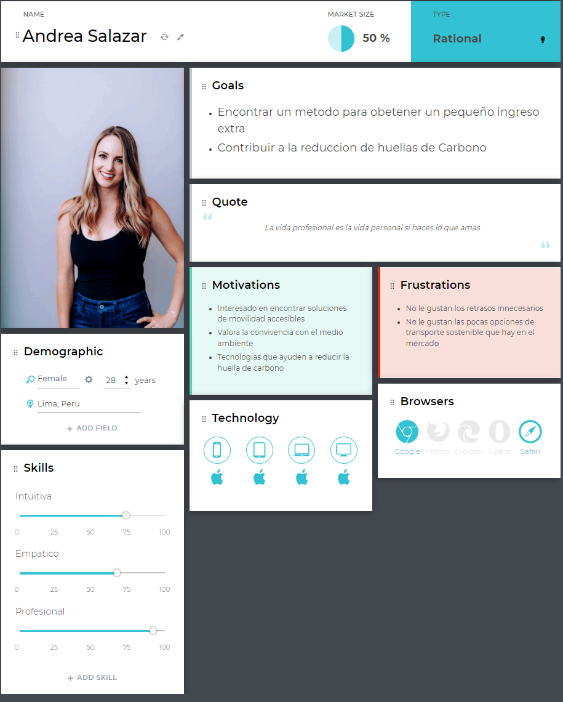
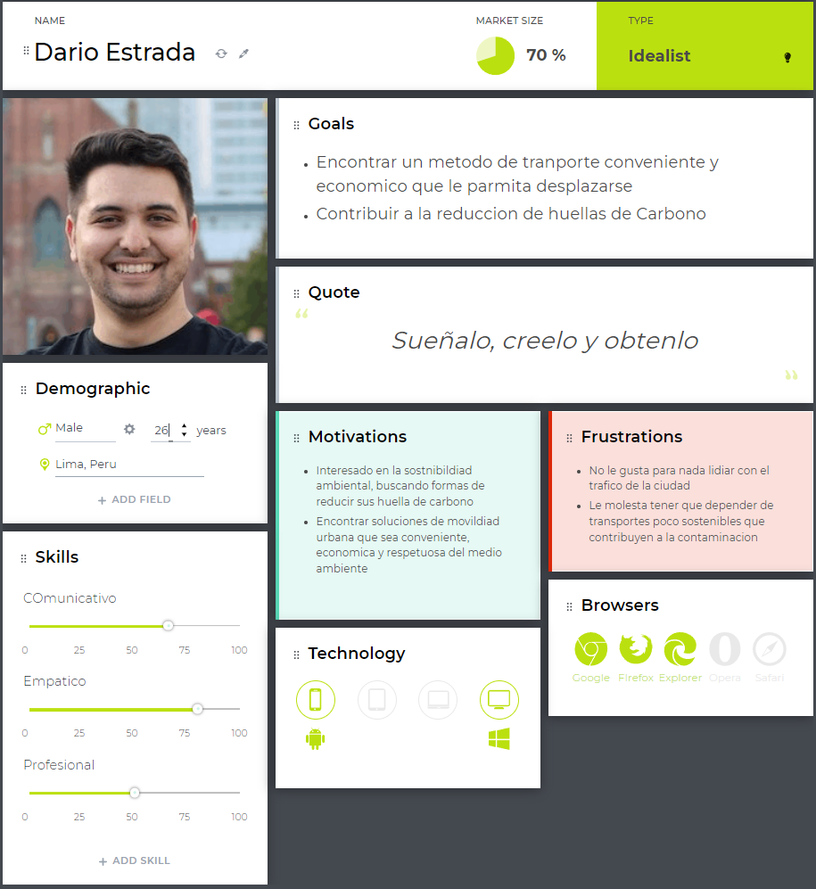
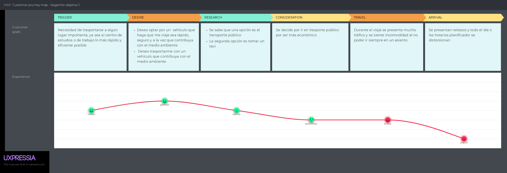
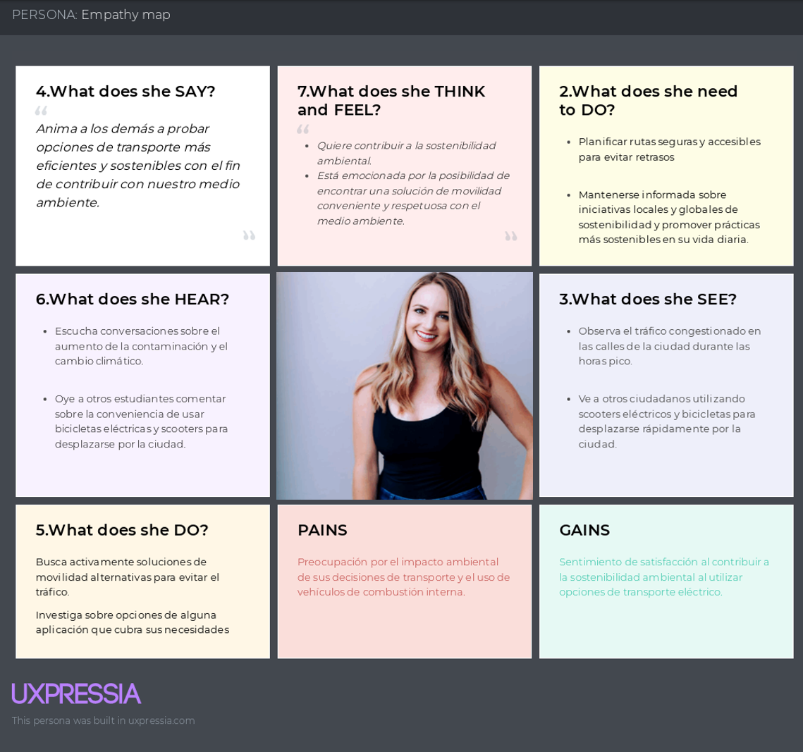
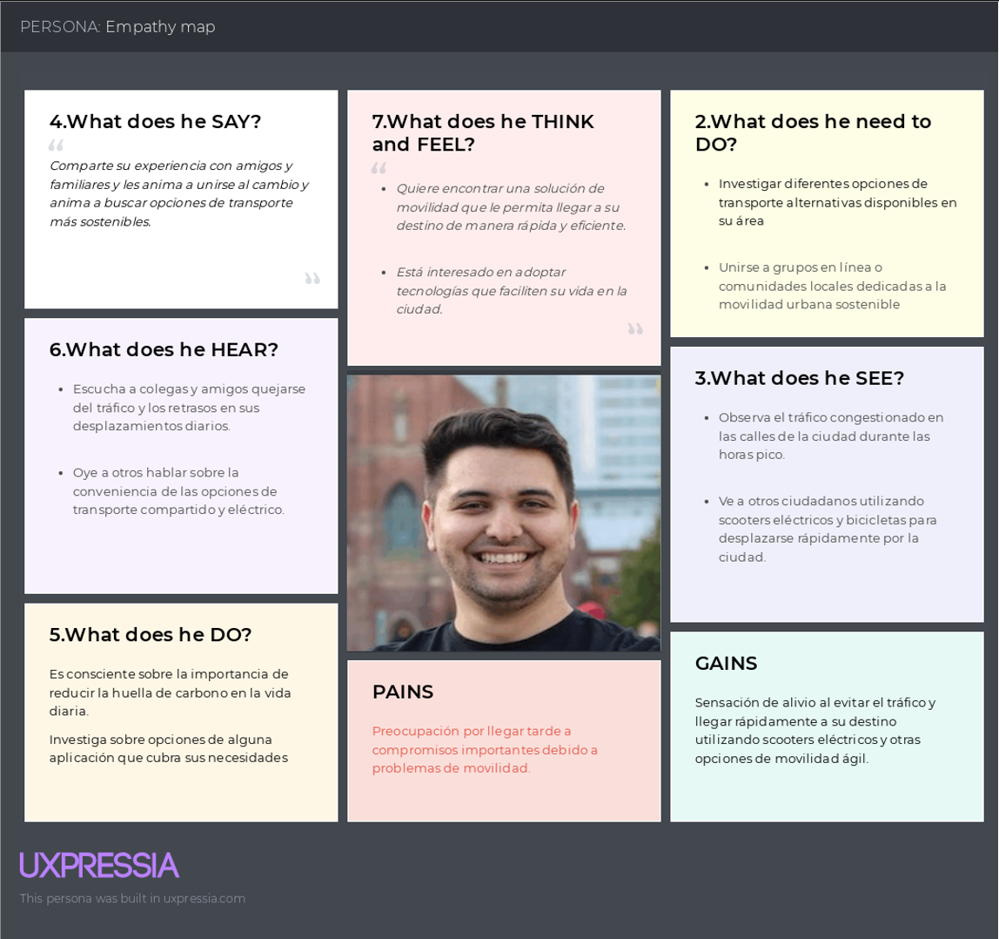
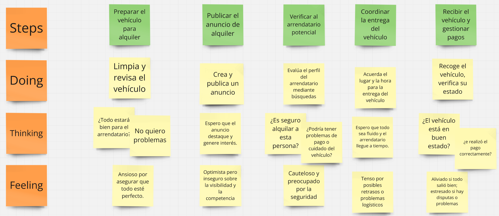
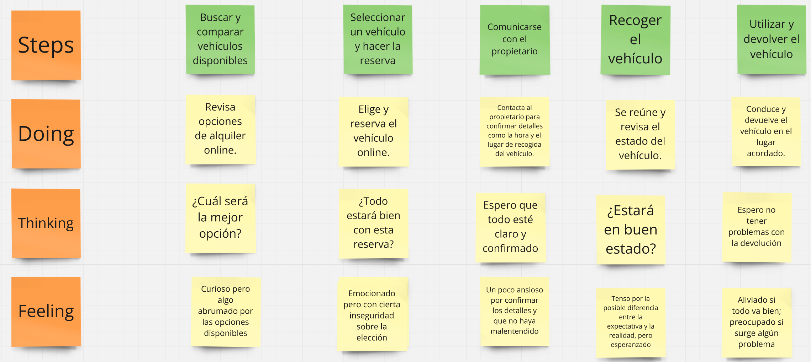

# Capítulo II: Requirements Elicitation & Analysis
## 2.1. Competidores

### 2.1.1. Análisis competitivo
<table>
    <thead>
    <tr>
    <th colspan= 6>Competitive Analysis Landscape</th>
    </tr>
        <tr>
    <th colspan= 6>El objetivo del análisis fue examinar y elaborar estrategias de mercado que nos permitan competir eficazmente tanto con nuestros competidores directos como con aquellos que influyen de manera indirecta en nuestro mercado.</th>
    </tr>
        <tr>
    <th colspan= 6>¿Cuáles podrían ser las estrategias efectivas para diferenciar y destacar nuestra aplicación 'GreenMove' en el mercado de manera que facilite e incentive el uso de transporte sostenible y la reducción de la huella de carbono en áreas urbanas? </th>
    </tr>
        <tr>
            <th colspan= 2></th>
            <th>GreenMove</th>
            <th>Grin</th>
            <th>Bee</th>
            <th>Uber Green</th>
        </tr>
    </thead>
    <tbody>
        <tr>
            <td rowspan=2 align="center">Perfil</td>
            <td align="center">Overview</td>
            <td align="center">GreenMove es una plataforma de transporte compartido con vehículos eléctricos, sostenible y futurista. La cual ofrece una idea novedosa que permite la concientización de las personas con el medio ambiente.</td>
            <td align="center">Grin es una plataforma de movilidad que permite a los usuarios alquilar patinetes eléctricos en varias ciudades de América Latina, facilitando un transporte urbano ágil y ecológico.</td>
            <td align="center">Bee es una aplicación de micromovilidad que se centra en la disponibilidad de bicicletas y scooters eléctricos en áreas urbanas, promoviendo una movilidad sostenible y accesible para todos.</td>
            <td align="center">Awto es una aplicación que ofrece el alquiler de vehículos, incluyendo modelos eléctricos e híbridos, en ciudades seleccionadas de América Latina, brindando una opción flexible y respetuosa con el medio ambiente para desplazarse.</td>
        </tr>
        <tr>
            <td align="center">Ventaja competitiva ¿Qué valor ofrece a los clientes?</td>
            <td align="center">GreenMove ofrece tarifas diferenciadas basadas en la duración del alquiler, la distancia recorrida y el tipo de vehículo eléctrico, junto con membresías, publicidad colaborativa y programas de fidelización.</td>
            <td align="center">Grin se destaca por su enfoque en la micromovilidad urbana, ofreciendo una alternativa rápida y ecológica para desplazarse en ciudades congestionadas.</td>
            <td align="center">Bee destaca por su enfoque en la accesibilidad, con una red extensa de estaciones de bicicletas y scooters eléctricos, facilitando el acceso a la movilidad sostenible para usuarios en áreas urbanas.</td>
            <td align="center">Awto se diferencia por su variedad de vehículos y sus opciones flexibles de alquiler, incluyendo tarifas por minuto, hora o día. Su enfoque en la sostenibilidad y la disponibilidad de vehículos eléctricos e híbridos lo hacen atractivo para usuarios conscientes del medio ambiente.</td>
        </tr>
        <tr>
            <td rowspan= 5 align="center">Perfil de Marketing</td>
            <td align="center">Mercado Objetivo</td>
            <td align="center">El mercado objetivo de GreenMove son los residentes urbanos conscientes del medio ambiente, los turistas preocupados por la sostenibilidad y las empresas comprometidas con la reducción de su huella de carbono.</td>
            <td align="center">Grin tiene como mercado objetivo a los residentes urbanos y turistas en ciudades latinoamericanas que buscan opciones de transporte rápido y ecológico para distancias cortas.</td>
            <td align="center">Bee se dirige a usuarios urbanos que buscan una alternativa de transporte eficiente y ecológica en sus desplazamientos diarios, especialmente en áreas con alta congestión vehicular.</td>
            <td align="center">Awto se enfoca en usuarios urbanos y viajeros que necesitan una solución de transporte flexible y sostenible, con una fuerte presencia en ciudades seleccionadas de América Latina.</td>
        </tr>
        <tr>
            <td align="center">Estrategias de Marketing</td>
            <td align="center">GreenMove implementa campañas de publicidad digital dirigidas a usuarios urbanos y turistas, colaboraciones con empresas locales para promocionar la sostenibilidad y eventos especiales para aumentar la visibilidad de la plataforma.</td>
            <td align="center">Grin utiliza publicidad en redes sociales y eventos urbanos para promocionar el uso de sus patinetes eléctricos, destacando su conveniencia y su impacto positivo en el medio ambiente.</td>
            <td align="center">Bee se apoya en campañas locales que resaltan la conveniencia y el impacto ecológico de su servicio, además de fomentar una comunidad activa de usuarios que apoyan la movilidad verde.</td>
            <td align="center">Awto emplea campañas de marketing digital, publicidad colaborativa con empresas comprometidas con la movilidad sostenible, y promociones especiales para atraer a usuarios conscientes del medio ambiente.</td>
        </tr>
        <tr>
            <td align="center">Productos & servicios</td>
            <td align="center">Los productos y servicios ofrecidos por GreenMove incluyen el alquiler de vehículos eléctricos con tarifas diferenciadas, membresías con beneficios exclusivos, opciones de publicidad colaborativa, programas de fidelización, así como servicios adicionales como alquiler de accesorios y seguros premium.</td>
            <td align="center">Grin ofrece alquiler de patinetes eléctricos con tarifas por minuto, disponibles a través de su aplicación móvil, brindando una solución ágil para el tráfico urbano en las ciudades donde opera.</td>
            <td align="center">Bee proporciona alquiler de bicicletas y scooters eléctricos, con estaciones disponibles en múltiples ubicaciones urbanas, y una interfaz sencilla para reservar vehículos a través de su aplicación móvil.</td>
            <td align="center">Awto ofrece una variedad de vehículos, incluidos eléctricos e híbridos, para alquiler con tarifas por minuto, hora o día, así como opciones de suscripción para usuarios frecuentes.</td>
        </tr>
        <tr>
            <td align="center">Precios & Costos</td>
            <td align="center">GreenMove establece tarifas variables basadas en la duración del alquiler, la distancia recorrida y el tipo de vehículo, con membresías y suscripciones disponibles.</td>
            <td align="center">Grin ofrece tarifas por minuto para el alquiler de sus patinetes eléctricos, con la opción de paquetes de tiempo que permiten a los usuarios ahorrar en viajes más largos. Las tarifas son competitivas en el mercado latinoamericano.</td>
            <td align="center">Bee implementa un modelo de precios accesible con tarifas por minuto y paquetes de tiempo, diseñados para ser asequibles y fomentar el uso recurrente de sus servicios de micromovilidad.</td>
            <td align="center">Awto ofrece precios flexibles basados en la duración del alquiler, con opciones de tarifas por minuto, hora o día. Las membresías están disponibles para quienes utilizan el servicio con frecuencia.</td>
        </tr>
        <tr>
            <td align="center">Canales de distribución (Web y/o móvil)</td>
            <td align="center">La distribución de GreenMove se realiza a través de su plataforma web y su aplicación móvil, disponible tanto para Android como iOS, asegurando una experiencia fluida para los usuarios.</td>
            <td align="center">Grin distribuye su servicio a través de su aplicación móvil para Android e iOS, facilitando el acceso rápido a sus patinetes eléctricos en las ciudades donde opera.</td>
            <td align="center">Bee utiliza una aplicación móvil, que puede usarse tanto en Android como en iOS, para facilitar el acceso a bicicletas y scooters eléctricos en áreas urbanas.</td>
            <td align="center">Awto distribuye su servicio a través de su aplicación móvil y sitio web, con una interfaz intuitiva que permite a los usuarios encontrar y reservar vehículos de manera eficiente.</td>
        </tr>
        <tr>
            <th colspan= 2></th>
            <th>GreenMove</th>
            <th>Grin</th>
            <th>Bee</th>
            <th>Awto</th>
        </tr>
        <tr>
            <td rowspan= 4 align="center">Análisis SWOT</td>
            <td align="center">Fortalezas</td>
            <td align="center">Las fortalezas de GreenMove incluyen su enfoque en la sostenibilidad, las tarifas diferenciadas y las membresías para incentivar el uso recurrente, las colaboraciones con empresas locales y marcas para aumentar la visibilidad, y los programas de fidelización para mejorar la retención de usuarios.</td>
            <td align="center">La amplia cobertura en América Latina y los precios competitivos son las principales fortalezas de Grin. Además, su interfaz intuitiva y promociones especiales atraen a una amplia base de usuarios.</td>
            <td align="center">Bee se distingue por su enfoque en ofrecer una solución de movilidad ecológica a través de una flota variada de bicicletas y scooters eléctricos. Además, su capacidad para establecer alianzas estratégicas y su atención personalizada al cliente son también aspectos clave.</td>
            <td align="center">Awto se destaca por ofrecer una opción flexible de carsharing, con vehículos eléctricos e híbridos disponibles para alquiler por horas o días. Su enfoque en la sostenibilidad y su cobertura en ciudades de Latinoamérica son puntos clave.</td>
        </tr>
        <tr>
            <td align="center">Debilidades</td>
            <td align="center">Entre las debilidades de GreenMove se encuentran la necesidad de aumentar la base de usuarios y la dependencia de la infraestructura de carga, así como la competencia en un mercado emergente.</td>
            <td align="center">Las debilidades de Grin incluyen problemas ocasionales de disponibilidad de vehículos en áreas congestionadas y la competencia con otras plataformas de movilidad urbana.</td>
            <td align="center">Bee enfrenta retos en la expansión de su infraestructura, particularmente en la creación de más estaciones físicas en ciudades donde aún no tiene presencia significativa, reteniendo su accesibilidad y crecimiento.</td>
            <td align="center">Awto puede verse limitado por la disponibilidad de vehículos en algunas zonas y por la competencia con servicios más establecidos en el mercado de movilidad compartida.</td>
        </tr>
        <tr>
            <td align="center">Oportunidades</td>
            <td align="center">Las oportunidades de GreenMove incluyen la expansión a nuevas ciudades y la creación de alianzas estratégicas con empresas que compartan su visión de sostenibilidad. Además, el creciente interés en la movilidad sostenible ofrece un entorno favorable para el crecimiento.</td>
            <td align="center">Grin tiene oportunidades para expandirse a nuevas ciudades y mercados, así como para desarrollar nuevas funciones en su aplicación para mejorar la experiencia del usuario y diferenciarse de la competencia.</td>
            <td align="center">Las oportunidades de Bee incluyen las variadas de sus servicios y la optimización de su red de estaciones. Además, la creciente demanda de opciones de transporte limpio y su capacidad de adaptación al mercado local presentan un fuerte potencial de expansión.</td>
            <td align="center">Awto puede aprovechar el creciente interés en la movilidad compartida para expandirse a nuevas ciudades y ofrecer nuevas opciones de vehículos, incluyendo más modelos eléctricos y híbridos.</td>
        </tr>
        <tr>
            <td align="center">Amenazas</td>
            <td align="center">Entre las amenazas para GreenMove se encuentran la competencia con otras plataformas de movilidad, los cambios en las regulaciones locales que podrían afectar su operación y las fluctuaciones en la demanda de servicios de movilidad compartida.</td>
            <td align="center">Las amenazas para Grin incluyen la competencia intensa en el mercado de movilidad urbana y los cambios regulatorios en diferentes ciudades que podrían afectar su operación.</td>
            <td align="center">Bee enfrenta la amenaza de un mercado cada vez más competitivo y los posibles cambios en la normativa local que podrían afectar su modelo de negocio, especialmente en ciudades donde opera con una menor presencia.</td>
            <td align="center">Awto enfrenta amenazas similares a las de otras plataformas de movilidad compartida, incluyendo la competencia y los cambios en las regulaciones locales que podrían afectar su operación.</td>
        </tr>
    </tbody>
</table>

### 2.1.2. Estrategias y tácticas frente a competidores

# Estrategias y Tácticas para GreenMove

Para que GreenMove se consolide como el líder en el mercado de alquiler de vehículos eléctricos, es crucial desarrollar un conjunto de estrategias y tácticas que diferencien sus servicios y proporcionen un valor agregado a los clientes.

## Innovación y Tecnología

GreenMove debe priorizar el desarrollo tecnológico, incorporando avances en la movilidad urbana y en la sostenibilidad. Esto incluye la creación de soluciones que no solo se adapten a las necesidades actuales del mercado, sino que también puedan anticiparse a las futuras tendencias en movilidad eléctrica, garantizando un servicio ágil y con alto valor añadido.

## Alianzas Estratégicas

Es esencial establecer alianzas con entidades públicas y privadas, como gobiernos municipales, universidades y empresas que promuevan la movilidad sostenible. Estas alianzas permitirán a GreenMove implementar proyectos piloto en nuevas áreas urbanas, integrándose de manera efectiva en las comunidades locales y contribuyendo a la reducción de emisiones de carbono.

## Experiencia del Usuario

Mejorar la experiencia del usuario es también una prioridad, a través de una interfaz intuitiva y la incorporación de funciones adicionales, como rutas personalizadas, información sobre estaciones de carga y eventos relacionados con la movilidad sostenible en tiempo real, creando una experiencia de usuario única.

## Comercialización y Retención

En cuanto a la comercialización, GreenMove debe centrarse en promociones y campañas que fomenten la movilidad sostenible,  utilizando campañas educativas y promociones que incentiven el uso continuo. Es crucial realizar estudios de mercado e identificar áreas urbanas con alta demanda de vehículos eléctricos para impulsar el crecimiento de la empresa. Además, la fidelización de usuarios a través de incentivos como créditos por uso compartido y recompensas por reducción de emisiones puede asegurar un crecimiento sostenido.

## Seguridad

Para asegurar la seguridad de GreenMove, se implementará una robusta estrategia de seguridad basada en la metodología DevSecOps:

**Autenticación Multifactor:** GreenMove implementará la autenticación multifactor (MFA) para garantizar que solo usuarios autorizados puedan acceder a la aplicación. Esto añadirá una capa extra de seguridad, reduciendo significativamente el riesgo de acceso no autorizado y protegiendo la información de los usuarios.

- **Pruebas de Seguridad Automatizadas:** La implementación de pruebas de seguridad automatizadas en el proceso de desarrollo de GreenMove asegurará que la aplicación esté protegida contra vulnerabilidades conocidas y desconocidas, fortaleciendo así la seguridad de los datos y la privacidad de los usuarios.

- **Monitoreo Continuo:** GreenMove utilizará herramientas de monitoreo en tiempo real para detectar cualquier actividad sospechosa, permitiendo una intervención rápida y efectiva para minimizar riesgos y asegurar la continuidad del servicio.

## 2.2. Entrevistas

### 2.2.1. Diseño de entrevistas

En esta sección se han definido unas preguntas para nuestros segmentos objetivos, con la finalidad de obtener información que nos ayudara con opiniones o descripciones para el desarrollo de nuestra aplicación.

#### Preguntas sobre la información del entrevistado:
- ¿Cuál es su nombre?
- ¿Cuántos años tiene?
- ¿Cuál es su estado civil?
- ¿A que se dedica actualmente?
- ¿Qué dispositivos electrónicos utiliza?

#### Preguntas para el segmento Owner:

- ¿Tiene algún tipo de vehiculo en su hogar?¿Cuáles son?
- ¿Alguna vez ha puesto en alquiler algún vehículo suyo?
- ¿Conoce de otras personas que han alquilado o puesto en alquiler algún vehículo para movilizarse?
- ¿Ha utilizado alguna aplicacion para alquilar vehiculos?
- ¿Estaría interesado en utilizar una aplicación para alquilar sus vehículos?
- ¿Què caracteristicas les gustaría ver en este tipo de aplicaciones?

#### Preguntas para el segmento User:

- ¿A que lugares usted suele recurrir?
- ¿Con qué medio de transporte se dirige a esos lugares?
- ¿Cuánto suele ser el monto que gasta al movilizarse con un medio de transporte?
- ¿Cuánto suele demorar estos trayectos?
- ¿Alguna vez ha alquilado algún vehiculo?
- ¿Conoce alguna aplicación que alquila vehículos?
- ¿Estaría interesado en utilizar una aplicación de alquiler de vehículos?
- ¿Què caracteristicas les gustaría ver en este tipo de aplicaciones?

### 2.2.2. Registro de entrevistas

**Segmento Objetivo 1:**

**Entrevista 1**

**Entrevistador:** Eduard Gedeon Travezaño Patiño

**Entrevistado:** Marco Aurelio Junior Chavez

Captura:

**Resumen:** El entrevistado, Marco, tiene un automóvil y una bicicleta, pero nunca los ha alquilado. Conoce personas que han utilizado aplicaciones de alquiler y estaría interesado en hacerlo si la aplicación ofrece seguridad, seguro contra daños y es fácil de usar.

**Entrevista 2**

**Entrevistador:** Fabio Horna Silva

**Entrevistado:** Salomon Zegarra moreno

Captura:

**Resumen:**
En la entrevista Salomon que cuenta con una Laptop y celular cuenta con un vehiculo que utilzia para movilizarse, este vehiculo es de uso personal y no ha alquidado este vehiculo, sin embargo ha alquilado vehiculos para actividades como viajes ademas en su circuloc ercano no sabe de nadie que haya alquilado a su vehiculo. Por ultimo Salomon destaca la sencilles y el agrado de poder contar con una aplicacion que facilite el tramite de alquiler de estos vehiculos.

**Entrevista 3**

**Entrevistador:**

**Entrevistado:**

Captura:

**Resumen:**

**Semento Objetivo 2:**

**Entrevista 4**

**Entrevistador:** Eduard Gedeon Travezaño Patiño

**Entrevistado:** Francisco Hilder Ruiz Perez

Captura: 

**Resumen:**
Hilder utiliza un smartphone y se desplaza principalmente en transporte público o aplicaciones de taxi. Aunque nunca ha alquilado un vehículo, estaría interesado en usar una aplicación que ofrezca alquileres seguros, con precios competitivos y disponibilidad amplia.

**Entrevista 5**

**Entrevistador:** Fabio Horna Silva

**Entrevistado:** Anderson Velazques

Captura:

Resumen:
Ander es un Joven que trabaja y estudia, como estudiante activo tiene varios dispositvos electronicos a su disposicion, para movilizarse Anderson utilzia transporte publico o taxis dependiendo de la severidad de su horario y su disponibilidad de llegada a sus clases o trabajo. Anderson dice estar interesado en alquilar autos mediante una plataforma ya que le facilitaria la movilidad.

**Entrevista 6**

**Entrevistador:** Yair Christofer Aru Acevedo

**Entrevistado:** Aldhair Valenzuela

Captura:

**Resumen:**

### 2.2.3. Análisis de entrevistas

## 2.3. Needfinding

En la sección de Needfinding, se emplean diversas herramientas como UXPressia, LucidChart y Miro para identificar y comprender las necesidades, comportamientos y emociones de los usuarios potenciales mediante la creación de User Personas, User Task Matrix, User Journey Maps, Empathy Maps y As-Is Scenario Maps. Estos artefactos ayudan a capturar una visión detallada de los usuarios, sus objetivos, tareas y experiencias actuales sin la solución propuesta, lo que permite diseñar un producto alineado con sus expectativas reales. Además, se incluye un glosario de términos del dominio de negocio, garantizando una comunicación clara y coherente entre todos los miembros del equipo.

### 2.3.1. User Personas

Se presentan los perfiles de los Owners y los Clientes que utilizarán nuestra plataforma de alquiler de vehículos eléctricos. Estos perfiles son fundamentales para comprender sus necesidades específicas y diseñar una solución que facilite el acceso a opciones de transporte sostenibles y rentables, mejorando su experiencia de movilidad urbana.

Segmento 1: Owner (Dueños de vehiculos)

Segmento 2: CLientes 

### 2.3.2. User Task Matrix

En esta sección se presenta el User Task Matrix para la plataforma de alquiler de vehículos eléctricos, considerando dos segmentos de usuarios: **Owners (Propietarios de Vehículos Eléctricos)** y **Clientes (Usuarios de Vehículos Eléctricos)**. Las tareas están ordenadas de manera que cada segmento pueda entender sus prioridades y necesidades.

| **Tareas**                             | **Owner (Propietarios de Vehículos Eléctricos)** |                       | **Cliente (Usuarios de Vehículos Eléctricos)** |                       |
|-----------------------------------------|--------------------------------------------------|-----------------------|------------------------------------------------|-----------------------|
|                                         | **Frecuencia**                                   | **Importancia**       | **Frecuencia**                                 | **Importancia**       |
| **Definir precios de alquiler**             | _A veces_                                          | **Alta**              | ~~Nunca~~                                      | ~~Sin Importancia~~   |
| **Realizar una reserva de vehículo**        | ~~Nunca~~                                            | ~~Sin Importancia~~   | **Siempre**                                    | **Alta**              |
| **Evaluar la disponibilidad del vehículo**  | _A veces_                                          | _Media_               | ~~Nunca~~                                      | ~~Sin Importancia~~   |
| **Revisar pagos y comisiones**              | **Casi siempre**                                   | **Alta**              | ~~Nunca~~                                      | ~~Sin Importancia~~   |
| **Buscar y comparar vehículos disponibles** | ~~Nunca~~                                            | ~~Sin Importancia~~   | **Siempre**                                    | **Alta**              |
| **Contactar al propietario del vehículo**   | ~~Nunca~~                                            | ~~Sin Importancia~~   | **Casi siempre**                               | _Media_               |
| **Devolver el vehículo al final del alquiler** | ~~Nunca~~                                          | ~~Sin Importancia~~   | **Siempre**                                    | **Alta**              |
| **Gestionar reservas y disponibilidad**     | **Siempre**                                        | **Alta**              | ~~Nunca~~                                      | ~~Sin Importancia~~   |
| **Revisar opciones de seguros**             | ~~Nunca~~                                            | ~~Sin Importancia~~   | _A veces_                                      | _Media_               |
| **Verificar el historial del arrendatario** | **Casi siempre**                                   | **Alta**              | ~~Nunca~~                                      | ~~Sin Importancia~~   |
| **Evaluar costos y beneficios del alquiler**| ~~Nunca~~                                            | ~~Sin Importancia~~   | _A veces_                                      | **Alta**              |
| **Crear un perfil de vehículo**             | **Siempre**                                        | **Alta**              | ~~Nunca~~                                      | ~~Sin Importancia~~   |

- **Tareas con Mayor Frecuencia e Importancia para los Owners:**
  - Tareas como **Gestionar reservas y disponibilidad** y **Crear un perfil de vehículo** son realizadas con **Siempre** y tienen **Alta** importancia, ya que son esenciales para mantener la operatividad y optimización del proceso de alquiler.
  - **Verificar el historial del arrendatario** y **Revisar pagos y comisiones** se realizan **Casi siempre** y también son de **Alta** importancia debido a la necesidad de seguridad y control financiero.

- **Tareas con Mayor Frecuencia e Importancia para los Clientes:**
  - **Buscar y comparar vehículos disponibles**, **Realizar una reserva de vehículo**, y **Devolver el vehículo al final del alquiler** son tareas realizadas con **Siempre** y son de **Alta** importancia, pues representan las etapas claves en la experiencia del cliente.
  - **Contactar al propietario del vehículo** es realizado **Casi siempre** y tiene _Media_ importancia para resolver dudas o coordinar detalles específicos del alquiler.

- **Principales Diferencias:**
  - Los **Owners** se enfocan en la **gestión continua** y la **seguridad del proceso**, mientras que los **Clientes** están más interesados en **seleccionar** y **utilizar** los vehículos.

- **Coincidencias:**
  - Ambos grupos valoran la **transparencia y seguridad** durante el alquiler. Los **Owners** se enfocan en la verificación del arrendatario, mientras que los **Clientes** buscan opciones de seguros que les brinden confianza.

### 2.3.3. User Journey Mapping
Este gráfico ilustra cómo los usuarios interactúan con nuestra solución a lo largo del tiempo, resaltando tanto las experiencias clave como las oportunidades de mejora. Este análisis detallado permite asegurar que la solución esté perfectamente alineada con los flujos de trabajo de los usuarios y responda de manera efectiva a sus necesidades, mejorando así su experiencia general.

### 2.3.4. Empathy Mapping
Mediante este gráfico de **Empathy Mapping**, se reflejan las percepciones, pensamientos y sentimientos de los usuarios al interactuar con nuestra plataforma de alquiler de vehículos eléctricos. Este análisis nos permite comprender de manera más profunda sus experiencias, expectativas y desafíos, lo cual es fundamental para diseñar una solución más alineada con sus necesidades y que ofrezca una experiencia de usuario mejorada y centrada en el cliente.

Segmento 1: Owner (Dueños de vehiculos)

Segmento 2: CLientes 

### 2.3.5. As-is Scenario Mapping
Se describen los procesos actuales de los usuarios antes de la implementación de nuestra solución. Esto nos permite identificar ineficiencias y oportunidades para mejorar la gestión del alquiler de vehículos eléctricos y optimizar la experiencia de movilidad urbana con nuestra tecnología.

Segmento 1: Owner (Dueños de vehiculos)

Segmento 2: CLientes 

## 2.4. Ubiquitous Language

En esta sección, se definen los términos clave utilizados en el dominio de negocio de la plataforma de alquiler de vehículos eléctricos, siguiendo el enfoque de **Ubiquitous Language** propuesto por Eric Evans en *Domain-Driven Design*. Estas definiciones tienen como objetivo garantizar una comunicación clara y coherente entre los miembros del equipo y stakeholders, alineando el lenguaje del negocio con los objetivos y necesidades del proyecto.

1. **Owner (Propietario):** Persona que posee un vehículo eléctrico y lo pone en alquiler a través de la plataforma. El propietario puede establecer precios, definir la disponibilidad del vehículo y aceptar o rechazar reservas.

2. **Client (Arrendatario):** Usuario que alquila un vehículo eléctrico mediante la plataforma para uso temporal. Debe cumplir con los términos de alquiler establecidos por el propietario y la plataforma.

3. **Booking (Reserva):** Acción de reservar un vehículo eléctrico para un período de tiempo específico. Incluye seleccionar el vehículo, elegir las fechas, y confirmar el pago.

4. **Vehicle Availability (Disponibilidad del Vehículo):** Estado que indica si un vehículo está disponible para ser alquilado en un momento determinado. Es gestionado por el propietario en la plataforma.

5. **Rental Agreement (Contrato de Alquiler):** Documento que detalla los términos y condiciones del alquiler, como duración, costo y responsabilidades de ambas partes. Se genera automáticamente cuando se confirma una reserva.

7. **User Rating (Calificación de Usuario):** Sistema de puntuación que permite a propietarios y arrendatarios evaluarse mutuamente después de cada alquiler. Ayuda a construir confianza dentro de la plataforma.

8. **Drop-off Location (Ubicación de Entrega):** Lugar donde el arrendatario debe devolver el vehículo al finalizar el alquiler. Puede ser un punto acordado o un lugar designado por el propietario.

10. **Cancellation Policy (Política de Cancelación):** Reglas que establecen los términos para cancelar una reserva y los posibles cargos asociados. Las políticas son visibles antes de confirmar una reserva.

