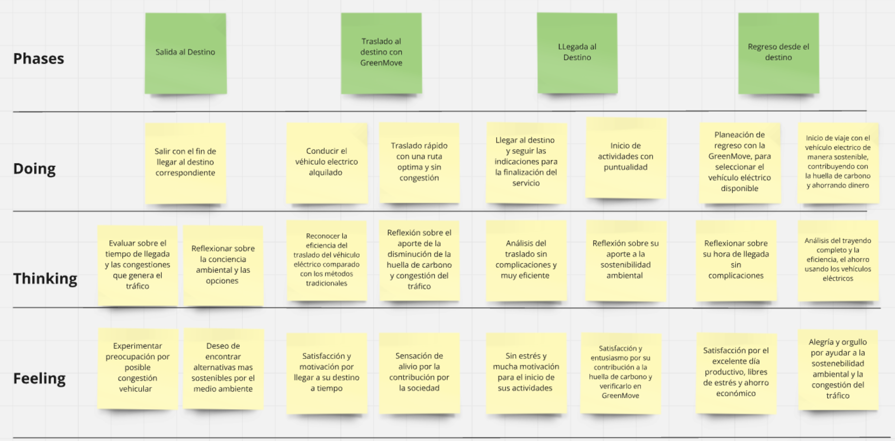
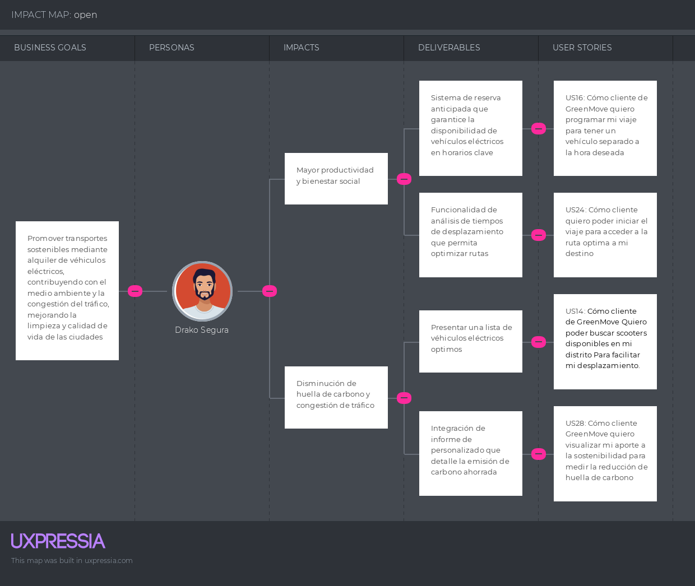

---
# Capítulo III: Requirements Specification
## 3.1. To-Be Scenario Mapping

Describiremos los escenarios To-Be para los dos segmentos correspondientes, owners que quieran alquilar sus vehículos eléctricos y clientes con conciencia ambiental que desean una mayor productividad. Estos escenarios representan la situación futura al usar la aplicación GreenMove para trasladarse a las oficinas de su trabajo. Con ello, analizaremos los beneficios que tendran los usuarios de GreenMove  y se destacará las áreas donde se genera un impacto positivo significativo para la calidad de transporte y vida

**Segmento 1: Owner**

**Segmento 2: User**

## 3.2. User Stories

<table >
    <tr>
        <th>Epic / Story ID</th>
        <th>Título</th>
        <th>Descripción</th>
        <th>Criterios de Aceptación</th>
        <th>Relacionado con (Epic ID)</th>
    </tr>
    <tr>
        <td>EP01</td>
        <td>Landing page para la aplicacion GreenMove</td>
        <td><b>Como</b> Owner/Cliente GreenMove <b>Quiero</b> ingresar una landing page <b>Para</b> informarme sobre la aplicación y su equipo de desarrollo.</td>
        <td>No corresponde</td>
        <td>No corresponde</td>
    </tr>
    <tr>
        <td>EP02</td>
        <td>Gestión de cuenta de usuario</td>
        <td><b>Como</b> Owner/Cliente de GreenMove <b>Quiero</b> crear, visualizar, eliminar y editar mi cuenta <b>Para</b> tener mis datos actualizados y comenzar a hacer uso de la aplicación correctamente.</td>
        <td>No corresponde</td>
        <td>No corresponde</td>
    </tr>
    <tr>
        <td>EP03</td>
        <td>Gestión de vehículos en alquiler</td>
        <td><b>Como</b> Owner en GreenMove <b>Quiero</b> agregar y gestionar mis vehículos <b>Para</b> asegurarme que estén disponibles y en buen estado para el alquiler.</td>
        <td>No corresponde</td>
        <td>No corresponde</td>
    </tr>
    <tr>
        <td>EP04</td>
        <td>Gestión de reservas</td>
        <td><b>Como</b> cliente de GreenMove <b>Quiero</b> gestionar mis reservas y el uso de vehículos <b>Para</b> planificar y controlar mis alquileres. </td>
        <td>No corresponde</td>
        <td>No corresponde</td>
    </tr>
    <tr>
        <td>EP05</td>
        <td>Gestionar historial de reservas</td>
        <td><b>Cómo</b> Cliente de GreenMove <b>Quiero</b> poder ver el historial completo de las reservas realizadas<b> Para</b> acceder a la información de estos de manera sencilla.
        <b>Y</b> tener un control de mi historial</td>
        <td>No corresponde</td>
        <td>No corresponde</td>
    </tr>
    <tr>
        <td>EP06</td>
        <td>Gestión de planes</td>
        <td><b>Cómo</b> cliente de GreenMove <b>Quiero</b> tener una gestión y control de mi plan <b>Para</b> poder adquirirlo y coancelarlo cuando lo requiera</td>
        <td>No corresponde</td>
        <td>No corresponde</td>
    </tr>
    <tr>
        <td>EP07</td>
        <td>Implementaciones técnica</td>
        <td><b>Cómo</b> desarrollador <b>Quiero</b> tener una gestión y control de cambios de la página <b>Para</b> poder brindar mejoras continuas a la aplicación web</td>
        <td>No corresponde</td>
        <td>No corresponde</td>
    </tr>
    <tr>
        <td>US01</td>
        <td>Descripción de la aplicación</td>
        <td><b>Como</b> visitante de la landing page
        <b>Quiero</b> visualizar una descripción del producto ofrecido
        <b>Para</b> conocer los beneficios que puedo adquirir mediante el uso de la aplicación.</td>
        <td>
            <b>Scenario 1: Visualizar sección Home</b>  
            <b>Dado que</b> el visitante ingresa a la página 
            <b>Cuando</b>la página cargue  
            <b>Entonces</b> se muestra una sección llamativa que anime al usuario a usar la aplicación. 
             
            <b>Scenario 2: Acceder a la sección "Services"</b>  
            <b>Dado que</b> el visitante se encuentre dentro de la landing page 
            <b>Cuando</b> navegue hasta la sección “Services”  
            <b>Entonces</b> se muestra información sobre los servicios que ofrece GreenMove  
             
            <b>Scenario 3: Explorar la sección "Pricing"</b>  
            <b>Dado que</b> el visitante se encuentre dentro de la landing page 
            <b>Cuando</b> navegue hasta la sección “Pricing”  
            <b>Entonces</b> se muestra la información relacionada a los planes de pago que se ofrecen y cuáles son los beneficios de cada uno de estos. 
        <td>EP01</td>
    </tr>
    <tr>
        <td>US02</td>
        <td>Descripción de la startup</td>
        <td><b>Cómo</b> visitante interesado 
        <b>Quiero</b> ver una descripción clara de la startup
        <b>Para</b> conocer a sus integrantes y su propósito como startup</td>
        <td>
            <b>Scenario 1: Acceder a la sección "About us</b>  
            <b>Dado que</b> el visitante se encuentre dentro de la landing page  
            <b>Cuando</b> navegue hasta la sección “About Us”  
            <b>Entonces</b> se muestra información importante sobre la startup.  
             
            <b>Scenario 2: Conocer al equipo en "About The Team"</b>  
            <b>Dado que</b> el visitante se encuentre dentro de la landing page  
            <b>Cuando</b> navegue hasta la sección “About The Team” 
            <b>Entonces</b> se muestra la información correspondiente a los videos about the project y about the team, además de la información de cada uno de los miembros. 
        <td>EP01</td>
    </tr>
    <tr>
        <td>US03</td>
        <td>Acceder a la aplicación desde la landing page </td>
        <td><b>Cómo</b> visitante de la landing page 
        <b>Quiero</b> poder acceder a la aplicación GreenMove desde la landing page
        <b>Para</b> comenzar a utilizar las funcionalidades ofrecidas</td>
        <td>
            <b>Scenario 1: Usuario ingresa a aplicación</b>  
            <b>Dado que</b> el visitante se encuentra en la landing page  
            <b>Cuando</b> seleccione la opción que permite el acceso al software elaborado 
            <b>Entonces</b> es redirigido a la aplicación desplegada 
             
            <b>Scenario 2: Fallo en el acceso a la aplicación</b>  
            <b>Dado que</b> el visitante se encuentre en la landing page  
            <b>Cuando</b> seleccione la opción que permite el acceso al software elaborado y ocurra un error en el proceso de redirección 
            <b>Entonces</b> el usuario obtiene un mensaje de error. 
        <td>EP01</td>
    </tr>
    <tr>
        <td>US04</td>
        <td>Registrar usuario</td>
        <td><b>Cómo</b> visitante de la aplicación web de GreenMove
        <b>Quiero</b> poder crear una cuenta personal
        <b>Para</b> comenzar a hacer uso de la aplicación como Owner/Cliente.</td>
        <td>
            <b>Scenario 1: Usuario ingresa credenciales válidas.</b>  
            <b>Dado que</b> el visitante desee crear una cuenta personal en la aplicación GreenMove  
            <b>Cuando</b> ingrese las credenciales de una cuenta inexistente en la base de datos GreenMove, una contraseña que cumple con todos los requisitos de seguridad, su DNI real y acepte los términos y condiciones de uso  
            <b>Entonces</b> se creará la cuenta de usuario. 
             
            <b>Scenario 2: Usuario ingresa credenciales incorrectas.</b>  
            <b>Dado que</b> Usuario ingresa credenciales incorrectas.  
            <b>Cuando</b> ingrese una dirección de correo electrónico o contraseña o DNI que no cumplen con los requisitos especificados 
            <b>Entonces</b> se le denegará la operación 
        <td>EP02</td>
    </tr>
    <tr>
        <td>US05</td>
        <td>Iniciar sesión</td>
        <td><b>Cómo</b> Owner/Cliente de GreenMove
        <b>Quiero</b> iniciar sesión
        <b>Para</b> acceder a los beneficios que ofrece la aplicación.</td>
        <td>
            <b>Scenario 1: Usuario ingresa credenciales válidas </b>  
            <b>Dado que</b> el usuario posee una cuenta en la aplicación GreenMove  <b>Y</b> desee iniciar sesión  
            <b>Cuando</b> ingrese las credenciales necesarias correctamente 
            <b>Entonces</b> el sistema permitirá el acceso a la aplicación 
             
            <b>Scenario 2: Usuario ingresa credenciales incorrectas</b>  
            <b>Dado que</b> el usuario posee una cuenta en la aplicación GreenMove  <b>Y</b> desea iniciar sesión  
            <b>Cuando</b> ingrese alguna credencial de manera incorrecta  
            <b>Entonces</b> el sistema denegará la solicitud 
        <td>EP02</td>
    </tr>
    <tr>
        <td>US06</td>
        <td>Visualizar perfil de usuario</td>
        <td><b>Cómo</b> Owner/Cliente de GreenMove 
        <b>Quiero</b> visualizar mi perfil personal 
        <b>Para</b> visualizar mis datos actuales</td>
        <td>
            <b>Scenario 1: Acceder al perfil personal</b>  
            <b>Dado que</b> el usuario desee visualizar su información personal  
            <b>Cuando</b>  ingrese a su perfil  
            <b>Entonces</b> obtendrá toda la información que registró previamente 
             
            <b>Scenario 2: Problema al acceder al perfil personal </b>  
            <b>Dado que</b> el usuario desee visualizar su información personal   
            <b>Cuando</b> intente ingresar a su perfil  <b>Y</b> experimente un error de conexión o de servidor  
            <b>Entonces</b> no se visualizarán los datos del perfil  
        <td>EP02</td>
    </tr>
    <tr>
        <td>US07</td>
        <td>Cambiar datos personales </td>
        <td><b>Cómo</b> Owner/Cliente de GreenMove 
        <b>Quiero</b> cambiar los datos asociados a mi perfil
        <b>Para</b> actualizar la información</td>
        <td>
            <b>Scenario 1: Cambiar contraseña</b>  
            <b>Dado que</b> el usuario quiera cambiar su contraseña  
            <b>Cuando</b> ingrese la nueva contraseña, esta sea validada por el sistema  <b>Y</b> el usuario confirme su intención de proceder con el cambio 
            <b>Entonces</b> la nueva clave será guardada y la información actualizada. 
             
            <b>Scenario 2: Cambiar nombre</b>  
            <b>Dado que</b> el usuario quiera cambiar su nombre 
            <b>Cuando</b> ingrese el nuevo nombre, esta sea validada por el usuario  <b>Y</b> confirme su intención de proceder con el cambio  
            <b>Entonces</b> el nuevo nombre será guardado y la información actualizada 
             
            <b>Scenario 3: Cambiar foto</b>  
            <b>Dado que</b> el usuario quiera cambiar su foto  
            <b>Cuando</b> ingrese la nueva foto, esta sea validada por el usuario  <b>Y</b> confirme su intención de proceder con el cambio 
            <b>Entonces</b> la nueva foto será guardada y la información actualizada 
             
            <b>Scenario 4: Cambiar número de celular</b>  
            <b>Dado que</b> el usuario quiera cambiar su número de celular  
            <b>Cuando</b> ingrese el nuevo número, esta sea validada por el sistema  <b>Y</b> el usuario confirme su intención de proceder con el cambio  
            <b>Entonces</b> el nuevo número será guardado y la información actualizada 
             
            <b>Scenario 5: Ingreso de datos inválidos</b>  
            <b>Dado que</b> el usuario quiera cambiar su información  
            <b>Cuando</b> ingrese datos inválidos 
            <b>Entonces</b> se mostrará un mensaje de dato no válido 
             
            <b>Scenario 6: No cambiar información</b>  
            <b>Dado que</b> el usuario no quiera cambiar su información  
            <b>Cuando</b> aparezca el pop up para confirmar el cambio  <b>Y</b> seleccione la opción para cancelar cambio 
            <b>Entonces</b> el pop up desaparecerá y el cambio no se realizará 
        <td>EP02</td>
    </tr>
    <tr>
        <td>US08</td>
        <td>Eliminar cuenta de usuario</td>
        <td><b>Cómo</b> Owner/Cliente de GreenMove
        <b>Quiero</b> eliminar mi cuenta de usuario
        <b>Para</b> dejar de usar los servicios de la aplicación</td>
        <td>
            <b>Scenario 1: Owner/Cliente elimina cuenta de usuario </b>  
            <b>Dado que</b> el Owner/Cliente desee eliminar su cuenta de usuario  
            <b>Cuando</b> seleccione la opción de eliminar cuenta en su perfil  <b>Y</b> confirme su intención para proceder con la operación 
            <b>Entonces</b> el sistema eliminará la cuenta y todos los datos almacenados.  
             
            <b>Scenario 2: Owner/Cliente no elimina cuenta de usuario</b>  
            <b>Dado que</b> el Owner/Cliente desee eliminar su cuenta de usuario  
            <b>Cuando</b> niegue su intención para proceder con la operación 
            <b>Entonces</b> el sistema regresará a la vista de su cuenta sin eliminar los datos. 
        <td>EP02</td>
    </tr>
    <tr>
        <td>US09</td>
        <td>Atención al cliente</td>
        <td><b>Cómo</b> usuario
        <b>Quiero</b> tener acceso fácil a un servicio de atención al cliente
        <b>Para</b> tener ayuda en caso de problemas técnicos o consultas relacionadas con el uso de la aplicación. </td>
        <td>
            <b>Scenario 1: Cliente tiene un problema técnico </b>  
            <b>Dado que</b> el usuario tiene problemas técnicos en la página web 
            <b>Cuando</b> el usuario acceda al servicio de atención al cliente  <b>Y</b> se contacte con un asesor  
            <b>Entonces</b> el asesor se encargará de informar sobre el problema para resolverlo en la brevedad posible.  
             
            <b>Scenario 2: Cliente tiene una consulta </b>  
            <b>Dado que</b> el usuario tiene una consulta relacionada a la página web 
            <b>Cuando</b> el usuario acceda al servicio de atención al cliente  <b>Y</b> se contacte con un asesor  
            <b>Entonces</b> el asesor se responder su consulta en la brevedad y de la manera más sencilla  
        <td>EP02</td>
    </tr>
    <tr>
        <td>US10</td>
        <td>Publicar vehículo en alquiler</td>
        <td><b>Cómo</b> Owner de un vehículo eléctrico  
        <b>Quiero</b> crear publicaciones con la información y especificaciones de mi vehículo
        <b>Para</b> que pueda ser alquilado por un cliente</td>
        <td>
            <b>Scenario 1: Owner publica su vehículo en GreenMove </b>  
            <b>Dado que</b> el Owner cuente con una cuenta en nuestra aplicación  <b>Y</b> se encuentre el la opción de “Publicar vehículo”  
            <b>Cuando</b> llene todas las casillas obligatorias para publicar su vehículo  <b>Y</b> le de al botón “Publicar” 
            <b>Entonces</b> el sistema le muestra un aviso de que su vehículo ha sido publicado.  
             
           <b>Scenario 2: Owner cancela la publicación de su vehículo en GreenMove </b>  
            <b>Dado que</b> el Owner cuente con una cuenta en nuestra aplicación  <b>Y</b> se encuentre el la opción de “Publicar vehículo”   
            <b>Cuando</b> le de al botón de “Cancelar” 
            <b>Entonces</b> el sistema le muestra un aviso de que se ha cancelado la publicación. 
             
           <b>Scenario 3: Owner no publica su vehículo en GreenMove </b>  
            <b>Dado que</b> el Owner cuente con una cuenta en nuestra aplicación  <b>Y</b> se encuentre el la opción de “Publicar vehículo”  
            <b>Cuando</b> no llene todas las casillas obligatorias para publicar su vehículo  <b>Y</b> le de al botón “Publicar” 
            <b>Entonces</b> el sistema le muestra un aviso de que se no ha completado la información requerida  <b>Y</b> no se publica su vehículo 
        <td>EP03</td>
    </tr>
    <tr>
        <td>US11</td>
        <td>Visualizar un vehículo en alquiler</td>
        <td><b>Cómo</b> Owner de un vehículo eléctrico 
        <b>Quiero</b> visualizar las publicaciones con la información y especificaciones de mi vehículo
        <b>Para</b> verificar que toda la información ingresada es correcta y actualizada.</td>
        <td>
            <b>Scenario 1: Owner visualiza su vehículo en GreenMove </b>  
            <b>Dado que</b> el Owner se encuentre en la aplicación de GreenMove  
            <b>Cuando</b> se dirija a la opción de “Ver mis vehículos” 
            <b>Entonces</b> el sistema le mostrará la información de los vehículos publicados. 
             
            <b>Scenario 2: Owner cancela la visualización de su vehículo en GreenMove </b>  
            <b>Dado que</b> el Owner se encuentre en la aplicación de GreenMove 
            <b>Cuando</b> se dirija a la opción de “Ver mis vehículos”  <b>Y</b> le de al botón de “Salir”  
            <b>Entonces</b> el sistema lo sacará de la ventana de “Ver mis vehículos” 
        <td>EP03</td>
    </tr>
    <tr>
        <td>US12</td>
        <td>Editar vehículo en alquiler</td>
        <td><b>Cómo</b> Owner de un vehículo eléctrico 
        <b>Quiero</b> editar la publicación de mi vehículo
        <b>Para</b> que la información proporcionada a los clientes esté siempre actualizada.</td>
        <td>
            <b>Scenario 1: Owner edita la publicación de su vehículo en GreenMove</b>  
            <b>Dado que</b> el Owner se encuentra en el apartado de “Mis vehículos”  <b>Y</b> le de al botón “Editar” de una publicación.  
            <b>Cuando</b> actualice correctamente la información 
            <b>Entonces</b> el sistema le muestra un aviso de que su vehículo ha sido actualizado 
             
            <b>Scenario 2: Owner cancela la edición de la publicación de su vehículo en GreenMove </b>  
            <b>Dado que</b> el Owner se encuentra en el apartado de “Mis vehículos”  <b>Y</b> le de al botón “Editar” de una publicación.  
            <b>Cuando</b> le de al botón de “Cancelar” 
            <b>Entonces</b> el sistema cierra la ventana de edición de publicación 
             
            <b>Scenario 3: Owner no edita la publicación de su vehículo en GreenMove </b>  
            <b>Dado que</b> el Owner se encuentra en el apartado de “Mis vehículos”  <b>Y</b> le de al botón “Editar” de una publicación.  
            <b>Cuando</b> ingrese incorrectamente la información  <b>Y</b> le de al botón de “Aceptar” 
            <b>Entonces</b> el sistema le muestra un aviso de que su vehículo no ha sido actualizado. 
        <td>EP03</td>
    </tr>
    <tr>
        <td>US13</td>
        <td>Eliminar vehículo en alquiler</td>
        <td><b>Cómo</b> Owner 
        <b>Quiero</b> eliminar un vehículo en alquiler
        <b>Para</b> mantener la integridad de la información almacenada.</td>
        <td>
            <b>Scenario 1: Owner borra vehículo en alquiler</b>  
            <b>Dado que</b> el Owner se encuentra en el apartado de “Mis vehículos”  <b>Y</b> le de al botón “Eliminar” de una publicación.  
            <b>Cuando</b> confirme su intención de borrar los datos 
            <b>Entonces</b> el sistema eliminará de la base de datos toda la información almacenada de ese vehículo 
             
            <b>Scenario 2: Owner decide no borrar vehículo </b>  
            <b>Dado que</b> el Owner se encuentra en el apartado de “Mis vehículos”  <b>Y</b> le de al botón “Eliminar” de una publicación. 
            <b>Cuando</b> o niegue su intención de borrar los datos  
            <b>Entonces</b> el sistema no eliminará la información del vehículo.  
        <td>EP03</td>
    </tr>
    <tr>
        <td>US14</td>
        <td>Búsqueda de vehículos cercano</td>
        <td><b>Cómo</b> cliente de GreenMove
        <b>Quiero</b> poder buscar vehículos disponibles en mi distrito
        <b>Para</b> facilitar mi desplazamiento.</td>
        <td>
            <b>Scenario 1: Búsqueda de vehículos cercanos</b>  
            <b>Dado que</b> se encuentre en la sección de búsqueda de vehículos  
            <b>Cuando</b> el usuario use un filtro por distrito  
            <b>Entonces</b> se mostrará en una lista al usuario los vehículos cercanos 
             
            <b>Scenario 2: No encuentra disponibilidad</b>  
            <b>Dado que</b> el usuario use un filtro por distrito  <b>Y</b> no hay vehículos disponibles en esa zona  
            <b>Cuando</b> el usuario realiza la búsqueda  
            <b>Entonces</b> se muestra un mensaje indicando que no hay vehículos disponibles en la zona seleccionada en este momento. 
        <td>EP04</td>
    </tr>
    <tr>
        <td>US15</td>
        <td>Alquiler vehículo</td>
        <td><b>Cómo</b> Cliente de GreenMove
        <b>Quiero</b> alquilar un vehículo
        <b>Para</b> llegar rápido a mi destino.</td>
        <td>
            <b>Scenario 1: Owner alquila un vehículo en GreenMove </b>  
            <b>Dado que</b> el Cliente se encuentra en el apartado de “Vehículos”  <b>Y</b> le de al botón “Ver detalles” de una publicación.  <b>Y</b> se dé al botón de “Alquilar”  
            <b>Cuando</b> el sistema le muestre la ventana de pago  <b>Y</b> se complete la información requerida  
            <b>Entonces</b> el sistema le mostrará un aviso de que el vehículo ha sido alquilado con éxito y que puede ir a recogerlo para su uso. 
             
            <b>Scenario 2: Owner cancela el alquiler de un vehículo en GreenMove </b>  
            <b>Dado que</b> el Cliente se encuentra en el apartado de “Vehículos”  <b>Y</b> le de al botón “Ver detalles”de una publicación  <b>Y</b> se dé al botón de “Alquilar”  
            <b>Cuando</b> el sistema le muestre la ventana de pago  <b>Y</b> le de al botón de “Cancelar”  
            <b>Entonces</b> el sistema le mostrará un aviso de que se ha cancelado la operación 
             
            <b>Scenario 3: Owner no alquila un vehículo en GreenMove</b>  
            <b>Dado que</b> el Cliente se encuentra en el apartado de “Vehículos”  <b>Y</b> le de al botón “Ver detalles” de una publicación  <b>Y</b> se dé al botón de “Alquilar” 
            <b>Cuando</b> el sistema le muestre la ventana de pago  <b>Y</b> no se complete la información requerida 
            <b>Entonces</b> el sistema le mostrará un aviso de que no se ha podido proceder con el pago. 
        <td>EP04</td>
    </tr>
    <tr>
        <td>US16</td>
        <td>Reserva de alquiler con horario</td>
        <td><b>Cómo</b> Cliente de GreenMove
        <b>Quiero</b> poder programar mi viaje
        <b>Para</b> tener un vehículo separado a la hora deseada</td>
        <td>
            <b>Scenario 1: Owner alquila un vehículo en GreenMove </b>  
            <b>Dado que</b> el Cliente se encuentra en el apartado de “Vehículos”  <b>Y</b> le de al botón “Ver detalles” de una publicación.  <b>Y</b> se dé al botón de “Alquilar”  
            <b>Cuando</b> el sistema le muestre la ventana de pago  <b>Y</b> se complete la información requerida  
            <b>Entonces</b> el sistema le mostrará un aviso de que el vehículo ha sido alquilado con éxito y que puede ir a recogerlo para su uso. 
             
            <b>Scenario 2: Owner cancela el alquiler de un vehículo en GreenMove </b>  
            <b>Dado que</b> el Cliente se encuentra en el apartado de “Vehículos”  <b>Y</b> le de al botón “Ver detalles”de una publicación  <b>Y</b> se dé al botón de “Alquilar”  
            <b>Cuando</b> el sistema le muestre la ventana de pago  <b>Y</b> le de al botón de “Cancelar”  
            <b>Entonces</b> el sistema le mostrará un aviso de que se ha cancelado la operación 
             
            <b>Scenario 3: Owner no alquila un vehículo en GreenMove</b>  
            <b>Dado que</b> el Cliente se encuentra en el apartado de “Vehículos”  <b>Y</b> le de al botón “Ver detalles” de una publicación  <b>Y</b> se dé al botón de “Alquilar” 
            <b>Cuando</b> el sistema le muestre la ventana de pago  <b>Y</b> no se complete la información requerida 
            <b>Entonces</b> el sistema le mostrará un aviso de que no se ha podido proceder con el pago. 
        <td>EP04</td>
    </tr>
    <tr>
        <td>US17</td>
        <td>Calificación y reseñas</td>
        <td><b>Cómo</b> cliente de GreenMove
        <b>Quiero</b> poder calificar y dejar reseñas sobre mi experiencia con vehículos utilizados y la zona donde los tomé
        <b>Para</b> ayudar a otros usuarios a tomar decisiones informadas.</td>
        <td>
            <b>Scenario 1: Calificación y reseñas </b>  
            <b>Dado que</b> el usuario tenga una cuenta registrada en la página web  <b>Y</b> haya utilizado un vehículo recientemente  
            <b>Cuando</b> el usuario acceda a la opción de dejar reseña  <b>Y</b> seleccione la zona o tipo de vehículo donde quiera dejar su reseña  <b>Y</b> escriba su reseña  <b>Y</b> haga clic en publicar  
            <b>Entonces</b> se creará la reseña del usuario  <b>Y</b> será visible para otros usuarios.  
             
            <b>Scenario 2: Ver reseñas de otros clientes </b>  
            <b>Dado que</b> el usuario esté viendo las reseñas de otros usuarios sobre un vehículo o una zona específica 
            <b>Cuando</b> el usuario busque reseñas  
            <b>Entonces</b> se mostrarán las calificaciones promedio y las reseñas de otros usuarios para ayudar al usuario a tomar una decisión informada sobre su experiencia.  
        <td>EP04</td>
    </tr>
    <tr>
        <td>US18</td>
        <td>Notificaciones de disponibilidad</td>
        <td><b>Cómo</b> usuario
        <b>Quiero</b> recibir notificaciones
        <b>Para</b> conocer cuando haya vehículos disponibles. </td>
        <td>
            <b>Scenario 1: Notificación de disponibilidad exitosa</b>  
            <b>Dado que el usuario se encuentra en la sección de búsqueda de vehículos</b>  
            <b>Cuando</b> elige un vehiculo que no está disponible  <b>Y</b> seleccione "Notificar cuando está disponible"  
            <b>Entonces</b> podrá seguir la disponibilidad del vehículo en tiempo real  
             
            <b>Scenario 2: Notificación de disponibilidad fallida </b>  
            <b>Dado que el usuario se encuentra en la sección de búsqueda de vehículos</b>  
            <b>Cuando</b> el usuario elige un vehiculo que no está disponible  <b>Y</b> no le notifica cuando está disponible  
            <b>Entonces</b> se contactará con atención al cliente para que vean el problema de la notificación   
        <td>EP04</td>
    </tr>
    <tr>
        <td>US19</td>
        <td>Alertas de Seguridad</td>
        <td><b>Cómo</b> usuario
        <b>Quiero</b> recibir alertas de seguridad y consejos sobre el uso seguro de vehículos eléctricos 
        <b>Para</b> revenir accidentes y lesiones. </td>
        <td>
            <b>Scenario 1: Indicacioness de seguridad </b>  
            <b>Dado que</b> el usuario tiene una cuenta registrada en la página web 
            <b>Cuando</b> comience su ruta usando el vehiculo alquilado  <b>Y</b> el usuario ingrese a la aplicación con su cuenta  
            <b>Entonces</b> se mostrarán al usuario avisos de seguridad y consejos de uso seguro de los vehículos ofrecidos  
             
            <b>Scenario 2: Prevención de accidentes </b>  
            <b>Dado que</b> el usuario esté en una zona de alto tráfico o riesgo 
            <b>Cuando</b> esté utilizando la aplicación  <b>Y</b> se detecte un posible peligro  
            <b>Entonces</b> se enviará una alerta de seguridad al usuario para informarle sobre la situación y sugerir precauciones adicionales  
        <td>EP04</td>
    </tr>
    <tr>
        <td>US20</td>
        <td>Recordatorios de reserva</td>
        <td><b>Cómo</b> usuario
        <b>Quiero</b> recibir recordatorios de mis reservas
        <b>Para</b> no olvidarlas </td>
        <td>
            <b>Scenario 1: Notificación de recordatorios </b>  
            <b>Dado que</b> que tengo una reserva confirmada para una fecha futura 
            <b>Cuando</b> el sistema alcanza la fecha del recordatorio  
            <b>Entonces</b> recibo una notificación recordatoria de la reserva  
             
            <b>Scenario 2: No notifica recordatorio </b>  
            <b>Dado que</b> que tengo una reserva confirmada para una fecha futura 
            <b>Cuando</b> el sistema alcanza la fecha del recordatorio  <b>Y</b> no reciba una notificación recordatoria de la reserva  
            <b>Entonces</b> se contactará con atención al cliente para que vean el problema del recordatorio  
        <td>EP04</td>
    </tr>
    <tr>
        <td>US21</td>
        <td>Ubicar vehículo por Mapa</td>
        <td><b>Cómo</b> usuario
        <b>Quiero</b> tener la opción de ver un mapa dentro de la aplicación
        <b>Para</b> ver la ubicación de los vehículos eléctricos disponibles. </td>
        <td>
            <b>Scenario 1: Ubicar el vehículo </b>  
            <b>Dado que</b> el usuario quiere alquilar un vehículo 
            <b>Cuando</b> está en la sección "Buscar vehículo"  <b>Y</b> seleccione "Ver en mapa" 
            <b>Entonces</b> se mostrará al usuario la ubicación de los vehículos en el mapa  
             
            <b>Scenario 2: Error al ubicar vehículo </b>  
            <b>Dado que</b> el usuario quiere alquilar un vehículo 
            <b>Cuando</b> está en la sección "Buscar vehículo"  <b>Y</b> le aparezca "Error al mostrar mapa" 
            <b>Entonces</b> se contactará con atención al cliente para que solucionen el problema  
        <td>EP04</td>
    </tr>
    <tr>
        <td>US22</td>
        <td>Método de pago</td>
        <td><b>Cómo</b> usuario
        <b>Quiero</b> tener varias opciones de pago en la aplicación
        <b>Para</b> pagar por el uso de medio de transporte </td>
        <td>
            <b>Scenario 1: Cliente utiliza el método de pago </b>  
            <b>Dado que</b> el usuario quiere pagar el medio reservado 
            <b>Cuando</b> el usuario accede a la opción de métodos de pago  
            <b>Entonces</b> se mostrarán al usuario las diferentes opciones de pago como tarjetas o monederos virtuales disponibles para realizar el pago que tenga el dueño del medio de transporte.  
             
            <b>Scenario 2: Cliente no puede utilizar el método de pago </b>  
            <b>Dado que</b> el usuario quiere pagar el medio reservado  
            <b>Cuando</b> el usuario accede a la opción de métodos de pago  <b>Y</b> Sale error cuando elige un método  
            <b>Entonces</b> el sistema mostrará un mensaje en la pantalla donde dirá "Ocurrió un problema al elegir método de pago, por favor inténtelo más tarde. Si el problema persiste, contactese con atención al cliente"  
        <td>EP04</td>
    </tr>
    <tr>
        <td>US23</td>
        <td>Visualizar historial de vehículos alquilados</td>
        <td><b>Cómo</b> Cliente de GreenMove
        <b>Quiero</b> visualizar mi historial de vehículos alquilados
        <b>Para</b> acceder fácilmente a su información</td>
        <td>
            <b>Scenario 1: Cliente visualiza su historial de vehículos alquilados </b>  
            <b>Dado que</b> el Cliente se encuentre en la aplicación de GreenMove  <b>Y</b> ya ha alquilado vehículos anteriormente 
            <b>Cuando</b> se dirija a la opción de “Ver historial” 
            <b>Entonces</b> el sistema le mostrará la información de los vehículos que alquiló anteriormente. 
             
            <b>Scenario 2: Cliente no visualiza su historial de vehículos alquilados</b>  
            <b>Dado que</b> el Cliente se encuentre en la aplicación de GreenMove  <b>Y</b> no ha alquilado vehículos anteriormente  
            <b>Cuando</b> se dirija a la opción de “Ver historial” 
            <b>Entonces</b> el sistema mostrará un mensaje de que aún no ha alquilado ningún vehículo.  
        <td>EP05</td>
    </tr>
    <tr>
        <td>US24</td>
        <td>Iniciar viaje con el vehículo eléctrico seleccionado</td>
        <td><b>Cómo</b> Cliente de GreenMove
        <b>Quiero</b> poder iniciar el viaje 
        <b>Para</b> acceder a la ruta optima y empiece el tiempo del alquiler</td>
        <td>
            <b>Scenario 1: Cliente selecciona el vehículo para iniciar el viaje </b>  
            <b>Dado que</b> el Cliente se encuentre en la sección principal de GreenMove  
            <b>Cuando</b> se dirija a la vista principal 
            <b>Entonces</b> el sistema le mostrará el estado de su ruta en tiempo real, indicando el tiempo transcurrido. 
             
        <td>EP05</td>
    </tr>
    <tr>
        <td>US25</td>
        <td>Borrar historial de vehículos alquilados</td>
        <td><b>Cómo</b> Cliente de GreenMove
        <b>Quiero</b> o borrar mi historial de vehículos alquilados
        <b>Para</b> ya no tener información que considere innecesaria. </td>
        <td>
            <b>Scenario 1: Cliente elimina su historial de vehículos alquilados</b>  
            <b>Dado que</b> el Cliente se encuentre en la aplicación de GreenMove  <b>Y</b> ya ha alquilado vehículos anteriormente  
            <b>Cuando</b> se dirija a la opción de “Ver historial”  <b>Y</b> le de al botón de “Borrar historial”  <b>Y</b> confirme la acción 
            <b>Entonces</b> el sistema le mostrará un mensaje de que su historial ha sido borrado  <b>Y</b> ya no mostrará la información del historial 
             
            <b>Scenario 2: Cliente no elimina su historial de vehículos alquilados</b>  
            <b>Dado que</b> el Cliente se encuentre en la aplicación de GreenMove  <b>Y</b> ya ha alquilado vehículos anteriormente  
            <b>Cuando</b> se dirija a la opción de “Ver historial”  <b>Y</b> le de al botón de “Borrar historial”  <b>Y</b> cancele la acción.  
            <b>Entonces</b> el sistema le mostrará un mensaje de que su historial no ha sido borrado  <b>Y</b> seguirá mostrando la información del historial. 
        <td>EP05</td>
    </tr>
    <tr>
        <td>US26</td>
        <td>Notificaciones de confirmación</td>
        <td><b>Cómo</b> usuario
        <b>Quiero</b> recibir notificaciones
        <b>Para</b> tener confirmaciones ante cualquier acción realizada en mi cuenta </td>
        <td>
            <b>Scenario 1: Notificación de confirmación activada</b>  
            <b>Dado que el usuario desea tener notificaciones de confirmación</b>  
            <b>Cuando</b> cree su cuenta  
            <b>Entonces</b> recibirá notificaciones de confirmación ante cualquier acción hecha  
             
            <b>Scenario 2: Notificación de disponibilidad desactivada </b>  
            <b>Dado que el usuario se encuentra en la sección de búsqueda de vehículos</b>  
            <b>Cuando</b> cree su cuenta  <b>Y</b> entre a configuración  
            <b>Entonces</b> podrá elegir desactivar las notificaciones de confirmación   
        <td>EP05</td>
    </tr>
    <tr>
        <td>US27</td>
        <td>Adquirir plan</td>
        <td><b>Cómo</b> Cliente de GreenMove
        <b>Quiero</b> Comprar un plan
        <b>Para</b> acceder a sus beneficios al usar la aplicación. </td>
        <td>
            <b>Scenario 1: Cliente compra una membresía en GreenMove </b>  
            <b>Dado que</b> el Cliente se encuentra en el apartado de “Membresía”  <b>Y</b> el Cliente no cuente con una membresía  <b>Y</b> le de al botón “Subscribe” de una membresía.  
            <b>Cuando</b> el sistema le muestre la ventana de pago  <b>Y</b> se complete la información requerida  
            <b>Entonces</b> el sistema le mostrará un aviso de que la membresía se ha comprado con éxito.  
             
            <b>Scenario 2: Cliente cancela compra una membresía en GreenMove </b>  
            <b>Dado que</b> el Cliente se encuentra en el apartado de “Membresía”  <b>Y</b> el Cliente no cuente con una membresía  <b>Y</b> le de al botón “Subscribe” de una membresía.  
            <b>Cuando</b> el sistema le muestre la ventana de pago  <b>Y</b> se dé al botón de cancelar 
            <b>Entonces</b> el sistema le mostrará un aviso de que se ha cancelado la compra de la membresía 
             
            <b>Scenario 3: Cliente no compra una membresía en GreenMove </b>  
            <b>Dado que</b> el Cliente se encuentra en el apartado de “Membresía” Y le de al botón “Subscribe” de una membresía  <b>Y</b> el Cliente no cuente con una membresía  
            <b>Cuando</b> el sistema le muestre la ventana de pago  <b>Y</b> no se complete la información requerida  
            <b>Entonces</b> el sistema le mostrará un aviso de que la membresía no se ha adquirido 
             
            <b>Scenario 4: Cliente cambia de membresía en GreenMove </b>  
            <b>Dado que</b> el Cliente se encuentra en el apartado de “Membresía”  <b>Y</b> el Cliente cuente con una membresía  <b>Y</b> le de al botón “Subscribe” de una membresía  <b>Y</b> seleccione otra membresia diferente  
            <b>Cuando</b> el sistema le muestre la ventana de pago  <b>Y</b> se complete la información requerida 
            <b>Entonces</b> el sistema le mostrará un aviso de que la membresía se ha comprado con éxito 
        <td>EP06</td>
    </tr>
    <tr>
        <td>US28</td>
        <td>Reporte de contribución de huella de carbono </td>
        <td><b>Cómo</b> Cliente de GreenMove
        <b>Quiero</b> visualizar mi aporte  a la sostenibilidad 
        <b>Para</b> medir mi reducción de huella de carbono </td>
        <td>
            <b>Scenario 1: Cliente observa el reporte de sostenibilidad </b>  
            <b>Dado que</b> el Cliente se encuentra en el apartado de “Mi Perfil”   
            <b>Cuando</b> el sistema muestre la opción de "Mi huella" <b>Y</b> se confirme la acción 
            <b>Entonces</b> el sistema le mostrará un reporte de los datos de la huella de carbono reducida 
        <td>EP06</td>
    </tr>
       <tr>
        <td>US29</td>
        <td>Cancelar suscripción </td>
        <td><b>Cómo</b> Cliente de GreenMove
        <b>Quiero</b> cancelar mi suscripción
        <b>Para</b> ya no seguir teniendo cobros de esta. </td>
        <td>
            <b>Scenario 1: Cliente cancela una membresía en GreenMove </b>  
            <b>Dado que</b> el Cliente se encuentra en el apartado de “Membresía”  <b>Y</b> el Cliente cuente con una membresía  <b>Y</b> le de al botón “Cancelar Membresía” de una membresía.  
            <b>Cuando</b> el sistema le muestre la ventana de cancelación  <b>Y</b> se confirme la acción 
            <b>Entonces</b> el sistema le mostrará un aviso de que la membresía se ha cancelado con éxito. 
             
            <b>Scenario 2: Cliente no cancela una membresía en GreenMove </b>  
            <b>Dado que</b> el Cliente se encuentra en el apartado de “Membresía”  <b>Y</b> el Cliente cuente con una membresía  <b>Y</b> le de al botón “Cancelar Membresía” de una membresía. 
            <b>Cuando</b> el sistema le muestre la ventana de cancelación  <b>Y</b> no confirme la acción 
            <b>Entonces</b> el sistema le mostrará un aviso de que la membresía no se ha cancelado. 
        <td>EP06</td>
    </tr>
    <tr>
        <td>US30</td>
        <td>Creación de un repositorio Git</td>
        <td><b>Cómo</b> desarrollador
        <b>Quiero</b> crear un repositorio Git
        <b>Para</b> gestionar el control de versiones y permitir la colaboración entre los miembros del equipo. </td>
        <td>
            <b>Scenario 1: Cambiar y actualizar versión de la página </b>  
            <b>Dado que</b> el desarrollador tenga una cuenta registrada en el sistema 
            <b>Cuando</b> quiera subir los cambios al repositorio Git  <b>Y</b> elija la rama a la que quiere subir los cambios 
            <b>Entonces</b> se le mostrará al resto del equipo los cambios asi como el nombre del colaborador  
        <td>EP07</td>
    </tr>
    <tr>
        <td>US31</td>
        <td>Configuración del enrutamiento en Angular</td>
        <td><b>Cómo</b> desarrollador
        <b>Quiero</b> configurar el enrutamiento en Angular
        <b>Para</b> definir las rutas y las vistas que se mostrarán en la aplicación según la URL solicitada. </td>
        <td>
            <b>Scenario 1: Cambiar una página </b>  
            <b>Dado que</b> el desarrollador tenga una cuenta registrada en el sistema 
            <b>Cuando</b> haga nuevos cambios a la aplicación  <b>Y</b> complete los cambios al enrutamiento 
            <b>Entonces</b> se le permitira al usuario hacer uso del enrutamiento para visualizar el sitio web  
        <td>EP07</td>
    </tr>
    <tr>
        <td>US32</td>
        <td>Historial de transacciones</td>
        <td><b>Cómo</b> desarrollador
        <b>Quiero</b> quiero obtener el historial del usuario a traves del API
        <b>Para</b> tener controlado el historial ante incidentes </td>
        <td>
            <b>Scenario 1: Obtener historial </b>  
            <b>Dado que</b> el desarrollador quiere obtener la lista de transacciones de un usuario 
            <b>Cuando</b> el servidor se encuentre en linea  <b>Y</b> utilize los endpoints 
            <b>Entonces</b> La API proporcionará un endpoint que devuelva el historial completo del usuario.  
        <td>EP07</td>
    </tr>
</table>

## 3.3. Impact Mapping

En este apartado se muestra los impact mapping de nuestros segmentos objetivos:

**Segmento 1: Owner**

**Segmento 2: User**

## 3.4. Product Backlog

<table border="1px" style="text-align: center; width: 100%;">
  <tr>
    <td valign="top"> #Orden </td>
    <td valign="top"> User Story Id </td>
    <td valign="top"> Título </td>
    <td valign="top"> Descripción </td>
    <td valign="top"> StoryPoints (1/2/3/5/8 </td>
  </tr>
  <tr>
    <td valign="top"> 01 </td>
    <td valign="top"> US01 </td>
    <td valign="top"> Descripción de la aplicación </td>
    <td valign="top"> Como visitante de la landing page Quiero visualizar una descripción del producto ofrecido Para conocer los beneficios que puedo adquirir mediante el uso de la aplicación.</td>
    <td valign="top"> 3 </td>
  </tr>
    <tr>
    <td valign="top"> 02 </td>
    <td valign="top"> US02 </td>
    <td valign="top"> Descripción de la startup </td>
    <td valign="top"> Cómo visitante interesado Quiero ver una descripción clara de la startup Para conocer a sus integrantes y su propósito como startup</td>
    <td valign="top"> 3 </td>
  </tr>
  <tr>
    <td valign="top"> 03 </td>
    <td valign="top"> US03 </td>
    <td valign="top"> Acceder a la aplicación desde la landing page </td>
    <td valign="top"> Cómo visitante de la landing page Quiero poder acceder a la aplicación GreenMove desde la landing page Para comenzar a utilizar las funcionalidades ofrecidas </td>
    <td valign="top"> 3 </td>
  </tr>
  <tr>
    <td valign="top"> 04 </td>
    <td valign="top"> US04 </td>
    <td valign="top"> Registrar usuario </td>
    <td valign="top"> Cómo visitante de la aplicación web de GreenMove Quiero poder crear una cuenta personal Para comenzar a hacer uso de la aplicación como Owner/Cliente. </td>
    <td valign="top"> 3 </td>
  </tr>
  <tr>
    <td valign="top"> 05 </td>
    <td valign="top"> US05 </td>
    <td valign="top"> Iniciar sesión </td>
    <td valign="top"> Cómo Owner/Cliente de GreenMove Quiero iniciar sesión Para acceder a los beneficios que ofrece la aplicación.</td>
    <td valign="top"> 5 </td>
  </tr>
  <tr>
    <td valign="top"> 06 </td>
    <td valign="top"> US06 </td>
    <td valign="top"> Visualizar perfil de usuario </td>
    <td valign="top"> Cómo Owner/Cliente de GreenMove Quiero visualizar mi perfil personal Para visualizar mis datos actuales.</td>
    <td valign="top"> 5 </td>
  </tr>
  <tr>
    <td valign="top"> 07 </td>
    <td valign="top"> US07 </td>
    <td valign="top"> Cambiar datos personales </td>
    <td valign="top"> Cómo Owner/Cliente de GreenMove Quiero cambiar los datos asociados a mi perfil Para actualizar la información. </td>
    <td valign="top"> 3 </td>
  </tr>
  <tr>
    <td valign="top"> 08 </td>
    <td valign="top"> US08 </td>
    <td valign="top"> Eliminar cuenta de usuario </td>
    <td valign="top"> Cómo Owner/Cliente de GreenMove Quiero eliminar mi cuenta de usuario Para dejar de usar los servicios de la aplicación. </td>
    <td valign="top"> 2 </td>
  </tr>
    <tr>
    <td valign="top"> 09 </td>
    <td valign="top"> US09 </td>
    <td valign="top"> Atención al cliente </td>
    <td valign="top"> 
        Cómo usuario Quiero tener acceso fácil a un servicio de atención al cliente Para tener ayuda en caso de problemas técnicos o consultas relacionadas con el uso de la aplicación.
    </td>
    <td valign="top"> 5 </td>
</tr>
  <tr>
    <td valign="top"> 10 </td>
    <td valign="top"> US10 </td>
    <td valign="top"> Publicar vehículo en alquiler </td>
    <td valign="top"> Cómo Owner de un vehículo eléctrico Quiero crear publicaciones con la información y especificaciones de mi vehículo Para que pueda ser alquilado por un cliente. </td>
    <td valign="top"> 5 </td>
  </tr>
  <tr>
    <td valign="top"> 11 </td>
    <td valign="top"> US11 </td>
    <td valign="top"> Visualizar vehículos eléctricos en alquiler </td>
    <td valign="top"> Cómo Owner de un vehículo eléctrico Quiero visualizar las publicaciones con la información y especificaciones de mi vehículo Para verificar que toda la información ingresada es correcta y actualizada.</td>
    <td valign="top"> 3 </td>
  </tr>
  <tr>
    <td valign="top"> 12 </td>
    <td valign="top"> US12 </td>
    <td valign="top"> Editar vehículo en alquiler </td>
    <td valign="top"> Cómo Owner de un vehículo eléctrico Quiero editar la publicación de mi vehículo Para que la información proporcionada a los clientes esté siempre actualizada. </td>
    <td valign="top"> 3 </td>
  </tr>
  <tr>
    <td valign="top"> 13 </td>
    <td valign="top"> US13 </td>
    <td valign="top"> Eliminar vehículo en alquiler </td>
    <td valign="top"> Cómo Owner Quiero eliminar un vehículo en alquiler Para mantener la integridad de la información almacenada. </td>
    <td valign="top"> 3 </td>
  </tr>
    <tr>
    <td valign="top"> 14 </td>
    <td valign="top"> US14 </td>
    <td valign="top"> Búsqueda de vehículos cercano </td>
    <td valign="top"> Cómo cliente de GreenMove Quiero poder buscar vehículos disponibles en mi distrito Para facilitar mi desplazamiento. </td>
    <td valign="top"> 3 </td>
  </tr>
      <tr>   
  <tr>
    <td valign="top"> 15 </td>
    <td valign="top"> US15 </td>
    <td valign="top"> Alquiler vehículo </td>
    <td valign="top"> Cómo Cliente de GreenMove Quiero alquilar un vehículo Para llegar rápido a mi destino.</td>
    <td valign="top"> 2 </td>
  </tr>
   <tr>
    <td valign="top"> 16 </td>
    <td valign="top"> US16 </td>
    <td valign="top"> Calificación y reseñas </td>
    <td valign="top"> Cómo cliente de GreenMove Quiero poder calificar y dejar reseñas sobre mi experiencia con vehículos utilizados y la zona donde los tomé Para ayudar a otros usuarios a tomar decisiones informadas.</td>
    <td valign="top"> 2 </td>
  </tr>
<tr>
    <td valign="top"> 17 </td>
    <td valign="top"> US17 </td>
    <td valign="top"> Notificaciones de disponibilidad </td>
    <td valign="top"> 
        Cómo usuario Quiero recibir notificaciones Para conocer cuando haya vehículos disponibles.
    </td>
    <td valign="top"> 3 </td>
</tr>
<tr>
    <td valign="top"> 18 </td>
    <td valign="top"> US18 </td>
    <td valign="top"> Alertas de Seguridad </td>
    <td valign="top"> 
        Cómo usuario Quiero recibir alertas de seguridad y consejos sobre el uso seguro de vehículos eléctricos Para prevenir accidentes y lesiones.
    </td>
    <td valign="top"> 3 </td>
</tr>
<tr>
    <td valign="top"> 19 </td>
    <td valign="top"> US19 </td>
    <td valign="top"> Recordatorios de reserva </td>
    <td valign="top"> 
        Cómo usuario Quiero recibir recordatorios de mis reservas Para no olvidarlas.
    </td>
    <td valign="top"> 2 </td>
</tr>
<tr>
    <td valign="top"> 20 </td>
    <td valign="top"> US20 </td>
    <td valign="top"> Ubicar vehículo por Mapa </td>
    <td valign="top"> 
        Cómo usuario Quiero tener la opción de ver un mapa dentro de la aplicación Para ver la ubicación de los vehículos eléctricos disponibles.
    </td>
    <td valign="top"> 3 </td>
</tr>
<tr>
    <td valign="top"> 21 </td>
    <td valign="top"> US21 </td>
    <td valign="top"> Método de pago </td>
    <td valign="top"> Cómo usuario Quiero tener varias opciones de pago en la aplicación Para pagar por el uso de medio de transporte. </td>
    <td valign="top"> 5 </td>
  </tr>
  <tr>
    <td valign="top"> 22 </td>
    <td valign="top"> US22 </td>
    <td valign="top"> Visualizar historial de vehículos alquilados </td>
    <td valign="top"> Cómo Cliente de GreenMove Quiero visualizar mi historial de vehículos alquilados Para acceder fácilmente a su información. </td>
    <td valign="top"> 5 </td>
  </tr>
      <tr>
    <td valign="top"> 23 </td>
    <td valign="top"> US23 </td>
    <td valign="top"> Borrar historial de vehículos alquilados </td>
    <td valign="top"> Cómo Cliente de GreenMove Quiero o borrar mi historial de vehículos alquilados Para ya no tener información que considere innecesaria.</td>
    <td valign="top"> 4 </td>
  </tr>
<tr>
    <td valign="top"> 24 </td>
    <td valign="top"> US24 </td>
    <td valign="top"> Notificaciones de confirmación </td>
    <td valign="top"> 
        Cómo usuario Quiero recibir notificaciones Para tener confirmaciones ante cualquier acción realizada en mi cuenta.
    </td>
    <td valign="top"> 3 </td>
</tr>
      <tr>
    <td valign="top"> 25 </td>
    <td valign="top"> US25 </td>
    <td valign="top"> Adquirir plan </td>
    <td valign="top"> Cómo Cliente de GreenMove Quiero Comprar un plan Para acceder a sus beneficios al usar la aplicación.</td>
    <td valign="top"> 5 </td>
  </tr>
      <tr>
    <td valign="top"> 26 </td>
    <td valign="top"> US26 </td>
    <td valign="top"> Cancelar suscripción </td>
    <td valign="top"> Cómo Cliente de GreenMove Quiero cancelar mi suscripción Para ya no seguir teniendo cobros de esta.</td>
    <td valign="top"> 2 </td>
  </tr>
   

</table>

---
