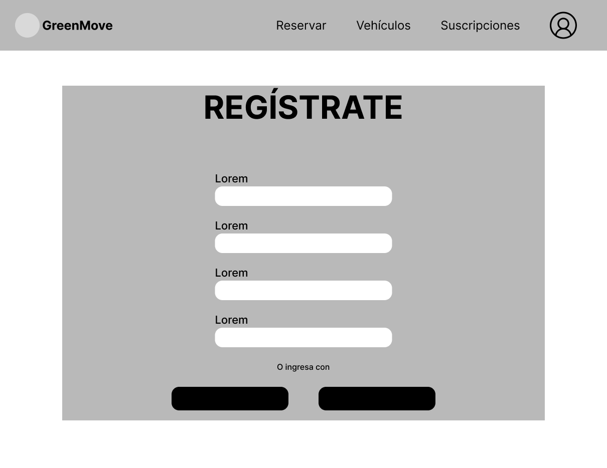
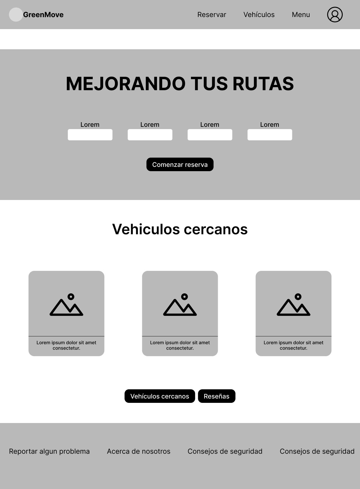
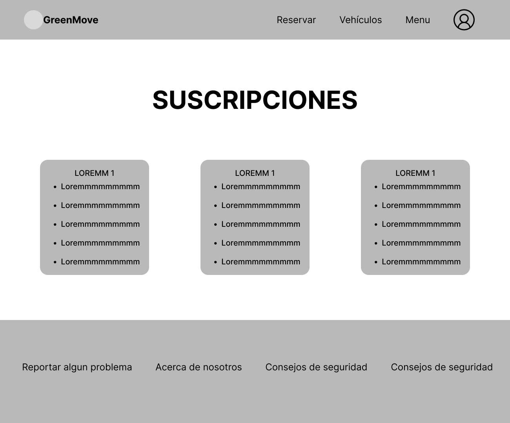
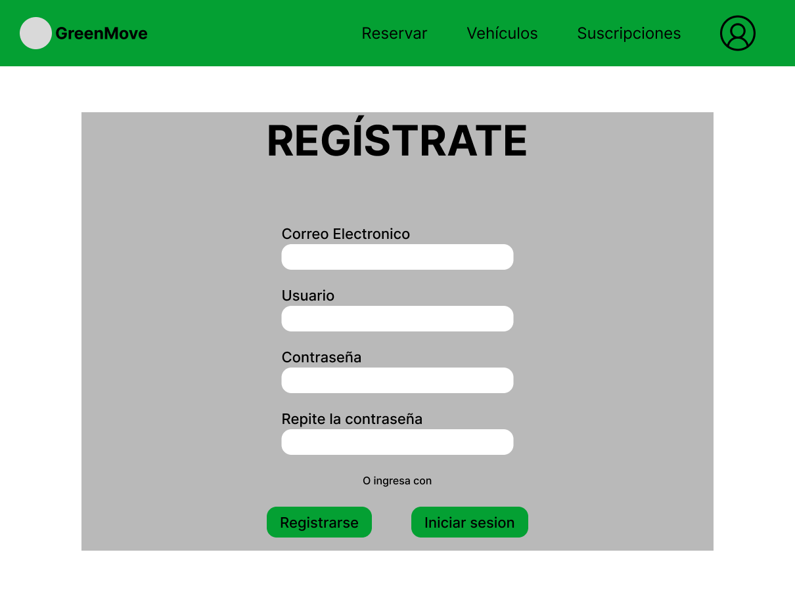
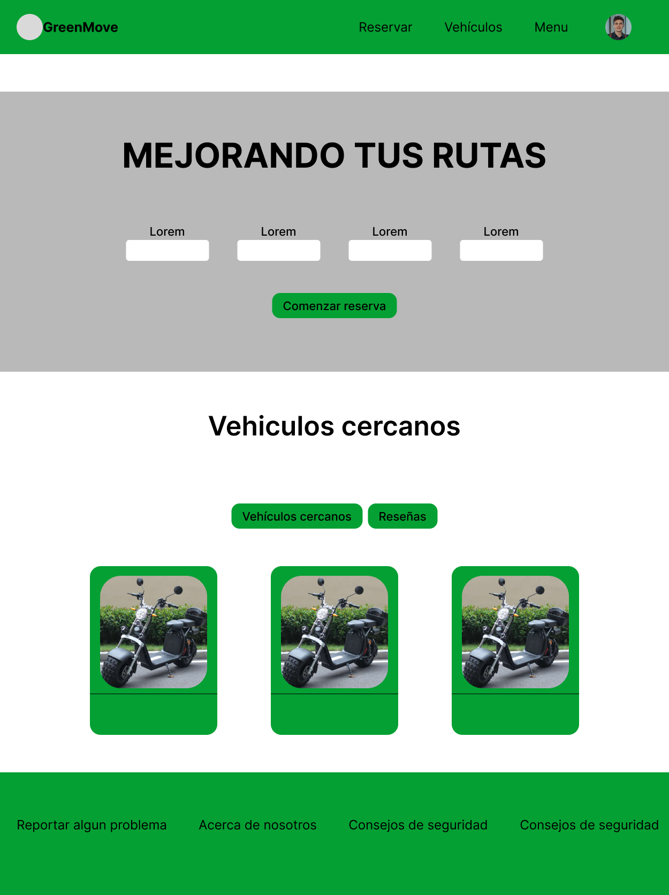
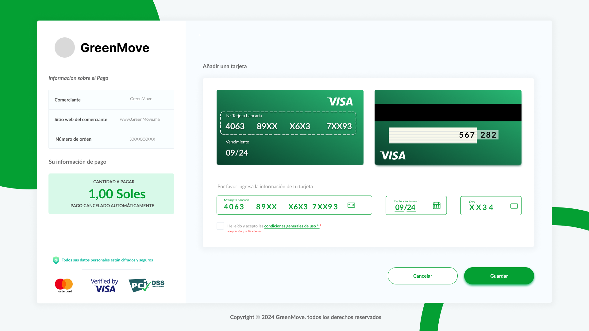
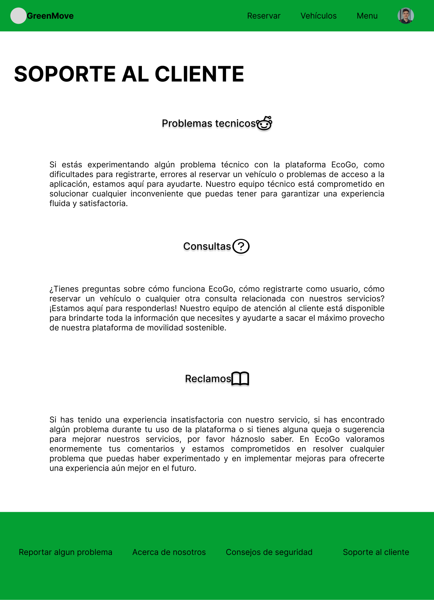
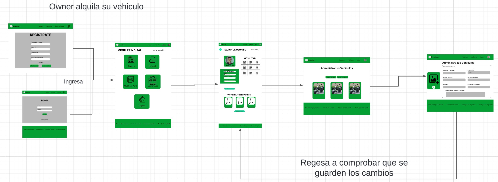

---

# Capítulo IV: Product Design
## 4.1. Style Guidelines
## 4.1.1. General Style Guidelines
En esta sección, estableceremos las directrices generales de estilo para nuestra plataforma **GreenMove**. La aplicación busca proyectar una imagen de innovación tecnológica, sostenibilidad y simplicidad en la movilidad urbana. El objetivo es ser un referente en la transición hacia una movilidad eléctrica eficiente y accesible. Queremos transmitir una identidad amigable, moderna y ecológica, conectada a la tecnología y al futuro de la movilidad.

### Branding
La identidad de marca de **GreenMove** refleja los valores de sostenibilidad, innovación y accesibilidad. Mediante una paleta de colores brillantes y naturales, una tipografía moderna y amigable, y elementos visuales minimalistas, **GreenMove** busca posicionarse como la opción más confiable en soluciones de movilidad eléctrica.

- **Nombre de la marca:** GreenMove
- **Tagline:** "Movilidad eléctrica al alcance de todos"
- **Elementos visuales:** Uso de íconos de scooters eléctricos, caminos y rayos para simbolizar velocidad, movilidad y energía sostenible.

### Comunicación Visual
El tono de comunicación debe ser amigable y accesible, dirigido a un público variado que abarca desde usuarios jóvenes hasta profesionales que buscan soluciones de movilidad eficientes y ecológicas. Queremos que la plataforma se sienta moderna y accesible, sin sacrificar claridad en la experiencia del usuario.

- **Formalidad:** Accesible pero profesional, con un lenguaje claro que invite al uso sencillo de la plataforma.
- **Estilo de Mensajes:** Directo, claro y orientado a la acción, evitando jerga técnica innecesaria.
- **Entusiasmo:** Enfocado en la sostenibilidad y la innovación, transmitiendo optimismo sobre el impacto positivo de la movilidad eléctrica.

### Material Design Links

### 4.1.2. Web Style Guidelines

En esta sección se mostrara con ilustraciones las decisiones tomadas en los estándares visuales y de interacción de nuestra pagina web.

## 4.2. Information Architecture

### 4.2.1. Organization Systems

- **Jerarquía Visual:**

  Con el propósito de mantener la estética de nuestra plataforma interactiva y a la vanguardia de la competencia actual, hemos decidido priorizar la interfaz según importancia para facilitar la interacción con el usuario.

- **Jerarquía de Tipografía:**

  Nuestra plataforma difunde información que es recibida por nuestros usuarios con un orden específico según la demanda. Por lo tanto, es importante tener en cuenta las características con las que se generan nuestros títulos, subtítulos, párrafos, entre otros.

- **Alineación:**

  En nuestra plataforma, nuestras imágenes y botones se encuentran alineados siempre de manera vertical y horizontal. Permitiendo así agrupar varios objetos de diversos tipos con la misma información.

- **Color:**

  A la vista de nuestros segmentos objetivos, el color cumple un rol muy importante en nuestra aplicación, promueve las correctas composiciones del color, para dirigir diversas emociones.

- **Organización Secuencial:**

  Además, los métodos de almacenamiento sobre los registros que el usuario final emplea siguen una organización secuencial, esto con el objetivo de mejorar la simplicidad y la rapidez con la que se almacenan y acceden a ellos. En el caso de nuestro proyecto, organizaremos la visualización de la lista de **scooters** y **bicicletas**.

- **Esquemas de categorización de contenido de nuestra web:**

  Para la organización visual, utilizaremos el sistema jerárquico, lo que nos permitirá resaltar los componentes a los que deseamos que el usuario preste mayor atención. Esto dirigirá la atención del usuario a componentes de suma importancia, solo tendrá que bajar la página.

  Para el proceso de **reservas de vehículos eléctricos**, haremos uso de la organización secuencial:

  - **Solicitud de reserva (clientes):**
    - Búsqueda de vehículos.
    - Elección del vehículo.
    - Solicitud de reserva.
    - Entrega del vehículo.
    - Devolución del vehículo.

  - **Solicitud de la inscripción de vehículos (owner):**
    - Inscripción de vehículo a la plataforma.
    - Establecer tarifa y disponibilidad del vehículo.
    - Publicar disponibilidad del vehículo.

  Para los esquemas de organización utilizaremos los siguientes tipos:

  - **Organización por orden cronológico** para el historial de reservas de los clientes.
  - **Organización por orden alfabético** para la sección **“Mis vehículos”** del Owner.

---

### 4.2.2. Labeling Systems

Para el uso de etiquetas de nuestro **Landing Page**, se ha elegido un lenguaje sencillo que permite a los usuarios familiarizarse con facilidad con las opciones proporcionadas. Esto logrará que los usuarios puedan navegar de manera intuitiva.

---

### Etiquetas en la Landing Page:

| **Etiqueta**   | **Descripción**                                                                                      |
|----------------|------------------------------------------------------------------------------------------------------|
| Inicio         | Apartado donde se muestran los beneficios de la aplicación y una introducción de lo que trata.        |
| Experiencia    | Apartado donde se muestran comentarios y opiniones de usuarios que probaron la aplicación.            |
| Suscríbete     | Apartado donde puedes suscribirte para recibir notificaciones.                                         |
| Contáctanos    | Apartado donde el usuario puede comunicarse con nosotros.                                             |
| Comenzar       | Apartado que te redirige a la aplicación web.                                                         |

---

### Etiquetas de Navegación en la Página Principal:

| **Etiqueta**   | **Descripción**                                                                                      |
|----------------|------------------------------------------------------------------------------------------------------|
| Nosotros       | Muestra quiénes somos, nuestro propósito y equipo.                                                    |
| Servicios      | Muestra lo que ofrecemos al usuario para mejorar su experiencia.                                       |
| Planes         | Muestra los planes que pueden adquirirse y lleva al registro.                                          |
| Equipo         | Muestra el equipo detrás de la aplicación.                                                            |
| Comenzar       | Botón que redirige al usuario a la aplicación web.                                                    |

---

Es importante mantener un sistema de etiquetado efectivo que permita a los usuarios encontrar fácilmente la información y los servicios que necesitan. Nuestro sistema de etiquetado utiliza palabras comunes, no más largas de tres palabras, para asegurar que los usuarios comprendan de manera intuitiva. También emplearemos colores y diseños diferenciados para resaltar las etiquetas importantes. Nos aseguraremos de evitar términos técnicos o jerga que pueda confundir a los usuarios.

### 4.2.3. SEO Tags and Meta Tags
Se utilizaron los siguientes tags en el desarrollo:

- SEO tag Header: Las principales etiquetas de encabezado del Html de nuestra página contendrán la información más importante de nuestra aplicación, conteniendo el nombre, descripción y funcionalidades de nuestra aplicación web

- SEO tah Url: Emplearemos una Url amigable, sin caracteres extraños para su fácil búsqueda.

- Meta title: Título de la página, ayuda a identificar el nombre de la misma y encontrarla en los navegadores.

- Meta tag Author: Es el autor de la página, en este caso utilizamos el nombre del startup GreenGo.

- Meta tag Description: Es una descripción de la página, ayuda a tener una idea general de que trata la página.

- Meta tag Keywords: Son palabras clave que ayudaran a los usuarios a poder encontrar la página aunque no busquen exactamente el nombre de la misma.

### 4.2.4. Searching Systems
Implementaremos métodos para mejorar la experiencia de búsqueda de nuestros usuarios. Utilizaremos un sistema de búsqueda por texto que permita a los usuarios encontrar su vehículo de manera más rápida y personalizada. Los sistemas de búsqueda que se usarán son:

- Barra de búsqueda:  Estos servirán para ayudar al usuario a encontrar los elementos de interés. La barra de búsqueda se hará presente en la búsqueda de algun tipo de producto que quieran comprar y de alguna duda que tenga.
- Filtros de búsqueda: Proporcionará una búsqueda más especializada y ayudará a encontrar de manera más fácil lo que buscamos, restringiendo los resultados según criterios específicos.
- Inicio estático: Es el complemento perfecto por si el usuario se siente confundido dentro del flujo de la aplicación. De este modo, el usuario puede regresar de nuevo al punto de inicio cuando lo necesite.

### 4.2.5. Navigation Systems
Esta parte de la aplicación se enfoca en guiar a los usuarios de manera efectiva mientras navegan por la plataforma y utilizan sus numerosas funcionalidades.
Como sistema de navegación, para el landing page, nos encargamos de realizar una página vertical con poco texto donde el usuario pueda navegar sin saltarse a otra página y confundirse por la inmensidad de información. Nuestro landing page cuenta con secciones como:
- About us: El usuario podrá visualizar a qué se dedica nuestra Startup, su misión y visión.
- Contact us: Donde los usuarios a través de un formulario podrán ponerse en contacto con nosotros.
- Experiencia: El usuario podrá visualizar los comentarios y opiniones de otros usuarios.
- Start: El usuario cuando llegue a la sección de "Empieza tu búsqueda", lo mandará a la web donde podrá navegar y alquilar con previo registro.

Como sistema de navegación, para la web, optamos emplear una barra de menú horizontal en la parte superior que guiará al usuario por las diferentes secciones con títulos claves y estáticos, esto facilitará al usuario a tener todas las herramientas a la mano y así disfrutar de una mejor navegación. Nuestra barra de menú contará con las siguientes secciones:
- About us: El usuario podrá visualizar a qué se dedica nuestra Startup, su misión y visión, y el equipo detrás de esta aplicación web.
- Services: El usuario podrá visualizar los servicios que estamos ofreciendo, si en caso quiera ser un Owner o un Client.
- Subscription: Aquí podrá obtener toda la información de los beneficios de la suscripción que la aplicación le ofrece.
- Contact us: Donde los usuarios a través de un formulario podrán ponerse en contacto con nosotros.
- Barra de búsqueda: Se usa la barra denavegación para poder realizar la búsqueda que quiera el usuario. Los resultados de la búsqueda se muestran de manera clara y precisa
  
## 4.3. Landing Page UI Design
### 4.3.1. Landing Page Wireframe

  

  <em>Landing Page Wireframe</em>
    

Link: https://www.figma.com/design/lkhyHTq8ltsPDtTA3EYqLd/GreenMove?node-id=164-2&t=qL31ZYA0pqlZTAJt-1

### 4.3.2. Landing Page Mock-up

  

  <em>Landing Page Mockup</em>
    

Link: https://www.figma.com/design/lkhyHTq8ltsPDtTA3EYqLd/GreenMove?node-id=0-1&t=fJnmCuW4lpajTYTg-1

### 4.4.2. Web Applications Wireflow Diagrams

  

  <em>Wireframe Registro de Usuarios</em>
    

  

  <em>Wireframe Login</em>
    

  

  <em>Wireframe Pagina de Inicio</em>
    

  

  <em>Wireframe Perfiles</em>
    

  

  <em>Wireframe Para los pagos</em>
    

  

  <em>Wireframe Para suscripciones</em>
    

  

  <em>Wireframe Para registro y control de viajes</em>
    

  

  <em>Wireframe Para Iniciar con la reserva</em>
    

  

  <em>Wireframe Para Continuar con la selección del vehículo</em>
    

  

  <em>Wireframe Para Continuar con el ingreso de datos</em>
    

  

  <em>Wireframe Para elegir el método de pago</em>
    

  

  <em>Wireframe Para recordar las tarjetas</em>
    

  

  <em>Wireframe Para Confirmación del registro</em>
    

  

  <em>Wireframe Para visualizar Vehículos Disponibles</em>
    

  

  <em>Wireframe Para visualizar Transportes cercanos</em>
    

  

  <em>Wireframe Para visualizar publicar Reseñas</em>
    

  

  <em>Wireframe Para visualizar reseñas</em>
    

  

  <em>Wireframe Para pedir Soporte</em>
    

  

  <em>Wireframe Alertas de seguridad</em>
    

  

  <em>Wireframe para Reportar problema</em>
    

  

  <em>Wireframe para visualizar el código de reserva</em>
    

Link: https://www.figma.com/design/lkhyHTq8ltsPDtTA3EYqLd/GreenMove?node-id=1-1237&t=qL31ZYA0pqlZTAJt-1

### 4.4.3. Web Applications Mock-ups

  

  <em>Formulario de registro de nuevos usuarios.</em>
    

  

  <em>Pantalla de inicio de sesión para usuarios registrados.</em>
    

  

  <em>Página de inicio que muestra los servicios disponibles.</em>
    

  

  <em>Lista de vehículos disponibles para la reserva.</em>
    

  

  <em>Menú principal con opciones de navegación.</em>
    

  

  <em>Formulario para añadir tarjetas de pago.</em>
    

  

  <em>Página de resumen de métodos de pago disponibles.</em>
    

  

  <em>Vista del perfil de usuario tipo cliente.</em>
    

  

  <em>Vista del perfil de usuario tipo propietario.</em>
    

  

  <em>Panel de administración de vehículos.</em>
    

  

  <em>Formulario para añadir nuevos vehículos a la plataforma.</em>
    

  

  <em>Interfaz para consultar reservas activas.</em>
    

  

  <em>Página con opciones de suscripción.</em>
    

  

  <em>Historial de viajes realizados por el usuario.</em>
    

  

  <em>Interfaz para iniciar una nueva reserva.</em>
    

  

  <em>Lista de vehículos actualmente disponibles.</em>
    

  

  <em>Visualización de paraderos cercanos.</em>
    

  

  <em>Visualización de transportes cercanos.</em>
    

  

  <em>Pantalla para elegir vehículo.</em>
    

  

  <em>Interfaz para publicar reseñas de servicios.</em>
    

  

  <em>Visualización de reseñas publicadas.</em>
    

  

  <em>Formulario para actualizar los datos personales.</em>
    

  

  <em>Pantalla de confirmación de registro exitoso.</em>
    

  

  <em>Formulario para solicitar soporte técnico.</em>
    

  

  <em>Consejos de seguridad para los usuarios.</em>
    

  

  <em>Interfaz para reportar problemas con el servicio.</em>
    

Link: https://www.figma.com/design/lkhyHTq8ltsPDtTA3EYqLd/GreenMove?node-id=24-874&t=qL31ZYA0pqlZTAJt-1

### 4.4.4. Web Applications User Flow Diagrams

User goal: EL cliente quiere reservar un vehiculo para comenzar su viaje.

  

  <em>Experiencia del usuario para reservar un vehiculo.</em>
    

User goal: EL Owner quiere empezar a alquilar vehiculos a travez de la aplicación.

  

  <em>Poner un Vehiculo en alquiler.</em>
    

Link: https://lucid.app/lucidchart/aead0aba-4ac3-4f4d-b842-fedf4a406f2a/edit?viewport_loc=-6799%2C-7391%2C18936%2C21604%2C0_0&invitationId=inv_4750b5f8-99af-4a2f-9bb4-e6a2c9ce7a72

## 4.5. Web Applications Prototyping

Link del Prototype: https://www.figma.com/proto/lkhyHTq8ltsPDtTA3EYqLd/GreenMove?node-id=24-1335&node-type=canvas&t=gechzDaRznPiSz1Y-1&scaling=min-zoom&content-scaling=fixed&page-id=24%3A5&starting-point-node-id=24%3A1335

Link del Video:

## 4.6. Domain-Driven Software Architecture
### 4.6.1. Software Architecture Context Diagram

### 4.6.2. Software Architecture Container Diagrams

### 4.6.3. Software Architecture Components Diagrams

## 4.7. Software Object-Oriented Design
### 4.7.1. Class Diagrams
### 4.7.1. Class Diagrams
Profile Management:
En el ámbito de la administración de perfiles, se ha desarrollado una serie de clases e interfaces dedicadas a optimizar la interacción entre los usuarios y el sistema. Asegurando un entorno confiable y proactivo para todas las operaciones relacionadas con la gestión de usuarios.

Rental Management:
En el campo de la administración de vehículos, se ha diseñado un conjunto de clases y estructuras enfocadas en facilitar la gestión de las reservas de los vehículos en el sistema. Estas herramientas abarcan desde la representación de diferentes tipos de vehículos hasta la gestión de reservas y el mantenimiento, trabajando en conjunto para ofrecer un entorno bien organizado y funcional que optimiza la administración de flotas.

Payment:
El ámbito de los procesos de pago incluye todas las funcionalidades y procedimientos relacionados con la gestión de transacciones financieras dentro de un sistema. Desde la verificación de métodos de pago hasta la ejecución y registro de transacciones.

### 4.7.2. Class Dictionary
**Context: Profile Management:**

- Profile: Representa un usuario en el sistema. Contiene información del usuario como nombre de usuario, correo electrónico y contraseña.
- User: Representa una sesión de usuario activa en el sistema. Guarda la información sobre el usuario que ha iniciado sesión, su ID de sesión y el momento en que inició sesión.
- Suscription: Una interfaz que define las características y beneficios de la suscripción de un usuario.
- SuscriptionFactory: Una fábrica que implementa suscripciones.
- UserProfile: Clase hija de Profile que representa un tipo de usuario que son los que desean un vehículo de forma temporal.
- OwnerProfile: Clase hija de Profile que representa un tipo de usuario que son los que desean poner en alquiler su vehículo.

**Context: Rental Management:**
- Rental: Entidad que representa el proceso de alquiler de un vehículo. Contiene información como el usuario que alquila, el vehículo alquilado, la duración del alquiler, el costo y el estado.
- RentalFactory: Clase que crea instancias de Rental. Se encarga de crear un alquiler cuando una reserva se activa y transforma una reserva en un alquiler.
- RentalRepository: Clase encargada de gestionar el almacenamiento y la recuperación de datos relacionados con los alquileres. Proporciona métodos para agregar, obtener o eliminar registros de alquiler en una base de datos.
- Reserve: Tabla que gestiona las reservas de vehículos. Contiene información sobre el usuario, el vehículo reservado, el tiempo de inicio y fin, y el estado de la reserva.
- GreenVehicle: Clase base que representa cualquier tipo de vehículo ecológico. Contiene atributos y métodos comunes como el nivel de batería, ubicación, estado, y gestión de mantenimiento.
- GreenScooter: Clase hija de GreenVehicle que representa un scooter eléctrico. Almacena atributos específicos como la velocidad máxima y el tamaño de las ruedas.
- GreenBycicle: Clase hija de GreenVehicle que representa una bicicleta. Contiene atributos como el número de marchas y el tipo de bicicleta.
- GreenCar: Clase hija de GreenVehicle que representa un auto eléctrico. Sus atributos específicos incluyen el número de asientos y el tiempo de carga.

**Context: Payment:**

- PaymentProcessor: Interfaz para el procesamiento de pagos.
- CreditCardProcessor: Implementa PaymentProcessor. Procesa pagos realizados con tarjetas de crédito.
- DebitCardProcessor: Implementa PaymentProcessor. Procesa pagos realizados con tarjetas de débito.
- PaymentProcessorFactory: Interfaz para la creación de objetos PaymentProcessor.
- CreditCardProcessorFactory: Implementa PaymentProcessorFactory. Se encarga de crear instancias de CreditCardProcessor.
- DebitCardProcessorFactory: Implementa PaymentProcessorFactory. Se encarga de crear instancias de DebitCardProcessor.
- TransactionEmitter: Emite transacciones financieras.
- Transaction: Representa una transacción financiera.
- TransactionRepository: Interfaz para el almacenamiento y recuperación de transacciones financieras.

## 4.8. Database Design
### 4.8.1. Database Diagram

---
